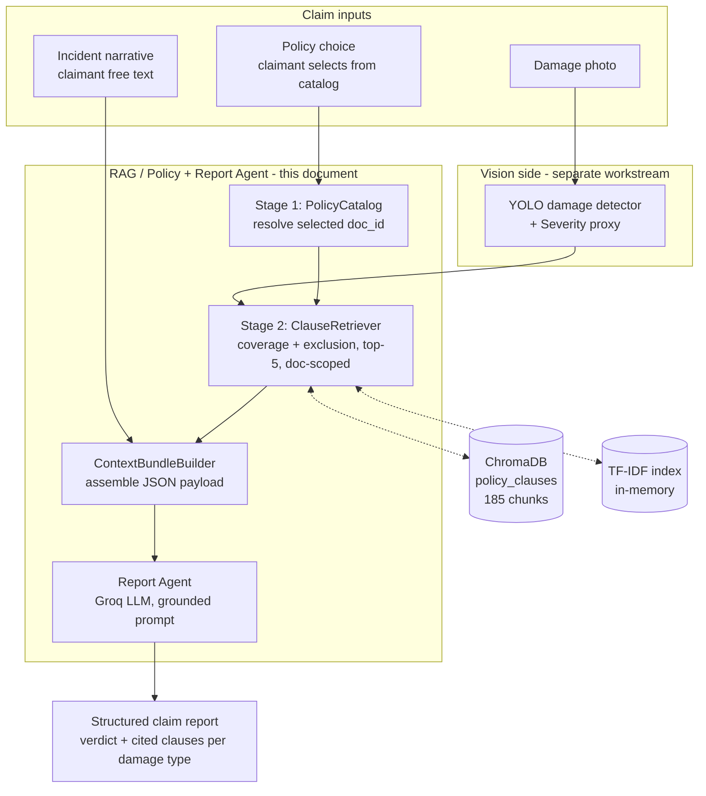
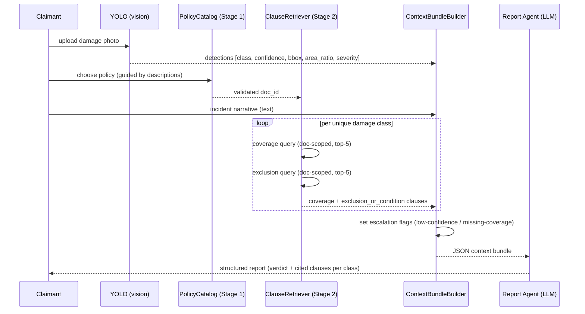

# RAG Support Reference — Milestone 3

**Purpose of this document.** This is a working reference for the RAG /
Policy-Agent + Report-Agent half of the system, written so a teammate can
lift from it directly when composing the formal Milestone 3 report. It is
organised to line up with the Milestone 3 report rubric (architecture,
model selection + justification, inputs/outputs, pipeline, retrieval
components, prompt engineering, integration, compute, trade-offs, risks,
deliverables), but written as an engineering reference — concrete numbers,
file paths, and reproduction commands rather than finished report prose.

Everything here is reproducible from the repo; commands are given per
section and collected in Appendix A. The vision half (YOLO damage detection,
severity) is out of scope for this document and is owned separately — where
the RAG pipeline depends on it, the interface is called out explicitly
(Section 3).

---

## 1. Scope and objectives

### 1.1 Project recap

The system accepts a vehicle-damage photograph and an insurance policy, and
produces a **preliminary, qualitative claim assessment report**: for each
detected damage type, whether it appears *covered / excluded / conditional /
needs-review* under the applicable policy, grounded in and citing the actual
policy clauses. Damage detection is a fine-tuned YOLO model (separate
workstream); the RAG portion covered here turns *(detections + chosen policy
+ incident narrative)* into a grounded report.

### 1.2 Milestone 3 objectives for the RAG portion

1. Design and implement the **complete end-to-end RAG pipeline** from claim
   input to grounded report output (Sections 2–3).
2. **Select the models** for each RAG stage and justify them against
   alternatives (Sections 4–5).
3. Define the **prompt + guardrails** for the report LLM (Section 9).
4. **Evaluate** retrieval quality and report faithfulness, and record the
   design decisions the evaluation drove (Sections 6, 10).

### 1.3 What was built in this milestone

| File | Role |
| --- | --- |
| `scripts/yolo_schema.py` | Provisional YOLO detection schema + severity bucketing (interface to vision side) |
| `scripts/policy_catalog.py` | **Stage 1** — the policy selection menu (claimant chooses; each option described) |
| `scripts/policy_selector.py` | **Rejected alternative** — auto-select policy from damage profile, with the 315-case census that rejected it |
| `scripts/report_context.py` | **Stage 2 + assembler** — scoped clause retrieval + context-bundle builder |
| `scripts/generate_claim_payloads.py` | 10 contrastive synthetic claim scenarios → JSON payloads |
| `scripts/report_agent.py` | **Report Agent** — LLM report generation via Groq (2 models) |
| `scripts/eval_report_agent.py` | Mechanical faithfulness / grounding eval |
| `scripts/hybrid_retrieval.py` | Retrieval core (from M2), extended with `doc_filter` for doc-scoped retrieval |

Carried over from Milestone 2 (not re-derived here): the corpus itself — 5
synthetic policy PDFs, 185 chunks, `all-MiniLM-L6-v2` embeddings in ChromaDB,
`data/clause_groundtruth.json`. See `docs/Milestone2_Report.md` Section 6.2.

---

## 2. Overall architecture

### 2.1 High-level diagram



### 2.2 Modules and interactions

| Module | Input | Output | Backed by |
| --- | --- | --- | --- |
| PolicyCatalog (Stage 1) | claimant's policy choice | validated `doc_id` + description | `policy_catalog.py` (static catalog) |
| ClauseRetriever (Stage 2) | `doc_id`, damage classes | coverage + exclusion clauses per class | `HybridRetriever` → ChromaDB + TF-IDF |
| ContextBundleBuilder | detections, narrative, `doc_id`, clauses | one JSON payload | `report_context.py` |
| Report Agent | JSON payload | structured report (JSON) | Groq API (2 LLMs) |
| Faithfulness eval | payloads + reports | grounding metrics | `eval_report_agent.py` |

### 2.3 External services and technology stack

- **Embedding model:** `sentence-transformers/all-MiniLM-L6-v2` (local, CPU).
- **Vector store:** ChromaDB (local persistent, `data/chroma_db/`).
- **Sparse retrieval:** scikit-learn `TfidfVectorizer` (in-memory).
- **Report LLM:** Groq Cloud (OpenAI-compatible API), models
  `llama-3.3-70b-versatile` and `openai/gpt-oss-20b`. Key in `.env` as
  `GROQ_API_KEY` (git-ignored; `.env.example` is the template).
- **PDF ingest (M2):** `pdfplumber`, `langchain` text splitter.
- Python 3.11. Full pins in `requirements.txt`.

There is **no orchestration framework yet** (LangGraph is named in Milestones
1–2 as the intended orchestrator). The current pipeline is plain sequential
Python calls; see Section 8 for how the LangGraph nodes would map onto the
existing stage functions.

---

## 3. End-to-end workflow

### 3.1 Sequence



### 3.2 Per-stage inputs and outputs

| Stage | In | Out |
| --- | --- | --- |
| Vision (external) | photo | list of detections (see 3.4) |
| Stage 1 PolicyCatalog | policy choice | `doc_id`, insurer/product/description |
| Stage 2 ClauseRetriever | `doc_id` + damage classes | per class: `coverage[]`, `exclusion_or_condition[]`, `coverage_clause_found` |
| Assembler | all of the above + narrative | one JSON payload (Section 7) |
| Report Agent | JSON payload | report JSON (Section 9) |

### 3.3 Error handling / fallback (escalation to human review)

The pipeline never silently produces an authoritative-sounding report on
uncertain input. `ContextBundleBuilder` sets
`escalation.needs_human_review = true` when **either**:

- any detection's `confidence` < `ESCALATION_CONFIDENCE_THRESHOLD` (0.50,
  a placeholder — no calibrated value exists yet), **or**
- no coverage clause was retrieved for a detected damage class
  (`missing_coverage_clause_for`).

The Report Agent is instructed to honour that flag and to use the
`needs_review` verdict when the retrieved clauses don't support a confident
decision — rather than guessing.

### 3.4 Interface to the vision side (provisional)

No trained YOLO model exists yet (`src/models/`, `src/inference/` empty;
`configs/model.yaml`/`inference.yaml` blank). `scripts/yolo_schema.py`
defines the assumed detection format so RAG work is unblocked, built from
constants already in the repo (not invented):

```json
{"class_id": 0, "class_name": "dent", "confidence": 0.91,
 "bbox_normalized": [0.5, 0.5, 0.1, 0.1], "area_ratio": 0.01, "severity": "minor"}
```

- Classes / IDs: `configs/class_remap.json` (dent, scratch, crack,
  broken_lamp, shattered_glass, flat_tyre).
- Severity bins `[0.0, 0.02, 0.08, 1.0]` → minor/moderate/severe: reused
  verbatim from `scripts/eda_vehide.py` (the global area-ratio proxy in M2
  Section 5.3; per-class calibration is still future work).

**Two things to confirm with the vision owner** (both flagged, unresolved):
(1) training labels in `data/vehide/labels/` are plain 5-field bounding
boxes, not segmentation polygons, despite "YOLO11m-seg" in M1/M2 — this
schema assumes bbox output; (2) the escalation confidence threshold is a
placeholder, not calibrated.

---

## 4. Model architecture selection (RAG stages)

| Stage | Model / method | Pretrained or custom | Size | Input → Output |
| --- | --- | --- | --- | --- |
| Dense retrieval | `all-MiniLM-L6-v2` | Pretrained, used as-is (frozen) | 22.7M params, 384-dim, ~87 MB | text → 384-d vector |
| Sparse retrieval | TF-IDF (`TfidfVectorizer`) | Fit on the 185-chunk corpus | in-memory matrix | text → sparse vector |
| Fusion | Weighted Reciprocal Rank Fusion | Custom (no params) | — | two rankings → one ranking |
| Vector store | ChromaDB (HNSW) | Library | 2.5 MB on disk | query vector → top-k chunks |
| Report generation | `llama-3.3-70b-versatile` **and** `openai/gpt-oss-20b` | Pretrained, via Groq API | 70B / 20B (remote) | JSON payload → JSON report |

**No model is fine-tuned or trained in the RAG pipeline.** Retrieval is
feature-extraction on frozen embeddings; generation is zero-shot prompting.
This is why the "Training Strategy" rubric section is minimal for RAG — there
is no loss function, optimizer, epoch count, or checkpoint on this side. The
only *fitting* is the TF-IDF vocabulary, fit once on the corpus at load time
(~milliseconds).

---

## 5. Justification of model choices

### 5.1 Embedding model — `all-MiniLM-L6-v2` (from M2, retained)

Benchmarked in M2 against `BAAI/bge-small-en-v1.5` on the actual 185-chunk
corpus using the 6-query smoke test: **MiniLM reached mean Precision@3 =
1.00 vs 0.94 for BGE-small** (BGE lagged on `crack` at 0.67), while both
embed the corpus in under a second. Larger models (MPNet-base, E5-base,
~110M params) offer only marginal retrieval gains at 3–5× the size/latency —
not justified at this corpus scale, and heavier for a no-GPU deployment
target. **Advantage:** small, fast, strong at this scale. **Disadvantage:**
general-purpose (not insurance-domain-tuned) — mitigated by the sparse
channel (5.3) for lexical cues.

### 5.2 Vector store — ChromaDB (from M2, retained)

Benchmarked against a FAISS `IndexFlatIP` on identical embeddings: FAISS was
~50–60× faster per query (<0.01 ms vs ~0.5 ms) but both returned identical
top-1 content on 6/6 test queries. At 185 chunks FAISS's raw speed is not
operationally meaningful; ChromaDB was kept for **persistent storage +
per-chunk metadata + metadata-filtered queries** out of the box — the last
of which Stage 1/2 depend on directly (the `where={"doc_id": ...}` filter,
5.4). **Trade-off:** accepted ~0.5 ms/query for the metadata filtering the
pipeline needs.

### 5.3 Hybrid dense + sparse retrieval (from M2)

Dense-only retrieval reached P@3 = 0.893 over 50 synthetic incidents;
fusing with a TF-IDF sparse ranking via weighted RRF (dense:sparse = 3:1)
lifted it to **P@3 = 0.913** with no regression in MRR and no zero-hit
incidents. The motivating failure: an incident *"Vandals smashed the rear
window…"* whose dominant "vandalism" framing pulled the dense embedding
toward generic malicious-act clauses, burying the glass-specific clause the
lexical cue "window" would surface. RRF weighting swept over all 50
incidents, not just the failing case.

| Retriever | Mean P@3 (50 incidents) | Mean MRR |
| --- | --- | --- |
| Dense-only (MiniLM) | 0.893 | 0.980 |
| **Hybrid RRF (3:1)** | **0.913** | 0.977 |

Reproduce: `python scripts/hybrid_retrieval.py --evaluate`

### 5.4 Doc-scoped retrieval (new in M3)

`HybridRetriever` was extended with a `doc_filter` argument so retrieval can
be restricted to one policy: dense side via a ChromaDB `where` clause, sparse
side by masking non-matching TF-IDF rows before ranking. Re-running the
original 50-incident eval after this change reproduced **exactly** P@3=0.913
/ MRR=0.977 — the unscoped path is untouched (regression check).

### 5.5 Report LLM — two Groq models, compared

Two models are run head-to-head (Section 10 shows they tie on faithfulness):

- **`llama-3.3-70b-versatile`** — dense 70B, strong general reasoning.
- **`openai/gpt-oss-20b`** — open-weight MoE, ~3.5× smaller.

Chosen over paid frontier APIs (GPT-4o etc., named in M1) for this milestone
because Groq is **free-tier, fast (0.7–0.9 s/report), and OpenAI-compatible**
(so swapping to another provider later is a base-URL change). Running two
different families/sizes was deliberate — it is what let us show that
**report correctness is gated by retrieval/context quality, not model
choice** (Section 10.4). **Disadvantage:** remote dependency (network, rate
limits) — acceptable for a preliminary-report tool, and the grounding
guardrails (Section 9) are model-agnostic.

---

## 6. Model inputs and outputs (features & representations)

### 6.1 Corpus preprocessing (from M2, summary)

- **Source:** 5 team-authored synthetic policy PDFs
  (`data/policy_pdfs/synthetic/`). Two real IRDAI PDFs used as *structural
  reference only*, not indexed.
- **Chunking:** structure-aware — split on headings/list items first, then
  `RecursiveCharacterTextSplitter` (chunk_size 300, overlap 40). Each chunk
  is prefixed with its governing heading before embedding (the single
  biggest retrieval-quality lever in M2). **185 chunks total.**
- **Auto-tagging:** each chunk carries `damage_classes` and `clause_type`
  (coverage / exclusion / sub_limit / condition / definition / general),
  regex-tagged on the contextualised text.

Clause-type distribution (`data/rag_outputs/processing_summary.json`):
`exclusion 96, coverage 44, general 25, sub_limit 17, condition 2,
definition 1`.

### 6.2 Embedding / tokenization strategy

MiniLM's own WordPiece tokenizer; mean-pooled 384-d sentence embedding per
chunk; cosine similarity in ChromaDB (HNSW). Sparse side: TF-IDF with English
stop-words removed, cosine similarity. No custom tokenization.

### 6.3 Report Agent input features

The JSON payload (Section 7) — detections (class, severity, confidence),
incident narrative, selected policy (id + description), and the retrieved
clauses. **Output:** structured JSON report (Section 9).

---

## 7. Context bundle schema (the payload to the LLM)

```jsonc
{
  "claim_id": "CLAIM_09_multi_instance_hail_dents",
  "incident_narrative": "Hailstorm left multiple small dents ...",
  "detections": [
    {"class_id": 0, "class_name": "dent", "confidence": 0.80,
     "bbox_normalized": [0.3, 0.4, 0.11, 0.11], "area_ratio": 0.012, "severity": "minor"}
  ],
  "policy": {
    "doc_id": "policy_1_bharat_suraksha",
    "selection_method": "claimant_selected",       // NOT inferred - see Section 8.1
    "insurer": "Bharat Suraksha Motor Insurance Co. Ltd",
    "product": "Motor Private Car Comprehensive (Own Damage + Third Party Liability)",
    "description": "Comprehensive cover ... glass at nil depreciation ... no add-ons.",
    "clauses": {
      "dent": {
        "coverage": [ {"chunk_id": "chunk_00004", "text": "...", "heading": "...",
                        "clause_type": "definition", "doc_id": "...", "score": 0.0656}, ... up to 5 ],
        "exclusion_or_condition": [ ... up to 5 ],
        "coverage_clause_found": true
      }
    }
  },
  "escalation": {
    "low_confidence_detections": [],
    "missing_coverage_clause_for": [],
    "needs_human_review": false
  }
}
```

---

## 8. The RAG pipeline in detail

### 8.1 Stage 1 — Policy selection = **claimant selection** (not inference)

**Design decision (evidence-driven).** Reading all 5 synthetic policies
end-to-end shows the applicable policy **cannot be inferred from the
damage**: every policy covers all 6 damage classes, and everything that
differs between them is a *contract* fact, not a *damage* fact:

| Attribute | Varies across the 5? | Visible in a damage photo/narrative? |
| --- | --- | --- |
| Which damage classes are covered | No — all 5 cover all 6 | — |
| Glass at nil depreciation | No — all 5 have it | — |
| Tyre covered only with concurrent body damage | No — all 5 have this condition | — |
| Insurer identity / branding | Yes | No |
| Vehicle-age depreciation tier | Yes | No (on the schedule) |
| Add-ons (nil-dep, RTI, consumables) | Yes | No (what they paid for) |
| Reporting deadlines, pre-inspection clauses | Yes | No |

So Stage 1 is an **explicit input**: the claimant selects their policy,
guided by a short factual description of each (`scripts/policy_catalog.py`,
`PolicyCatalog.list_options()`). In a real deployment this is the policy
number → schedule lookup; the catalog is the demo stand-in. The chosen
`doc_id` scopes all Stage-2 retrieval.

The five catalog entries (insurer, product, distinctive feature) are drawn
directly from the policy wordings — e.g. SafeDrive = nil-depreciation
included by default; AutoGuard = full add-on suite + Rs. 2,500 deductible;
QuickClaim = strict 30-day scratch-reporting + pre-inspection; ValueMotor =
budget, no add-on; Bharat Suraksha = single umbrella clause, no add-on.

### 8.2 Rejected alternative — auto-selecting the policy from damage

We *implemented* damage-profile auto-selection (`scripts/policy_selector.py`)
and rejected it on evidence. Because the two main heuristics are
deterministic functions of a fixed 5-doc × 6-class score matrix, the entire
population of cases is enumerable — **63 non-empty class subsets × 5 docs =
315 cases** — so we ran a full census, not a sample:

| Heuristic | Top-1 | Top-2 | MRR |
| --- | --- | --- | --- |
| `mean_top_score` | 0.200 | 0.400 | 0.457 |
| `max_score` | 0.200 | 0.400 | 0.457 |

These are **exactly** the closed-form values for uniform-random ranking over
5 documents (1/5, 2/5, and (1+½+⅓+¼+⅕)/5 = 0.457) — i.e. indistinguishable
from guessing. Robustness checks (all null):

- **pool_k = 1 vs 5** (single best chunk vs sum of top-5 per doc/class):
  identical to 3 dp, even though individual per-class winners flip.
- **severity weighting** (570 controlled cases): flips 18–23% of predictions
  vs the baseline but helps and hurts in exactly equal measure.

**Why (structural, not just statistical):** per-class scores across all 5
docs sit within a ~5% band, and the top-scoring doc rotates across nearly all
5 depending on the class queried. This is the M2 corpus design goal
(interchangeable phrasing across insurers) working as intended. More data
would not fix it. Kept in the repo as documented negative-result evidence.

Reproduce: `python scripts/policy_selector.py --evaluate`

### 8.3 Stage 2 — Scoped clause retrieval (two-pass, top-5)

Once `doc_id` is fixed, `ClauseRetriever.get_clauses(cls, doc_id)` runs
**two doc-scoped queries per damage class** and post-filters by clause type:

- a **coverage** query → keep chunks tagged `coverage`/`definition`
  (see 8.4), up to **5**;
- an **exclusion** query → keep chunks tagged
  `exclusion`/`sub_limit`/`condition`, up to **5**.

Two passes rather than one mixed top-k is deliberate: a single "is X
covered?" query tends to rank the coverage clause on top and bury the
exclusion that caps or voids it — a report that only ever sees coverage will
over-approve. Each hit carries a `score` (fused RRF); a floor
`MIN_CLAUSE_SCORE = 0.01` drops obvious noise.

Validated e.g. on `policy_5` / `flat_tyre`: coverage pass surfaces *"Tyre and
tube damage at 50% … only when the vehicle has also been damaged in the same
incident"* and the exclusion pass surfaces the "3.7 Tyre exclusions" section.

### 8.4 The `definition` inclusion — a documented one-chunk fix

The coverage bucket accepts `clause_type ∈ {coverage, definition}`. Reason:
`chunk_00004` — policy_1's umbrella grant *"By accidental external means …
resulting dents, scratches, cracks, and breakage of lamps…"* — is the **only
chunk in the entire 185-chunk corpus** tagged `definition`, mistagged by the
M2 auto-tagger's bare `\bmeans\b` keyword firing on "external **means**". It
ranks #1 for policy_1's dent query but was being dropped by a coverage-only
filter, which caused a real, observed report error (Section 10.3). Fixing the
tag itself means rewriting M2's already-[Completed] corpus artifacts, so this
is a narrow retrieval-layer mitigation; the root-cause fix (drop bare
`\bmeans\b`) is flagged for the corpus owner.

---

## 9. Prompt engineering (Report Agent)

`scripts/report_agent.py`. Single **system prompt** + the JSON payload as the
user message; **zero-shot** (no few-shot examples needed given the structured
input); `temperature = 0.2`; `response_format = json_object`.

**Guardrails encoded in the system prompt** (directly addressing M1's stated
hallucination risk):

1. **Grounding** — use only clause text present in the payload; never invent
   or recall coverage terms, exclusions, deductibles, depreciation %, or IDV
   from general knowledge.
2. **No monetary figures** — qualitative verdict only; no rupee/currency
   amount (no IDV/deductible/repair-cost inputs exist, so any number would be
   fabrication). Mechanically checked (Section 10.1).
3. **Mandatory citation** — every verdict cites the `chunk_id`(s) it rests
   on, so citations can be checked against what was actually shown.
4. **Controlled verdict vocabulary** — `covered` / `excluded` / `conditional`
   / `needs_review`; `needs_review` when no coverage clause was retrieved;
   `conditional` when coverage depends on an unconfirmed condition.
5. **Escalation** — honour the payload's `needs_human_review` flag.

**Structured output schema** (enforced): `claim_id`, `policy_doc_id`,
`items[] {damage_class, verdict, rationale, cited_chunk_ids[]}`,
`overall_recommendation`, `escalate_to_human`, `escalation_reason`.

No function-calling / tool-use — the payload is fully pre-assembled, so the
LLM is a single constrained generation call. (This is also what keeps the
guardrails simple to verify.)

---

## 10. Evaluation

### 10.1 Faithfulness eval — method

`scripts/eval_report_agent.py` runs **mechanical (not LLM-judged)** checks, so
every number is reproducible from the JSON alone. Per report:

- **schema_valid** — required keys present, verdict in the allowed set.
- **class_coverage_complete** — every detected class got exactly one verdict.
- **citation_validity** — every cited `chunk_id` was actually *offered* to the
  model in that payload (catches citing a real corpus chunk it was never
  shown — as much a grounding failure as inventing one).
- **verdict_evidence_consistent** (hard) — a `covered` verdict must cite ≥1
  coverage-type chunk. Guards the domain's real risk (falsely claiming
  coverage).
- **escalation_consistent** — report's `escalate_to_human` matches the payload.
- **currency_violation** — a rupee/₹/INR figure in the model's prose not
  present in any offered clause text.

Two **soft flags** (surfaced for manual review, *not* scored):

- **multi_class_chunk_citations** — cites a chunk tagged with >1 damage class
  (proxy for a possibly-garbled merged table row, Section 10.3).
- **negative_verdict_on_coverage_only** — an `excluded`/`conditional` verdict
  resting only on coverage-typed chunks. This is usually *correct* reasoning
  (a condition or scope limit inside a coverage clause), so it is flagged, not
  penalised — see 10.2.

### 10.2 Faithfulness eval — results (10 payloads × 2 models)

| Model | schema | class-cov | cite-valid | verdict-ev (hard) | escal | $-viol | composite | multi-cls (soft) | neg-cov (soft) |
| --- | --- | --- | --- | --- | --- | --- | --- | --- | --- |
| `llama-3.3-70b-versatile` | 1.0 | 1.0 | 1.0 | 1.0 | 1.0 | 0 | **1.0** | 13 | 4 |
| `openai/gpt-oss-20b` | 1.0 | 1.0 | 1.0 | 1.0 | 1.0 | 0 | **1.0** | 11 | 2 |

Both models are fully grounded on the hard checks. The `neg-cov` soft flag
caught genuine, *correct* reasoning that an earlier stricter check
mis-flagged: CLAIM_03 (tyre "covered only when the vehicle is also damaged" —
condition unmet → excluded, citing that coverage clause) and CLAIM_08 (crack
in a lamp housing falls outside crack coverage's enumerated "bumpers, panels,
trims" scope → excluded). Requiring an exclusion-typed citation for those
would have been wrong, so the check surfaces them for review instead of
failing them.

Reproduce: `python scripts/report_agent.py` then
`python scripts/eval_report_agent.py`

### 10.3 Two data-quality issues found by running the pipeline

- **Fixed — `chunk_00004` mistagging (Section 8.4).** Before the fix, the two
  models *disagreed* on CLAIM_09 (hail dents, policy_1): llama said `covered`,
  gpt-oss-20b said `excluded` ("reject claim") — both citing a truncated
  substitute chunk because the real coverage clause was filtered out. After
  the fix, both agree: `covered`, citing `chunk_00004`.
- **Found, not fixed — PDF table-row garbling.** In `policy_4`, `pdfplumber`
  linearised a coverage table so a glass row's value and a tyre row's
  condition merged into one chunk (`chunk_00122`); both models then read a
  tyre condition as if it applied to glass. Citation-valid but semantically
  wrong. Recommendation: re-extract table pages via
  `pdfplumber.extract_tables()`. Partial detector: the `multi_class_chunk`
  soft flag (36 of 185 chunks carry >1 damage-class tag).

### 10.4 Headline finding — context quality, not model choice, gates correctness

The CLAIM_09 episode is the cleanest evidence: given the *same bad context*,
two different models produced opposite confident verdicts; given the *same
fixed context*, both converged on the same correct answer — with no change to
prompt, temperature, or model. Composite scores tell the same story (1.0 vs
0.98 before the fix, 1.0 vs 1.0 after). **Implication:** invest in
retrieval/chunking quality over a bigger LLM — a stronger model cannot
recover a clause that was never retrieved, and the grounding guardrails
cannot catch a wrong inference drawn from source text that is itself
corrupted.

---

## 11. Computational requirements

Measured on CPU (no GPU), local machine:

| Item | Value |
| --- | --- |
| Retriever cold init (MiniLM load + TF-IDF fit) | ~16.5 s (one-time per process) |
| Warm scoped retrieve (one query) | ~10 ms median |
| Stage-1+2 clause assembly (per claim) | sub-second (a few doc-scoped retrieves) |
| Report LLM call (Groq) | 0.7–0.9 s per report |
| ChromaDB on disk | 2.5 MB |
| MiniLM model | 87 MB |
| Corpus artifacts (chunks TSV + ground truth) | ~130 KB |

**Hardware:** CPU-only is sufficient — MiniLM (22.7M params) embeds the whole
corpus in <1 s on CPU; the heavy generation is remote (Groq). No GPU or
significant memory footprint required for the RAG side. This matches the
no-GPU Hugging Face Spaces demo target.

---

## 12. Design decisions and trade-offs

| Decision | Chosen | Rejected / alternative | Why |
| --- | --- | --- | --- |
| Policy identification | Claimant selects (catalog) | Auto-select from damage | Auto-select proven at chance over 315 cases (8.2); impossible in principle |
| Vector store | ChromaDB | FAISS | Need metadata-filtered (`doc_id`) queries; 0.5 ms/query is fine at this scale (5.2) |
| Retrieval | Hybrid dense+sparse | Dense-only | +2 pts P@3, fixes lexical-cue failure (5.3) |
| Clause retrieval | Two-pass coverage/exclusion | Single mixed top-k | Avoid burying the exclusion that voids coverage (8.3) |
| Report scope | Qualitative verdict | Estimated payable amount | No IDV/deductible/repair-cost inputs exist; a figure would be fabrication |
| Report LLM | Groq (free, 2 models) | Paid frontier API | Free, fast, OpenAI-compatible; findings show model choice is second-order (10.4) |
| Embedding | MiniLM (frozen) | BGE-small / MPNet / E5 | 1.00 vs 0.94 P@3 at a fraction of the size (5.1) |

Accuracy-vs-speed, cost-vs-performance, cloud-vs-local all resolve the same
way at this corpus scale: the corpus is small (185 chunks), so the cheap/local
option is also the accurate-enough option, and spend is better directed at
context quality than at heavier models.

---

## 13. Risks and limitations

- **Policy selection cannot be automated from damage** — proven exhaustively
  (8.2). The pipeline requires the policy as an explicit input; treat it as
  such, never as something the system can infer.
- **No financial computation** — qualitative verdicts only. A payable-amount
  feature needs a policy-schedule ingest (IDV, deductible, NCB) + a
  repair-cost source, neither of which exist.
- **Provisional YOLO interface** — no trained model yet; every field in
  `yolo_schema.py` must be confirmed against real inference output, and the
  bbox-vs-segmentation-mask question (3.4) resolved.
- **Escalation threshold (0.50) is a placeholder**, not calibrated.
- **PDF table-row garbling** (10.3) is confirmed in ≥1 policy and only
  partially detectable — audit the other policies' table pages before trusting
  this further.
- **Synthetic corpus** — 5 team-authored policies modelled on IRDAI structure;
  not validated against real-world policy variety or other jurisdictions.
- **Hallucination residual risk** — the guardrails + mechanical eval catch
  fabricated *citations* and monetary figures, but cannot catch a wrong
  inference drawn from correctly-cited but *garbled* source text (10.4).

---

## 14. Deliverables produced (RAG side)

**Code:** `scripts/{yolo_schema, policy_catalog, policy_selector,
report_context, generate_claim_payloads, report_agent, eval_report_agent}.py`
plus the `doc_filter` extension to `scripts/hybrid_retrieval.py`.

**Data / artifacts** (`data/rag_outputs/mile3/`):
- `payloads/` + `payloads_all.json` — 10 contrastive claim payloads.
- `reports/` — both models' generated reports.
- `policy_selection_eval.json` — the 315-case rejected-alternative census.
- `faithfulness_eval.json` — the grounding eval results.

**Diagrams:** Sections 2.1, 3.1, 8 (Mermaid, render on GitHub).

**Config / secrets:** `requirements.txt` (pinned), `.env.example` (template;
real `.env` git-ignored).

**Prompt template:** Section 9 / `scripts/report_agent.py` `SYSTEM_PROMPT`.

### 14.1 The 10 contrastive claim scenarios

| Claim | Damage | Selected policy | Stress-tests |
| --- | --- | --- | --- |
| 01 | dent (minor) | policy_1 | Clean baseline |
| 02 | glass (severe) | policy_4 | Table-garbling (10.3) |
| 03 | flat_tyre alone | policy_5 | Tyre-conditional-on-concurrent-damage |
| 04 | dent+crack+lamp | policy_3 | Multi-class, dense-exclusion policy |
| 05 | scratch (vandalism) | policy_2 | Vandalism wording vs malicious-act clause |
| 06 | dent (conf 0.35) | policy_1 | Escalation path |
| 07 | glass (window) | policy_2 | The M2 hybrid-fix case, end-to-end |
| 08 | crack+lamp | policy_4 | Scope-based exclusion reasoning |
| 09 | dent ×3 (hail) | policy_1 | Multi-instance; `chunk_00004` fix |
| 10 | flat_tyre+scratch | policy_5 | Mixed severity, multi-class |

---

## 15. Readiness and next steps (toward Milestone 4)

**Ready:** the retrieval core and the report-generation stage are
functionally complete, measured, and reproducible; the pipeline runs
end-to-end on synthetic claims with fully-grounded output from both LLMs.

**Blocking dependencies for a true end-to-end demo:**
1. Real YOLO detector + confirmed output schema (replaces `yolo_schema.py`
   placeholders; resolves bbox-vs-seg).
2. A UI / entry point wiring photo upload + policy selection + narrative
   (`app/app.py` is still a stub).

**Recommended before Milestone 4:**
- Apply the `chunk_00004` root-cause tag fix in the corpus (8.4) and
  re-extract garbled table pages (10.3).
- Calibrate the escalation confidence threshold once real detection scores
  exist.
- If an orchestrator is wanted, wrap the four stage-functions as LangGraph
  nodes (they already have clean input/output boundaries — Section 3.2).

---

## Appendix A — Reproduction commands

```bash
# Retrieval eval (dense vs hybrid, 50 incidents)
python scripts/hybrid_retrieval.py --evaluate

# Policy auto-selection census (rejected alternative, 315 cases)
python scripts/policy_selector.py --evaluate

# The policy selection menu shown to a claimant
python scripts/policy_catalog.py

# Generate the 10 claim payloads
python scripts/generate_claim_payloads.py

# Generate reports (needs GROQ_API_KEY in .env)
python scripts/report_agent.py

# Faithfulness / grounding eval
python scripts/eval_report_agent.py
```

## Appendix B — Benchmark quick-reference

| Metric | Value |
| --- | --- |
| Retrieval P@3 (hybrid / dense) | 0.913 / 0.893 |
| Retrieval MRR (hybrid / dense) | 0.977 / 0.980 |
| Embedding pick (MiniLM / BGE-small, smoke P@3) | 1.00 / 0.94 |
| Policy auto-selection (315-case census, top-1 / MRR) | 0.200 / 0.457 (= chance) |
| Report faithfulness composite (both models) | 1.0 |
| Warm retrieve latency | ~10 ms |
| Report LLM latency | 0.7–0.9 s |
| Footprint (ChromaDB / MiniLM) | 2.5 MB / 87 MB |

## Appendix C — Change log (from Milestone 2)

- Added `doc_filter` to `HybridRetriever` for doc-scoped retrieval; verified
  no regression on the M2 50-incident eval.
- Added provisional YOLO detection schema + severity bucketing.
- Added Stage 1 as **claimant selection** (`policy_catalog.py`); implemented
  and **rejected** damage-based auto-selection with a 315-case census.
- Added Stage 2 two-pass, doc-scoped, top-5 clause retrieval; included the
  one-chunk `definition` fix.
- Added the Report Agent (Groq, 2 models) with grounding guardrails, the 10
  contrastive payloads, and the mechanical faithfulness eval.
- Retrieval-layer mitigation for `chunk_00004`; documented (unfixed) PDF
  table-garbling issue.
