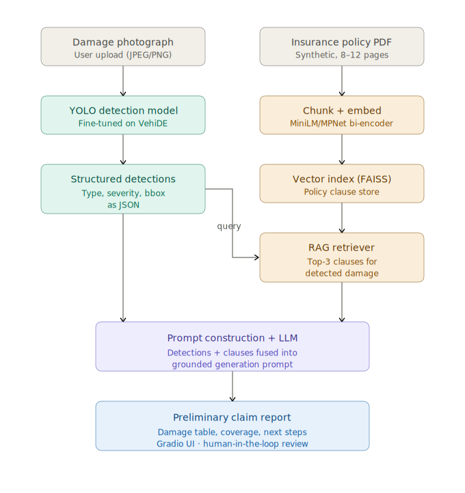

# Multimodal Damage Assessment for Insurance Claims
## Milestone 1: Problem Definition & Literature Review

**DS & AI Lab | May 2026 | Group 1**

---

## 1. Problem Statement

### 1.1 What problem are we solving?

Insurance claim processing for vehicle damage is a slow, labour-intensive, and inconsistent process. When a vehicle is damaged, a claim assessor must manually examine submitted photographs, cross-reference the relevant sections of the policyholder's insurance document, and produce a written preliminary assessment report - a workflow that is both time-consuming and susceptible to inter-assessor variability.

This project builds an AI-powered decision-support system that automates the initial stage of this assessment pipeline.

### 1.2 Who are the stakeholders?

| **Stakeholder** | **Type** | **Interest in the system** |
| --- | --- | --- |
| Insurance claim assessors | Primary | Faster, consistent first-pass reports; reduced repetitive manual work |
| Insurance companies | Primary | Reduced processing time per claim; standardised initial assessments |
| Policyholders (vehicle owners) | Secondary | Faster claim decisions; transparent, traceable damage documentation |

### 1.3 Scope Definition

**In Scope**

- Detection and localisation of visible vehicle damage from uploaded photographs using a fine-tuned YOLO object detection model.

- Classification of damage into types: dent, scratch, crack, broken lamp, flat tyre, shattered glass.

- Severity estimation per detected damage region, categorised as Minor, Moderate, or Severe, based on the proportion of the damaged area relative to the vehicle surface visible in the image.

- Retrieval of relevant insurance policy clauses from a user-provided policy PDF using a RAG pipeline.

- LLM-generated preliminary claim assessment report containing: detected damage summary table, estimated severity per damage, applicable policy coverage, and recommended next steps for the assessor.

- A Gradio-based web interface accessible via Hugging Face Spaces for live demonstration.

**Out of Scope**

- Final claim approval or rejection: The system produces a preliminary report only, all final decisions remain with a qualified human assessor.

- Repair costs depend on numerous variables such as vehicle make, model, manufacturing year, spare-part prices, labour rates, geographic location of service centre, and other policies none of which are determinable from photographs alone. Hence the final repair cost estimation is out of scope of this project.

- Detection of damage not visible in photographs such as internal mechanical damage, frame damage or anything that requires expertise is out of scope for this project.

- Synthetic policy will be used throughout the project due to the proprietary nature of real insurer documents.

- Multi-vehicle accident scenarios, fraud detection, or third-party liability assessment are out of scope for this project.

---

## 2. Problem Motivation

Vehicle insurance is one of the largest lines of general insurance globally. In India alone, the motor insurance market was valued at over $10 billion in 2026 and continues to grow rapidly, and is expected to cross $15 billion by 2031. Despite this scale, the claims assessment process remains heavily manual at its initial stage.

After a vehicle is damaged, the policyholder submits photographs and a written incident description through an insurer's app or portal. A claims assessor then reviews this submission, identifies the relevant policy sections, and writes a preliminary report. This process typically takes one to several business days. Several pain points are well-documented in the insurance technology literature:

- **Throughput bottleneck:** A single assessor may handle dozens of claims per day. Manual photo review for each claim is the largest time cost in the pipeline.
- **Assessor variability:** Two assessors examining identical photographs may classify damage severity differently, leading to inconsistent outcomes for policyholders.
- **Policy cross-referencing:** Identifying which policy clauses apply to a given damage type requires reading through multi-page policy documents repeatedly, creating additional latency.
- **Scalability:** Surge events such as hailstorms or floods produce claim volumes that cannot be absorbed at the same pace as normal operations.

Automating the initial assessment stage addresses all four pain points simultaneously, and does so in a setting where the consequences of an error are bounded. The system outputs a preliminary report reviewed by a human, not a final binding decision. This makes it an appropriate and high-impact application for AI-assisted decision support.

---

## 3. Existing Solutions and Prior Research

### 3.1 Computer Vision Approaches to Vehicle Damage Detection

Vehicle damage detection has been an active research topic since at least 2017. The foundational work by Kalpesh Patil (2017) demonstrated that convolutional neural networks could distinguish damaged from undamaged vehicles with reasonable accuracy on small datasets. Subsequent work shifted from binary classification toward damage localisation and type classification.

YOLO-series models (You Only Look Once) have become the dominant architecture for this task due to their speed and accuracy trade-off. Multiple published studies have fine-tuned YOLOv5, YOLOv8, and YOLOv11 on vehicle damage datasets:

- **YOLOv8 for damage segmentation:** A 2024 IEEE study trained YOLOv8 on a dataset of over 4,000 high-resolution vehicle images annotated with 21 car part classes and 8 damage type classes, achieving strong mAP scores for both part and damage segmentation simultaneously.
- **HL-YOLO:** A 2025 MDPI Vehicles paper proposed HL-YOLO, a heterogeneous convolution variant of YOLO11, reporting gains of 2.5% precision, 5.8% recall, and approximately 3–4% mAP over the YOLO11 baseline on vehicle damage detection.
- **Mask R-CNN:** He et al.'s Mask R-CNN (ICCV 2017) has been applied in a two-stage pipeline: first segmenting the vehicle body, then classifying damage within detected regions. This achieves higher segmentation fidelity but at significantly greater computational cost.
- **CarDD dataset paper:** The CarDD dataset (USTC, 2023) introduced pixel-level damage annotations across six damage categories and served as a benchmark for segmentation-based damage models.

### 3.2 Retrieval-Augmented Generation (RAG) for Document Understanding

Lewis et al. (2020, NeurIPS) introduced RAG as a framework for grounding LLM outputs in retrieved document context, reducing hallucination in knowledge-intensive tasks. Since then, RAG has been applied extensively to legal, medical, and financial document understanding — domains closely analogous to insurance policy retrieval.

Key findings from RAG literature relevant to this project:

- **Chunk size matters:** Smaller chunks (200–400 tokens with overlap) consistently outperform large-chunk retrieval for precise clause-level recall in legal documents.
- **Embedding model choice:** Bi-encoder models (e.g., MiniLM-L6-v2, MPNet) outperform BM25 sparse retrieval for semantic matching of insurance-style queries.
- **Faithfulness is critical:** Without explicit grounding, LLMs hallucinate coverage entitlements. RAG with source attribution substantially reduces this problem (ES-RAG, 2024).

### 3.3 Multimodal Insurance AI — Industry and Academic Work

Several insurtech companies (Tractable, CCC Intelligent Solutions, Mitchell) have deployed computer vision systems for vehicle damage assessment in production. Published technical details are limited due to proprietary constraints, but disclosed capabilities include:

- Automated identification of damaged parts (hood, door, bumper) from photographs.
- Integration with repair cost databases using vehicle VIN and local labour rates — which is outside the scope of this project.
- Human-in-the-loop review for all final decisions.

Academic work combining vision and language for insurance is sparse. The closest published analogues are medical report generation systems (e.g., MIMIC-CXR radiology report generation using vision-language models), which share a similar structure to this project: a vision model produces detections, and an LLM generates a structured natural-language report grounded in those detections. This project adapts that paradigm to the vehicle damage domain.

---

## 4. Metrics and Success Definitions

### 4.1 Vision Model Metrics

| Metric | Definition | Target |
|---|---|---|
| mAP@50 | Mean average precision at IoU threshold 0.50. Primary detection metric. | >= 0.70 overall |
| mAP@50-95 | mAP averaged over IoU thresholds 0.50–0.95. Stricter localisation metric. | >= 0.50 overall |
| Per-class F1 | Harmonic mean of precision and recall per damage class. | >= 0.65 all classes |
| Inference speed | Frames per second on a CPU/GPU at 640px input. | Report only |

### 4.2 RAG Pipeline Metrics

| Metric | Definition | Target |
|---|---|---|
| Retrieval precision @3 | Fraction of test queries where the correct policy clause appears in the top-3 retrieved chunks. | >= 0.80 |
| Faithfulness score | Manual assessment: does the generated report cite only coverage that appears in retrieved clauses? | >= 0.85 (20-sample eval) |

### 4.3 End-to-End and Usability Metrics

| Metric | Definition | Target |
|---|---|---|
| Human evaluation accuracy | 3 raters score each generated report for factual accuracy on a 1–5 scale. | Mean >= 4.0 |
| Human evaluation clarity | 3 raters score report clarity and usefulness to a claim assessor. | Mean >= 4.0 |
| Ablation delta | mAP and report quality improvement of full system vs. baseline (ResNet50 classifier, no RAG, no LLM). | Positive across all metrics |
| Severity accuracy | Agreement rate between model-assigned Minor/Moderate/Severe and human-assigned severity on a 30-image test set. | >= 0.75 |

---

## 5. Gaps in Existing Solutions

Despite meaningful progress in both vehicle damage detection and document-grounded generation, no publicly available system integrates all three components — vision-based damage detection, policy RAG retrieval, and LLM report generation — into a single end-to-end pipeline. The following specific gaps motivate this project:

**Gap 1: Detection without structured reporting**

Existing vision models for vehicle damage (YOLOv8 fine-tunes, CarDD benchmark models) produce bounding boxes and class labels, but do not generate human-readable structured outputs. A claim assessor receiving a list of bounding-box coordinates and class indices still needs to manually interpret and write the assessment. No published open-source system bridges the detection output and the final report.

**Gap 2: LLM reports without grounding in policy documents**

General-purpose LLMs (GPT-4, Gemini) can produce plausible insurance-related text, but without access to the specific policy document, they hallucinate coverage entitlements, cite incorrect exclusions, or fabricate deductible values. RAG over the actual policy document is necessary for any claim report to be trustworthy. This grounding step is absent in all existing publicly demonstrated systems.

**Gap 3: No accessible decision-support demo for this domain**

Industry systems (Tractable, CCC) are closed, proprietary, and inaccessible to researchers and small insurers. There is no open, deployable demonstration of a vision-plus-language claim assessment tool that a claim assessor could realistically interact with. Deployment on Hugging Face Spaces addresses this accessibility gap directly.

---

## 6. Nature of Our Contribution

This project's primary contribution is not a new model architecture. It lies in three other dimensions:

- **Deployment context and usability:** We will develop a publicly accessible, open-source end-to-end pipeline combining vision-based damage detection with policy-aware LLM report generation. The system is specifically designed for practical use by claim assessors, significantly reducing the time required to produce the first draft of an insurance claim assessment report.
- **Pipeline integration:** The YOLO detection results will be converted into a structured format and provided to an LLM together with relevant policy information retrieved using RAG. This enables the LLM to generate responses that are accurate, grounded in policy, and easy for non-technical assessors to understand. The integration of YOLO-based object detection with a RAG-supported LLM forms the core of this project.

---

## 7. High-Level Architecture Diagram

---

## 8. Modern VLMs vs Modular YOLO + RAG + LLM — Justification

1. Separation of concerns / independent debuggability - In Modular design, you can isolate which component has caused the fault. Using a single VLM is a black box, a bad output may not necessarily give us any signal as to what went wrong. It will make our iterations slower.

2. Measurable Detection - YOLO will produce bounding boxes and classes very precisely. VLMs describe damage in a not-so precise manner, calibrated localisation and the severity of damage could be unreliable and hard to score against the ground-truth of datasets (VehiDE).

3. Cost, Latency and Deployment - A fine-tuned YOLO-n/s will run on cpu or a small gpu and can be deployed on huggingface spaces with memory overhead to spare. Large VLMs would need paid API calls or dedicated GPU memory that spaces cannot reliably host.

VLMs are not worse, but modular is the better fit for our constraints.

---

## 9. Evaluation Plan 

The proposed system will be evaluated at both the component and system levels. Evidence will be gathered to assess the accuracy of vehicle damage detection, the relevance of retrieved policy information, and the quality of the generated claim reports, providing a comprehensive evaluation of the end-to-end pipeline.

### 9.1 Vehicle Damage Detection

The computer vision component will be evaluated using standard object detection metrics, including mAP@50, mAP@50–95, Precision, Recall, and F1-score on unseen test images. These metrics will indicate how accurately the YOLO model detects and classifies different types of vehicle damage.

### 9.2 Policy Retrieval

The RAG component will be evaluated by measuring whether it retrieves the correct policy clauses for detected damage. Retrieval Precision@3 will be used to determine how often the relevant policy information appears within the top three retrieved results. This demonstrates that the language model is provided with appropriate supporting evidence before generating a report.

### 9.3 Generated Claim Reports

The final reports will be assessed for three key qualities:

- **Accuracy:** whether the report correctly reflects the detected damage.
- **Faithfulness:** whether policy recommendations are supported by the retrieved policy clauses rather than generated from the LLM's internal knowledge.
- **Clarity:** whether the report is understandable and useful for a claims assessor.

These aspects will be evaluated through human assessment using a predefined scoring rubric.

Together, these evaluations will demonstrate the effectiveness of each individual component as well as the overall end-to-end claim assessment pipeline.

---

## 10. Dataset Plan

### 10.1 Vision Datasets

| Dataset | Size | Annotation type | Role |
|---|---|---|---|
| VehiDE | 13,945 images | Bounding boxes, 32k+ instances | Primary training and evaluation dataset |
| CarDD | Varies by split | Pixel-level segmentation masks | Supplementary segmentation fine-tuning |
| COCO Car Damage | ~500 images | COCO-format bounding boxes | Supplementary for architecture comparison |
| Car Damage Severity | ~2,300 images | Minor / Moderate / Severe labels | Severity classifier calibration |

### 10.2 Synthetic Data

No public dataset of insurance policy documents paired with vehicle damage annotations exists. The team will produce:

- Five synthetic insurance policy PDFs (approximately 8–12 pages each) covering collision coverage, comprehensive coverage, deductibles, exclusions, claim limits, and third-party liability.
- Each policy will have coverage clauses mapped to all six damage classes so that the RAG pipeline can be evaluated against known ground-truth clause retrievals.
- Fifty synthetic incident descriptions paired with test images, for end-to-end report quality evaluation.

---

## 11. Challenges and Project Risks

---

## 12. References

1. K. Patil, S. Kulkarni, S. M. P. B., and V. K. Bairagi, "Car Damage Detection Using Convolutional Neural Networks," *International Journal of Engineering Research & Technology (IJERT)*, vol. 6, no. 2, 2017.

2. K. He, G. Gkioxari, P. Dollár, and R. Girshick, "Mask R-CNN," in *Proceedings of the IEEE International Conference on Computer Vision (ICCV)*, Venice, Italy, 2017, pp. 2961–2969.

3. J. Redmon and A. Farhadi, "YOLOv3: An Incremental Improvement," *arXiv preprint*, arXiv:1804.02767, 2018.

4. P. Lewis et al., "Retrieval-Augmented Generation for Knowledge-Intensive NLP Tasks," in *Advances in Neural Information Processing Systems (NeurIPS)*, vol. 33, pp. 9459–9474, 2020.

5. S. Wang et al., "CarDD: A New Dataset for Vision-Based Car Damage Detection," University of Science and Technology of China (USTC), 2023.

6. H. Scullen, "VehiDE: Vehicle Damage Detection Dataset," Kaggle, 2023. Available: https://www.kaggle.com/datasets/hendrichscullen/vehide-dataset-automatic-vehicle-damage-detection

7. G. Jocher et al., "Ultralytics YOLOv8," GitHub Repository, 2023. Available: https://github.com/ultralytics/ultralytics

8. "Advanced Car Damage Assessment Using YOLOv8: A Hybrid Approach to Detection and Masking," *IEEE*, 2024. doi:10.1109/ICCV.2025.10983960.

9. A. E. W. Johnson et al., "MIMIC-CXR: A Large Publicly Available Database of Labelled Chest Radiographs," *arXiv preprint*, arXiv:1901.07042, 2019.

10. "HL-YOLO: Improving Vehicle Damage Detection with Heterogeneous Convolutions," *Vehicles (MDPI)*, 2025.

11. N. Reimers and I. Gurevych, "Sentence-BERT: Sentence Embeddings using Siamese BERT-Networks," in *Proceedings of the 2019 Conference on Empirical Methods in Natural Language Processing (EMNLP-IJCNLP)*, Hong Kong, China, 2019.

12. J. Johnson, M. Douze, and H. Jégou, "Billion-Scale Similarity Search with GPUs," *IEEE Transactions on Big Data*, vol. 7, no. 3, pp. 535–547, 2021.
