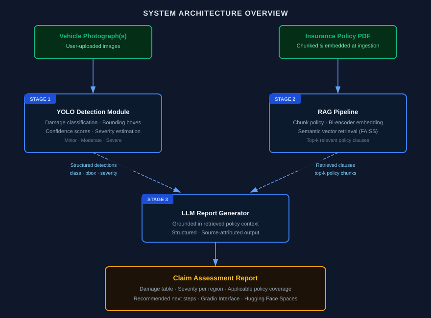

# Car Damage Insurance Claim

## Project Overview

This project focuses on automating and supporting car damage insurance claim workflows using computer vision, AI inference, retrieval, and reporting components.

## Problem Statement

Manual vehicle damage assessment can be slow, inconsistent, and difficult to document. The goal is to build a system that can analyze car damage evidence, support claim evaluation, and generate useful outputs for review.

## Features

- Car damage detection and classification
- Claim-support report generation
- Retrieval-assisted claim context and documentation
- Evaluation reports and visual outputs
- Deployment-ready app interface

## Architecture Diagram



## Dataset Details

Dataset information, sources, download instructions, and preprocessing notes should be documented in `data/README.md`.

## Model(s) Used

- **Policy Agent (RAG)**: `all-MiniLM-L6-v2` embeddings + ChromaDB hybrid (dense+sparse) retrieval, `llama-3.3-70b-versatile` (Groq) for report generation. Full write-up, design decisions, and results: [`docs/RAG_Component.md`](docs/RAG_Component.md).
- **Damage Agent (Vision)**: document the selected YOLO configuration, training setup, and inference approach here as the project evolves.

## Installation Steps

```bash
pip install -r requirements.txt
cp .env.example .env   # add GROQ_API_KEY (report generation) and GOOGLE_API_KEY (RAGAs eval)
```

## Running Instructions

- **RAG / Policy Agent**: see [`docs/RAG_Component.md`](docs/RAG_Component.md) §5 for the full set of commands (corpus build, retrieval eval, ingestion, report generation, RAGAs eval, parameter sweeps).
- **Vision / full pipeline**: add commands for training, inference, and app launch once those modules are implemented.

## Results

**Policy Agent (RAG)** — deterministic retrieval/faithfulness checks, plus a RAGAs LLM-judge layer on top:

| Metric | Value |
| :--- | ---: |
| Retrieval P@3 (deterministic, 50 incidents) | 0.913 (5.59x lift over random) |
| Report faithfulness composite (deterministic, both models) | 1.00 |
| RAGAs `context_precision` (50 incidents) | 0.832 |
| RAGAs `faithfulness` (pre-fix, `llama-3.3-70b-versatile`) | 0.630 |
| RAGAs `answer_relevancy` (pre-fix) | 0.435 |
| RAGAs `answer_correctness` (pre-fix) | 0.524 |
| RAGAs `answer_correctness` (post retrieval fix, `gemini-2.5-flash`) | 0.659 |
| Deterministic checks passed, post retrieval fix | 10 / 10 claims |

Full breakdown and how the post-fix numbers were produced: [`docs/RAG_Component.md`](docs/RAG_Component.md) §2-3.

**Damage Agent (Vision)**: add model metrics, qualitative results, and evaluation summaries here.

## Demo Screenshots

Store screenshots in `outputs/figures/` or `outputs/reports/` and reference them here.

## Team Members

Add team member names, roles, and responsibilities.

## References

Add datasets, papers, libraries, APIs, and other resources used in the project.
