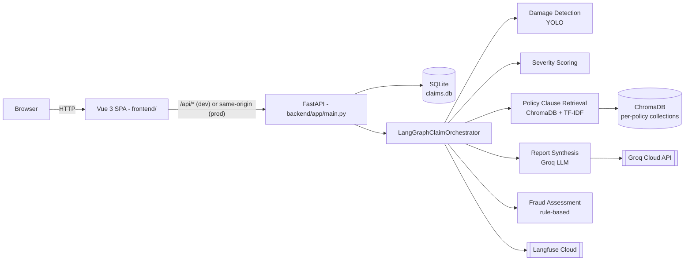
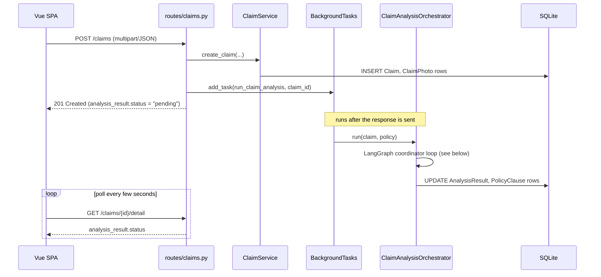
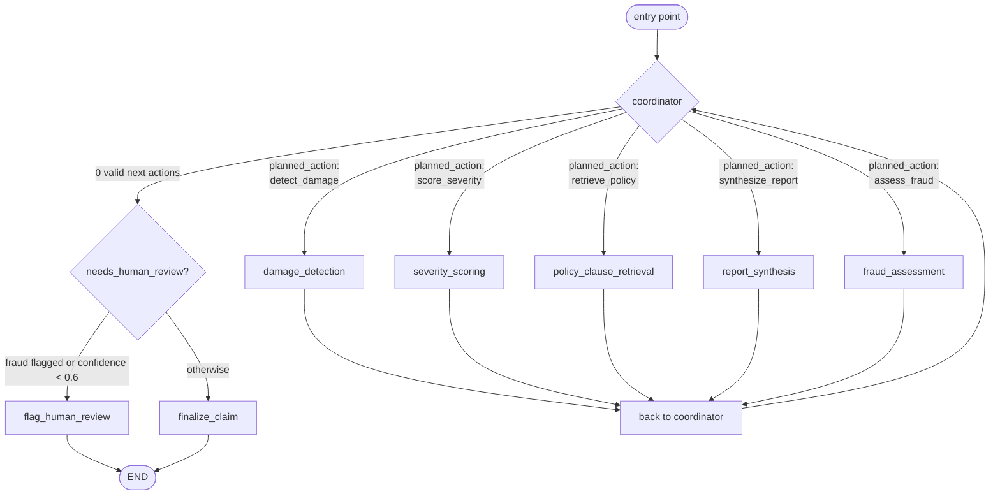
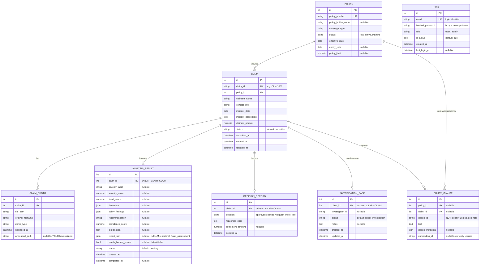

# Car Damage Insurance Claim Portal


## Table of Contents

1. [Project Overview](#1-project-overview)
   - [High-level architecture](#high-level-architecture)
   - [Low-level architecture](#low-level-architecture)
   - [Database schema (SQLite)](#database-schema-sqlite)
   - [Users table (signup/login)](#users-table-signuplogin)
2. [Environment Setup](#2-environment-setup)
3. [Configuration & Secrets](#3-configuration--secrets)
4. [Data & Inputs](#4-data--inputs)
   - [Data already in this repository](#41-data-already-in-this-repository-no-download-needed)
   - [Data you must download yourself](#42-data-you-must-download-yourself)
5. [Running the Application](#5-running-the-application)
6. [Model / Pipeline Execution](#6-model--pipeline-execution)
   - [Retraining the damage-detection model](#64-retraining-the-damage-detection-model)
   - [How the fraud score is computed](#65-how-the-fraud-score-is-computed)
7. [End-to-End Reproducibility](#7-end-to-end-reproducibility)
8. [Deployment Details](#8-deployment-details)
9. [Evaluation & Results](#9-evaluation--results)
10. [Repository Structure](#10-repository-structure)
11. [Troubleshooting](#11-troubleshooting)
12. [Contribution Summary](#12-contribution-summary)
13. [Future Improvements / Limitations](#13-future-improvements--limitations)

## 1. Project Overview

An AI-assisted motor insurance claim portal with four role-based interfaces: **Claimant** (submit a claim with photos), **Adjuster** (review AI findings and decide), **SIU** (investigate high-fraud-score claims), and **Supervisor** (portfolio analytics). Every submitted claim runs through a 5-agent AI pipeline — real object detection, real retrieval-augmented policy-clause lookup, and a real LLM call — not a mock.

Source: ("Build a minimal AI-assisted car damage insurance claim portal with Claimant and Adjuster portals, and expand it to include SIU and Supervisor portals as part of the same cohesive experience.")

### Key features

- **Claimant intake**: policy-number lookup, claim submission with 1–5 photos (`backend/app/routes/claims.py`).
- **YOLO damage detection**: an Ultralytics YOLO model (`backend/models/model.pt`) classifies `dent`, `scratch`, `crack`, `broken_lamp`, `shattered_glass`, `flat_tyre` (`backend/app/services/damage_detection_service.py`).
- **Severity scoring**: deterministic area-ratio heuristic over the real photo dimensions, not the raw model confidence (`backend/app/services/severity_scoring_service.py`).
- **RAG policy-clause retrieval**: hybrid dense (sentence-transformers) + sparse (TF-IDF) retrieval over per-policy ChromaDB collections built from the policy's own PDF wording (`backend/app/services/policy_clause_service.py`, wrapping the library under `backend/app/rag_scripts/src/`).
- **LLM report synthesis**: Groq Cloud (`openai/gpt-oss-120b` by default — see `MODEL_NAME` in §3) produces the recommendation, confidence score, cited coverage, and a required `recommendation_reason` grounded in the retrieved clauses — with a deterministic fallback report if Groq is unavailable (`backend/app/services/report_synthesis_service.py`).
- **Deterministic fraud scoring**: rule-based checks — claimant/policyholder name mismatch, expired or inactive policy, cumulative claimed amount exceeding the policy limit — that can force human review and even override an LLM "Approve" recommendation (`backend/app/services/fraud_agent_service.py`, `backend/app/services/langgraph_orchestrator.py`).
- **LangGraph orchestration with an LLM planner**: a coordinator node with conditional edges to 5 agent nodes (damage detection, severity scoring, policy-clause retrieval, report synthesis, fraud assessment), each looping back to the coordinator; when more than one next step is valid, Groq picks which one runs next via constrained tool-calling, with a deterministic fallback (`backend/app/services/langgraph_orchestrator.py`).
- **Langfuse observability**: every claim analysis is traced as one nested trace covering all five agents plus the coordinator's own planning decisions.
- **Human-in-the-loop decisioning**: the AI pipeline only ever recommends; an adjuster's own decision (`approved`/`denied`/`under review`) is what changes claim status.
- **Signup/login with enforced RBAC**: `POST /auth/signup` and `POST /auth/login` (bcrypt password hashing, JWT access tokens); every `/claims/*`, `/policies/*`, and `/analytics/*` route requires the resulting token, and the Adjuster/SIU/Supervisor portals require the `admin` role specifically — self-signup can only ever create a `user` account (see the `users` table note below).

### High-level architecture



### Low-level architecture

**Request → analysis sequence.** AI analysis runs as a `BackgroundTasks` job so `POST /claims` returns immediately (FR-010); the frontend then polls `GET /claims/{id}/detail` until the analysis finishes.



**The LangGraph coordinator loop itself.** `LangGraphClaimOrchestrator._build_graph()` (`backend/app/services/langgraph_orchestrator.py`) wires a `coordinator` node whose conditional edge routes directly to one of the 5 agent nodes (`damage_detection`, `severity_scoring`, `policy_clause_retrieval`, `report_synthesis`, `fraud_assessment`) based on `state["planned_action"]`, or to `flag_human_review`/`finalize_claim` once no actions remain. Each agent node runs its underlying method, records itself in `completed_actions` (via the `_wrap_agent` wrapper), then edges back to `coordinator`. There is no intermediate dispatcher node — every hop below is a real graph edge, matching LangGraph's own execution trace/checkpointing:



When 2+ actions are simultaneously valid (only `score_severity`/`retrieve_policy` overlap this way), Groq picks which one runs next via constrained tool-calling, falling back to a fixed order if Groq is unavailable — that choice just decides which edge above is taken, not whether it's an edge.

Dependency order enforced by `_valid_next_actions` (not the graph structure): `detect_damage` must run first; once it has, `score_severity` and `retrieve_policy` both become valid simultaneously (the one genuine multi-choice point the LLM planner resolves); then `synthesize_report`; then `assess_fraud` last.

**Key internal call chain** (file → responsibility):

| Layer | File | Responsibility |
| --- | --- | --- |
| HTTP route | `backend/app/routes/claims.py` | `create_claim`, `run_claim_analysis` (background task), dashboards, decisions, SIU actions |
| Domain service | `backend/app/services/claim_service.py` | Claim CRUD, claim-ID generation |
| Orchestration wrapper | `backend/app/services/claim_analysis_graph.py` | Thin `ClaimAnalysisOrchestrator` facade instantiated once as a module-level singleton in `claims.py` (so the YOLO model / embedding model / TF-IDF indices load once, not per request) |
| Orchestration engine | `backend/app/services/langgraph_orchestrator.py` | `LangGraphClaimOrchestrator` — the actual `StateGraph`, coordinator, and per-agent methods described above |
| Tool layer | `backend/app/services/agent_toolkit.py` | Wraps each service as a `langchain_core` `@tool` (`detect_damage_tool`, `score_severity_tool`, `retrieve_policy_clauses_tool`, `synthesize_report_tool`, `assess_fraud_tool`) — used as an in-process name registry (schema exposed to Groq for planning) and invoked directly via `_call_tool`, not through a real MCP client/server boundary |
| Agents | `damage_detection_service.py`, `severity_scoring_service.py`, `policy_clause_service.py`, `report_synthesis_service.py`, `fraud_agent_service.py` | The 5 actual implementations behind each tool |
| Observability | `backend/app/services/langfuse_observability.py` | `LangfuseObserver` — one trace per claim, with each agent + the coordinator's planning decisions as nested spans/generations |
| Auth | `backend/app/routes/auth.py`, `backend/app/services/auth_service.py` | `AuthService` — bcrypt hashing, JWT issuance; not applied as a dependency to any other route |

### Database schema (SQLite)

All 7 tables, from `backend/app/db/models.py` (SQLAlchemy ORM). SQLite is the only supported backend — `database_url` defaults to a local file, and `backend/app/db/database.py` has a homegrown `sync_sqlite_schema()` that only handles `ALTER TABLE ADD COLUMN` (no renames/drops/type changes; see §13).



Notes on real, non-obvious design decisions (verified in `models.py`, not idealized):

- **`policy_clauses` is uniquely keyed on `(claim_id, clause_id)`, not `clause_id` alone** (`UniqueConstraint`). The same retrieved clause is routinely cited by many different claims against the same policy over time, so one row per **citation** is correct; the table's own docstring in the source explains this was a deliberate fix — a bare `clause_id` unique key would silently drop or overwrite every claim's citation after the first. `claim_id`/`policy_id` are both nullable to accommodate the two seed rows (`CL-AUTO-001`/`CL-AUTO-002`) that aren't tied to any specific claim.
- **Foreign keys are declared but not enforced.** Nothing in `database.py` sets `PRAGMA foreign_keys = ON` (SQLite's own default is off), so the `FK` columns above are structural/documentation only — the database will not reject an orphaned row.
- **Only `ClaimPhoto` cascades on delete** (`cascade="all, delete-orphan"` from `Claim`). `AnalysisResult`, `DecisionRecord`, `InvestigationCase`, and `PolicyClause` have no cascade behavior defined, and `InvestigationCase`/`PolicyClause`'s relationship back to `Claim` has no `back_populates` — i.e. `Claim` doesn't expose `.investigation_case` or `.policy_clauses` attributes; those are only navigable from the child side.
- **`ix_claim_policy_status`** is a composite index on `(Claim.policy_id, Claim.status)`, declared at module level after the class bodies, not as a column-level `index=True`.
- **No migration tool** — see §13.

### `users` table (signup/login)

`User` model in `backend/app/db/models.py`, exposed via `POST /auth/signup` and `POST /auth/login` (`backend/app/routes/auth.py`, `backend/app/services/auth_service.py`). Passwords are hashed with `bcrypt`; login returns a JWT access token (`PyJWT`, `HS256`, signed with `JWT_SECRET_KEY`). `USER` is included in the ER diagram above, in the same database as every other table — drawn with **no relationship lines**, on purpose: there is no foreign key from `Claim`, `DecisionRecord`, or any other table to `users` in `models.py` yet, so a signed-up user isn't yet linked to the claims/decisions they touch.

**What this does and doesn't do, precisely:**
- ✅ A real account can be created and authenticated; the JWT payload carries `sub` (user id), `email`, and `role`.
- ✅ **Every `/claims/*`, `/policies/*`, and `/analytics/*` route requires a valid bearer token**, enforced server-side by `Depends(get_current_user)` / `Depends(require_admin)` (`backend/app/core/security.py`) — a request without one gets `401`, not just a frontend redirect. The frontend attaches the token automatically (`frontend/src/services/api.ts`'s axios request interceptor) and logs out on a `401` response.
- ✅ **The four portals are genuinely role-gated, both ends.** `admin` is the only role that can reach the Adjuster/SIU/Supervisor routes (`adjuster-dashboard`, `siu-dashboard`, `/{claim_id}/decision`, `/{claim_id}/siu-action`, `/analytics/summary` all require `require_admin`); `user` can reach the Claimant-facing routes (submit/list/lookup a claim). The frontend router (`frontend/src/router.js`) hides/redirects the same way, but that's a UX convenience — the backend check is what actually matters, and it's independent of what the frontend does.
- ✅ **Public self-signup can only ever create a `user` account.** `role` is not part of the signup request (`backend/app/schemas/auth_schema.py::SignupRequest` has no `role` field) — a client cannot self-assign `admin` by sending one; the field is silently dropped. The only `admin` account is the one seeded at startup (see below).
- One deliberate exception: `GET /claims/{claim_id}/annotated-photo` is not gated — it's rendered via a plain ``/`<a href>` in the Adjuster UI, and browsers don't attach an `Authorization` header to those requests. It exposes only a damage photo for a `claim_id` the caller already has, not claim data or the ability to act on a claim.
- ⚠️ **A default admin account is seeded at every startup**: `admin@gmail.com` / `admin` (`AuthService.seed_default_admin`, logged as a warning on every startup). This is demo/grading convenience, not something to leave in place — **rotate or delete it before any deployment beyond local development.**

---

## 2. Environment Setup

| Requirement | Version | Source |
| --- | --- | --- |
| Python | 3.12 | `.github/workflows/deploy-gke.yml`, `Dockerfile` |
| Node.js | 20 | `.github/workflows/deploy-gke.yml`, `Dockerfile` (`node:20-alpine`) |
| OS | No hard restriction in code. Developed on Windows; deployment images are `python:3.12-slim` / `node:20-alpine` (Linux). | TODO: fill in manually if a specific OS is mandated |
| Hardware | CPU-only inference (small YOLO model, no GPU code path). No GPU/CUDA requirement. | Inferred from `damage_detection_service.py` (plain `ultralytics.YOLO`, no `.cuda()`/device selection) |

### Virtual environment (backend)

```bash
cd backend
python -m venv .venv
# Windows PowerShell:
.\.venv\Scripts\Activate.ps1
# macOS/Linux:
source .venv/bin/activate

pip install -r requirements.txt
```

### Frontend dependencies

```bash
cd frontend
npm install
```

---

## 3. Configuration & Secrets

The backend reads configuration through `pydantic-settings` (`backend/app/core/config.py`), which loads a `.env` file from the **repository root**. These are the environment variables actually read by the running app:

| Variable | Used for | Required? |
| --- | --- | --- |
| `DATABASE_URL` | SQLAlchemy connection string. Defaults to `sqlite:///backend/data/claims.db` if unset. | No (has a working default) |
| `UPLOAD_DIR` | Where uploaded claim photos are stored. | No (defaults to `backend/data/uploads`) |
| `MODEL_DIR` | Where the YOLO weights are read from. | No (defaults to `backend/models`) |
| `DATA_DIR` | Base data directory (created at startup). | No (defaults to `backend/data`) |
| `GROQ_API_KEY` | Groq Cloud API key — powers report synthesis and the LangGraph coordinator's LLM planning. | **Effectively required** — without it, every claim gets the deterministic fallback report (`is_fallback: true`) instead of a real LLM assessment. |
| `MODEL_NAME` | Overrides the Groq model (maps to `groq_model`). | No (defaults to `openai/gpt-oss-120b`; verified against `backend/app/core/config.py`) |
| `GOOGLE_API_KEY` | Only needed to reproduce the RAGAs LLM-judge evaluation (`backend/app/rag_scripts/scripts/ragas_eval.py`, judge model `gemini-2.5-flash`). Not read by the running app. | No |
| `GROQ_BASE_URL` | Groq's OpenAI-compatible API base URL. | No (defaults to `https://api.groq.com/openai/v1`) |
| `LANGFUSE_PUBLIC_KEY`, `LANGFUSE_SECRET_KEY` | Enables Langfuse tracing. Observability is silently disabled if either is missing. | No |
| `LANGFUSE_HOST` or `LANGFUSE_BASE_URL` | Langfuse ingestion endpoint (both names accepted; `LANGFUSE_BASE_URL` is the one actually in `.env.example`). | No (defaults to `https://cloud.langfuse.com`) |
| `JWT_SECRET_KEY` | Signs/verifies the JWT issued by `POST /auth/login`. | **Effectively required for production** — defaults to the placeholder `"change-me-in-production"`, which is intentionally insecure (23 bytes; `PyJWT` warns it's below the 32-byte minimum recommended for HS256). |
| `JWT_ACCESS_TOKEN_EXPIRE_MINUTES` | Access token lifetime. | No (defaults to `15`) |
| `JWT_REFRESH_TOKEN_EXPIRE_DAYS` | Present in config for a future refresh-token flow — **no refresh-token endpoint exists yet**, so this value isn't consumed anywhere yet. | No (defaults to `7`) |

`.env.example` at the repo root lists exactly the variables `Settings` (`backend/app/core/config.py`) reads, plus `GOOGLE_API_KEY` (needed only to reproduce the RAGAs evaluation, not by the running app). Every value in it is a placeholder — copy it to `.env` and fill in real secrets there; never commit a real `.env`.

### API key setup

1. Create a `.env` file at the repository root: `cp .env.example .env` (or `copy .env.example .env` on Windows).
2. Get a Groq API key from [console.groq.com](https://console.groq.com) and set `GROQ_API_KEY`. Note Groq's free tier has a daily token limit (100,000 TPD observed in practice) — once exhausted, the app degrades gracefully to the deterministic fallback report rather than failing.
3. (Optional) Get Langfuse keys from [cloud.langfuse.com](https://cloud.langfuse.com) for pipeline tracing.

---

## 4. Data & Inputs

### 4.1 Data already in this repository (no download needed)

- **Seed policies**: 5 fictional policies (`POL-001`–`POL-005`), each with a policy holder name, coverage type, effective/expiry dates, and a policy limit — seeded automatically at startup (`backend/app/services/policy_service.py::SEED_POLICIES`). `status` is a derived value (`active`/`pending`/`expired`) computed from those dates against the current date, not stored.
- **Policy wording PDFs**: each seeded policy maps to a synthetic PDF under `backend/app/rag_scripts/data/policy_pdfs/synthetic/` (e.g. `policy_1_bharat_suraksha.pdf`). These are explicitly synthetic specimen documents (per their own PDF text: "This is a synthetic specimen policy for research and educational use only. Not a valid insurance contract."), auto-ingested into per-policy ChromaDB collections on first app startup (`PolicyClauseService.ensure_all_seeded_policies_ingested`).
- **Damage detection model**: `backend/models/model.pt` (~45MB YOLO weights), committed directly and loaded at inference time — no download needed to run the app. `backend/models/model_old.pt` (~95MB) is a superseded checkpoint kept for reference; the running app never loads it.
- **RAG evaluation fixtures**: `backend/app/rag_scripts/data/chroma_db/` (a prebuilt 185-chunk vector index) and `backend/app/rag_scripts/data/rag_outputs/` (chunk corpus, evaluation results, parameter-sweep results) are committed on purpose — they are the reproducibility fixtures the numbers in §9 are generated from, not regenerable runtime state.
- **Claim photos**: uploaded by the claimant (1–5 required per claim) at runtime, stored under `UPLOAD_DIR` at `<upload_dir>/<claim_id>/<uuid>.<ext>` (`backend/app/services/photo_storage_service.py`); not part of the committed dataset.

### 4.2 Data you must download yourself

- **VehiDE** (Vehicle Damage Detection Dataset, Kaggle, Apache-2.0) — the dataset the damage-detection model (`backend/models/model.pt`) was fine-tuned on. **Not committed** (13k+ images, too large). The training notebook, [`notebooks/Yolov11m_Training&HyperparameterTuning.ipynb`](notebooks/Yolov11m_Training&HyperparameterTuning.ipynb), downloads it itself via `kagglehub.dataset_download("m4rcuseryx/vehide-segmentation-dataset")` — this needs a free Kaggle account and API credentials (`~/.kaggle/kaggle.json`, or the `KAGGLE_USERNAME`/`KAGGLE_KEY` environment variables; see [kagglehub's auth docs](https://github.com/Kaggle/kagglehub)). The notebook itself is written for **Google Colab** (`google.colab.drive`, a T4 GPU runtime) — see §6.4 for exactly how to run it.

### 4.3 Data format and standalone tooling

- **Data format**: claim submission accepts either `multipart/form-data` (with photo files) or `application/json` (no photos) — see §5 for the exact field list.
- **Standalone RAG tooling** (not wired into the running app; CLI scripts under `backend/app/rag_scripts/scripts/`, with their own additional `requirements.txt`): `preprocess_policy_pdfs.py`, `ingest_user_policy.py`, `chunk_quality_analysis.py`, `ragas_eval.py`, `sweep_rag_params.py`, and others — these were used to develop/evaluate the retrieval pipeline (`src/retrieval/*.py`) and to reproduce the evaluation numbers in §9, but are not invoked at runtime by the app itself. Full instructions: [`backend/app/rag_scripts/README.md`](backend/app/rag_scripts/README.md).

---

## 5. Running the Application

### Backend

```bash
cd backend
uvicorn app.main:app --reload --host 127.0.0.1 --port 8000
```

### Frontend (dev server)

```bash
cd frontend
npm run dev
```

Open `http://localhost:5173` (Vite proxies `/api/*` to the backend on `127.0.0.1:8000`, per `frontend/vite.config.js`).

### Example requests

Every route below except `/auth/*` and `/health` needs a bearer token — log in first (see the
signup/login example further down) and export it:
```bash
export TOKEN="<access_token from /auth/login>"
```

Policy lookup:
```bash
curl -X POST http://127.0.0.1:8000/policies/lookup \
  -H "Content-Type: application/json" \
  -H "Authorization: Bearer $TOKEN" \
  -d '{"policy_number": "POL-001"}'
```

Submit a claim (JSON, no photos):
```bash
curl -X POST http://127.0.0.1:8000/claims \
  -H "Content-Type: application/json" \
  -H "Authorization: Bearer $TOKEN" \
  -d '{
    "policy_number": "POL-001",
    "claimant_name": "Ada Lovelace",
    "contact_info": "ada@example.com",
    "incident_date": "2026-08-01",
    "incident_description": "Rear bumper dent from a parking collision",
    "claimed_amount": 1200
  }'
```
Expected response (`201 Created`, shape from `ClaimRead` in `backend/app/schemas/claim_schema.py`):
```json
{
  "claim_id": "CLM-1001",
  "status": "submitted",
  "message": "Claim received",
  "claimant_name": "Ada Lovelace",
  "incident_date": "2026-08-01",
  "incident_description": "Rear bumper dent from a parking collision",
  "claimed_amount": "1200.00",
  "submitted_at": "2026-08-13T00:00:00",
  "photos": [],
  "analysis_result": { "status": "pending" }
}
```
AI analysis runs as a background task (FastAPI `BackgroundTasks`) — poll `GET /claims/{claim_id}/detail` until `analysis_result.status` is `completed` or `failed`.

Health check:
```bash
curl http://127.0.0.1:8000/health
# {"status":"ok"}
```

Full endpoint list (`backend/app/routes/`):

| Method | Path | Purpose | Auth required |
| --- | --- | --- | --- |
| POST | `/policies/lookup` | Look up a policy by number | Any logged-in user |
| POST | `/claims` | Submit a new claim (multipart or JSON) | Any logged-in user |
| GET | `/claims` | List claims (optional `?status=`) | Any logged-in user |
| GET | `/claims/{claim_id}` | Get a claim | Any logged-in user |
| GET | `/claims/{claim_id}/detail` | Get a claim plus its AI analysis result | Any logged-in user |
| GET | `/claims/{claim_id}/annotated-photo` | The claim's primary photo with detected-damage boxes drawn on it | **None** (see §1 users-table note for why) |
| POST | `/claims/{claim_id}/decision` | Adjuster records approve/deny/request-more-info | `admin` role |
| GET | `/claims/adjuster-dashboard` | Pending claims for the adjuster portal | `admin` role |
| GET | `/claims/siu-dashboard` | Claims with `fraud_score >= 0.65` for the SIU portal | `admin` role |
| POST | `/claims/{claim_id}/siu-action` | SIU opens/updates an investigation | `admin` role |
| GET | `/analytics/summary` | Supervisor portfolio analytics | `admin` role |
| POST | `/auth/signup` | Create an account (`email`, `password` — always creates role `user`) | None |
| POST | `/auth/login` | Authenticate, returns a JWT access token | None |
| GET | `/health` | Liveness/readiness check | None |

Every route above except `/auth/*`, `/health`, and the annotated-photo exception requires
`Authorization: Bearer <access_token>` (`backend/app/core/security.py::get_current_user` /
`require_admin`) — see the `users` table note in §1 for the full detail.

Signup / login example:
```bash
curl -X POST http://127.0.0.1:8000/auth/signup \
  -H "Content-Type: application/json" \
  -d '{"email": "user1@example.com", "password": "supersecret1"}'

curl -X POST http://127.0.0.1:8000/auth/login \
  -H "Content-Type: application/json" \
  -d '{"email": "user1@example.com", "password": "supersecret1"}'
# {"access_token": "eyJ...", "token_type": "bearer", "user": {"id": 1, "email": "user1@example.com", "role": "user", "is_active": true}}
```

---

## 6. Model / Pipeline Execution

Entry point: `LangGraphClaimOrchestrator.run(claim, policy)` in `backend/app/services/langgraph_orchestrator.py`, invoked from the background task `run_claim_analysis()` in `backend/app/routes/claims.py` right after a claim is created.

Pipeline (a LangGraph `StateGraph` coordinator loop with conditional edges to each agent node, not a flat chain):

1. **Damage detection** — YOLO inference on each uploaded photo (`DamageDetectionService`), followed by occlusion-sensitivity saliency (`DamageDetectionService.explain_detection`) for up to the top 3 detections: each one re-runs full YOLO inference on the whole image once per cell of a 4×4 occlusion grid (up to 16 extra model calls per detection, so up to ~48 total) to show which pixels actually drove that classification. This is the single most expensive part of the pipeline — see the runtime note below.
2. **Severity scoring** and **Policy clause retrieval** — both become valid once detection finishes; when both are available, Groq's coordinator picks which runs next via constrained tool-calling (falls back to a fixed order if Groq is unavailable).
3. **Report synthesis** — Groq LLM call producing `damage_table`, `applicable_coverage` (with clause citations), `recommendation`, `recommendation_reason`, `confidence_score`, `next_steps`.
4. **Fraud assessment** — deterministic rule checks; can force `needs_human_review` and can override an "Approve" recommendation to "Investigate" if the policy was inactive/expired at the incident date.
5. **Human-review routing** — deterministic: escalate if fraud flags investigation, or if `confidence_score < 0.6`.

**Model/checkpoint loading**: the YOLO model is loaded lazily on first use and cached on the service instance (`DamageDetectionService._load_model`); the sentence-transformers embedding model (`all-MiniLM-L6-v2`) downloads from the Hugging Face Hub on first use and is cached locally by `sentence-transformers` itself.

**Approximate runtime**: TODO: fill in manually for a rigorous benchmark. Observed during development (not a formal measurement): dominated by step 1's saliency computation, not the LLM call — each YOLO inference pass takes ~2-4s on CPU, and a claim with 2-3 detections can trigger 30-48 of them for saliency alone, so **tens of seconds to a few minutes is normal even when Groq responds instantly**; this is why `analysis_result.status` can stay `pending` for a while and the frontend's poll loop keeps firing during that whole window, not evidence of a stuck or looping claim. Add Groq rate-limiting (3 retries with backoff) or a cold-start sentence-transformers download on top, and total time can run longer still.

### 6.4 Retraining the damage-detection model

`backend/models/model.pt` is a committed artifact — retraining it is **not** part of running the app and is not automated by any local script, because the training pipeline needs a GPU and a Kaggle account:

1. Open [`notebooks/Yolov11m_Training&HyperparameterTuning.ipynb`](notebooks/Yolov11m_Training&HyperparameterTuning.ipynb) in **Google Colab** (it uses `google.colab.drive` and expects a T4 GPU runtime — Runtime → Change runtime type → T4 GPU).
2. Run Section 1 ("Setup — Libraries, Configuration & Data Download"). It `pip install`s `ultralytics`/`kagglehub` and downloads the VehiDE dataset itself via `kagglehub.dataset_download("m4rcuseryx/vehide-segmentation-dataset")` — this prompts for Kaggle credentials on first run (see §4.2).
3. Run the remaining sections in order: EDA → preprocessing → the 12-trial Optuna hyperparameter search (`seed=42`, ~9.6 hours across all trials on a T4) → the final 40-epoch training run (~5.9 hours) → validation metrics.
4. The notebook's final checkpoint (`best.pt`) is the retrained model. Replace `backend/models/model.pt` with it to use it in the running app.

This reproduces the training numbers in `docs/Milestone4_Report.md`/`docs/Milestone5_Report.md`, but **not** the earlier from-scratch VehiDE preprocessing (dedup, PII scan, letterboxing) — that pipeline's scripts are not in this repository, only its output as described in those reports (see `docs/Comprehensive_Technical_Documentation.md` §F for the same caveat).

### 6.5 How the fraud score is computed

`fraud_score` (0.0–1.0, surfaced in `analysis_result.fraud_score` and `report_json.fraud_assessment`) comes entirely from `FraudAgentService.assess_fraud_risk` (`backend/app/services/fraud_agent_service.py`) — a hand-written deterministic rule engine, **not a trained or statistically fitted model**. Full order of operations:

1. **Baseline**: `severity_score + 0.10` (plus `+0.01` if the claimed amount exceeds $10,000), floored at 0.15 and capped at 0.99. A more severely damaged, more expensive claim starts higher purely from these two facts.
2. **Risk-keyword check**: `+0.15` if the incident description contains "fire" or "fraud" verbatim.
3. **Narrative red flags**: `+0.05` per LLM-extracted, verbatim-grounded red-flag phrase found in the free-text description (capped at `+0.15` total) — grounded, not a raw LLM opinion: the caller must have already verified each flagged quote is a real substring of the description before it reaches this step.
4. **Name mismatch**: `+0.25` if the claimant's name and the policy's holder-of-record share no common token.
5. **Policy inactive/expired**: `+0.3` if the policy's status wasn't `active`, or its expiry date was before the incident date.
6. **Cumulative amount exceeds policy limit**: `+0.2` if this claim plus the policyholder's other non-denied claims exceed the policy limit.
7. **Confidence dampening**: the running total is scaled by `(1 − confidence_score × 0.2)` — a more confident report synthesis slightly *reduces* the score, on the reasoning that a well-grounded assessment is itself weak evidence against fraud.

`needs_investigation` is `true` if any hard-rule signal fired (steps 2–6) **or** the final score is `≥ 0.65` — the same 0.65 threshold used to populate the SIU dashboard (`SIU_FRAUD_THRESHOLD` in `backend/app/routes/claims.py`). Every step above is recorded in order in `fraud_assessment.score_breakdown`, so an adjuster/SIU reviewer can see exactly which factors moved the score and by how much, not just the final number.

**How to interpret it**: think of it as a triage/prioritization signal, not a fraud probability in any calibrated statistical sense — nothing in this repository validates these specific weights (0.25 for a name mismatch, 0.3 for policy inactivity, etc.) against real confirmed-fraud outcomes; they were chosen by hand, not fit to labeled data. The claims/policy dataset here is a small seeded synthetic set (§4), so there's no real-world fraud base rate to calibrate against even if the intent were to do so. Treat a high score as "route to a human for a specific, explainable reason" (visible in `score_breakdown`), not as evidence the claim is actually fraudulent.

---

## 7. End-to-End Reproducibility

**A single entry-point script** (`scripts/reproduce.py`, from the repo root) runs the steps below in sequence — installs backend deps, seeds/verifies the database, runs the full backend test suite (which exercises the real 5-agent pipeline end-to-end), and runs the no-API-key RAG retrieval evaluation from §9. It skips (with a clear message, not a silent no-op) anything that needs a key you haven't set or that this script cannot automate (frontend `npm` steps, YOLO retraining — see §6.4):

```bash
python scripts/reproduce.py --help    # see all flags
python scripts/reproduce.py           # run everything it can
```

The manual, step-by-step equivalent (useful if you want to see each step individually, or the script doesn't fit your platform):

```bash
# 1. Clone
git clone https://github.com/HiveCase/Group-1-DS-and-AI-Lab-Project.git
cd Group-1-DS-and-AI-Lab-Project

# 2. Configure
cp .env.example .env
# edit .env: set GROQ_API_KEY at minimum

# 3. Backend setup
cd backend
python -m venv .venv
source .venv/bin/activate   # or .\.venv\Scripts\Activate.ps1 on Windows
pip install -r requirements.txt

# 4. Run backend
uvicorn app.main:app --reload --host 127.0.0.1 --port 8000 &

# 5. Frontend setup and run (separate terminal)
cd ../frontend
npm install
npm run dev

# 6. Open http://localhost:5173, pick a portal, submit a claim as a Claimant
#    using policy number POL-001, then review it as an Adjuster at /adjuster

# 7. Verify with the test suites
cd ../backend && python -m pytest -q
cd ../frontend && npm test

# 8. Reproduce the RAG evaluation metrics reported in §9 (optional, no API
#    key needed for retrieval-only; see backend/app/rag_scripts/README.md
#    for the report-generation/RAGAs evals, which do need one)
cd ../backend/app/rag_scripts
PYTHONPATH=. python scripts/hybrid_retrieval.py --evaluate
```

This exact sequence (via `scripts/reproduce.py`) has been run end-to-end against this repository (backend test suite: 69 passed / 0 skipped with a live `GROQ_API_KEY` configured, 67 passed / 2 skipped without one; retrieval eval: mean P@3 ≈0.91, 0 zero-hit incidents). See [`REPRODUCIBILITY.md`](REPRODUCIBILITY.md) for the record of an **independent** verification — a fresh clone reproduced by a team member who was not primarily responsible for assembling this repository, as distinct from the run above.

---

## 8. Deployment Details

### Local: Docker Compose

```bash
docker compose up --build
```
Backend on `http://localhost:8000`, frontend dev server on `http://localhost:5173`. Compose pulls Groq/Langfuse secrets from a root-level `.env` if present. See inline comments in `docker-compose.yml` for known local-dev workarounds already applied (corporate-proxy `--trusted-host` flags, a CPU-only PyTorch index to avoid downloading ~1.5GB of unused CUDA libraries, an anonymous volume to prevent Windows/Linux `node_modules` binary mismatches, and pip/npm cache volumes).

### Single container (production-style)

The `Dockerfile` builds the Vue frontend and copies its static output into the FastAPI image; FastAPI serves both the API and the compiled SPA from one process/port.

```bash
docker build -t claims-portal .
docker run --rm -p 8000:8000 -v ${PWD}/.local-data:/data claims-portal
```
Open `http://localhost:8000`.

### Kubernetes (GKE)

`k8s/` holds `namespace.yaml`, `pvc.yaml`, `deployment.yaml`, `service.yaml`, `kustomization.yaml`. `.github/workflows/deploy-gke.yml` builds, vulnerability-scans (Trivy), pushes to Artifact Registry, and deploys via `kubectl` on pushes to the configured branch, with a post-deploy smoke test and automatic rollback on failure. Required GitHub secrets and manual `kubectl` commands are documented in [`docs/gke-cicd.md`](docs/gke-cicd.md).

### Ports

| Port | Service |
| --- | --- |
| 8000 | FastAPI backend (and, in the single-container image, the compiled frontend) |
| 5173 | Vite frontend dev server (local dev only) |
| 80 | Kubernetes `Service` (routes to container port 8000) |

### Known limitations

- **`replicas: 1` only** (`k8s/deployment.yaml`, deliberate) — the app persists to a single SQLite file and a local-disk ChromaDB index, neither safe to share across pods. Scaling out needs Postgres + a shared/hosted vector store first.
- No LangGraph checkpointer (`SqliteSaver`) is wired in — if the process restarts mid-analysis, the claim stays in `pending` (recovered automatically to `failed` on next startup by `_fail_orphaned_pending_analyses`, not resumed) and must be resubmitted (per `specs/001-claims-portal/tasks.md`, task T037).
- The RAG ChromaDB index rebuilds inside the container's own filesystem on every restart (not on the mounted PVC), adding a few seconds of startup latency each time.

---

## 9. Evaluation & Results

Key reported results and exactly how to reproduce each one:

| Result | Value | How to reproduce | Needs |
| --- | --- | --- | --- |
| RAG retrieval (50 incidents, 5-policy corpus) | Mean P@3 **0.9133**, MRR@5 **0.9767**, 0/50 zero-hit | `cd backend/app/rag_scripts && PYTHONPATH=. python scripts/hybrid_retrieval.py --evaluate` — verified reproducing (0.907/0.977) on a fresh run in this repository, small drift expected across dependency versions | Nothing (runs against the committed `data/chroma_db/` index) |
| Report faithfulness (10 claims, 2 models) | Composite **1.00**, 0 fabricated currency figures | `PYTHONPATH=. python scripts/eval_report_agent.py` (same directory) | `GROQ_API_KEY` |
| RAGAs LLM-judge (context_precision, faithfulness, answer_relevancy, answer_correctness) | See `backend/app/rag_scripts/README.md` §3 | `PYTHONPATH=. python scripts/ragas_eval.py --all` (same directory) | `GROQ_API_KEY`, `GOOGLE_API_KEY` |
| YOLO11m-seg damage detection (validation split) | Box mAP50 0.485, Mask mAP50 0.449 (tuned vs. 0.438/0.401 baseline) | Re-run [`notebooks/Yolov11m_Training&HyperparameterTuning.ipynb`](notebooks/Yolov11m_Training&HyperparameterTuning.ipynb) — see §6.4 | Google Colab (T4 GPU), Kaggle account |
| Backend test suite | 67 passed / 2 skipped without a live Groq key; **69 passed / 0 skipped** with one (verified) | `cd backend && python -m pytest -q` — the 2 conditional tests are a real Groq call and a real embedding-retrieval call, skipped (not failed) when their service is unavailable | Nothing required; `GROQ_API_KEY` unlocks the 2 conditional tests |

Full methodology, per-class breakdowns, and the provisional/validation-vs-test-split caveats behind the YOLO numbers: `docs/Milestone4_Report.md`, `docs/Milestone5_Report.md`, `docs/Comprehensive_Technical_Documentation.md` §B4–B5. Full RAG methodology and the RAGAs numbers per generator model: `backend/app/rag_scripts/README.md` §3, `docs/RAG_Component.md`.

- No automated evaluation suite runs as part of CI — the table above is run manually (or via `scripts/reproduce.py`, §7), not on every push.
- Langfuse provides live per-claim tracing (each of the 5 agents plus the coordinator's planning decisions as nested spans/generations under one trace) rather than batch metrics.
- **Known limitations**: all 5 policy documents are synthetic specimens explicitly marked "not a valid insurance contract"; the fraud-scoring model is a hand-written rule engine, not a trained classifier; the claims/policy dataset is a small seeded set (5 policies), not a representative production sample; the YOLO numbers above are validation-split, not test-split (see `docs/Milestone5_Report.md` §10).

---

## 10. Repository Structure

```text
.
├── backend/
│   ├── app/
│   │   ├── main.py                  # FastAPI app, startup seeding, static SPA serving
│   │   ├── core/config.py           # pydantic-settings configuration
│   │   ├── db/                      # SQLAlchemy models (models.py) and session/engine (database.py)
│   │   ├── routes/                  # claims.py, policies.py, analytics.py
│   │   ├── schemas/                 # Pydantic request/response models
│   │   ├── services/                # domain services: damage detection, severity, RAG clauses,
│   │   │                            #   report synthesis, fraud, LangGraph orchestrator, etc.
│   │   └── rag_scripts/             # hybrid dense+sparse retrieval library (src/) + standalone
│   │                                #   research/eval CLI tools (scripts/, not used at runtime)
│   ├── models/                      # model.pt (YOLO weights, in use), model_old.pt (unused)
│   ├── tests/                       # pytest suite (conftest.py isolates the test DB)
│   └── requirements.txt
├── frontend/
│   ├── src/
│   │   ├── views/                   # LandingView, ClaimantView, AdjusterView, SIUView, SupervisorView
│   │   ├── components/AiAnalysisPanel.vue  # shared AI-result display, used by Adjuster & SIU views
│   │   ├── services/api.ts          # axios client / API adapter
│   │   ├── router.js, App.vue, main.js
│   │   └── styles/                  # tokens.css, main.css
│   ├── tests/                       # Vitest + @vue/test-utils
│   └── package.json
├── k8s/                             # Kubernetes manifests for GKE deployment
├── .github/workflows/deploy-gke.yml # CI (pytest + vitest) and CD (build/scan/push/deploy) pipeline
├── Dockerfile                       # multi-stage: builds frontend, serves it from the FastAPI image
├── docker-compose.yml               # local dev: separate backend/frontend containers
└── pytest.ini                       # pythonpath=backend (gitignored — see Troubleshooting)
```

---

## 11. Troubleshooting

Issues below were actually encountered and diagnosed during this project's development (not generic boilerplate):

- **`ModuleNotFoundError: No module named 'app'` when running `pytest` in CI** — the root `pytest.ini` (which sets `pythonpath = backend`) is listed in `.gitignore` and never reaches a fresh checkout. Run tests with `python -m pytest` (not bare `pytest`), which adds the current directory to `sys.path` regardless.
- **`connect ECONNREFUSED 127.0.0.1:8000` from the Vite dev server** — almost always means the backend simply isn't running yet or has crashed; start/restart it. If running under Docker Compose specifically, the frontend container must reach the backend by its Compose **service name** (`http://backend:8000`), not `127.0.0.1` — see `VITE_BACKEND_PROXY_TARGET` in `docker-compose.yml` and `frontend/vite.config.js`.
- **`[SSL: CERTIFICATE_VERIFY_FAILED]` during `pip install` or `npm install`** — a corporate TLS-inspecting proxy not trusted by Python/Node's default certificate bundle. The backend already installs `pip-system-certs` (uses the OS cert store) for the app's own runtime HTTP calls; for `pip`/`npm` themselves during local Docker builds, see the `--trusted-host` flags already present in `docker-compose.yml` and the Dockerfile's `PIP_EXTRA_ARGS` build arg.
- **A claim's AI analysis stays `pending` forever** — check for a Groq or Langfuse network timeout with no bound (both now have explicit timeouts; see `report_synthesis_service.py` and `langfuse_observability.py`). On the next app restart, `_fail_orphaned_pending_analyses` (`main.py`) automatically marks any still-`pending` analysis as `failed` rather than leaving it silently stuck.
- **A code change doesn't seem to take effect even after restarting `uvicorn --reload`** — check for an orphaned worker process left over from a previous reloader crash (`netstat`/`Get-NetTCPConnection` for what's actually bound to port 8000); a dead reloader's worker keeps serving stale code indefinitely.
- **`404 {"detail":"policy not found"}` on claim submission** — `ClaimService.create_claim` requires `policy.status == "active"`; POL-003 in the seed data is intentionally `"inactive"` for fraud-scenario testing.
- **Groq 429 rate limit** — the free tier has a daily token cap; the app falls back to a deterministic report (`report_json.is_fallback == true`, surfaced in the Adjuster UI) rather than failing the claim.
- **SQLite data appears to reset/lose rows unexpectedly** — if the repository lives inside a cloud-synced folder (OneDrive/Dropbox/etc.), the sync client can interfere with a live, frequently-written SQLite file. Exclude `backend/data/` (and `backend/uploads*/`) from sync, or relocate them outside the synced tree.

---

## 12. Contribution Summary

Full ownership/remarks breakdown: [`CONTRIBUTING.md`](CONTRIBUTING.md#contribution-table).

| Name | Area(s) | Summary |
| --- | --- | --- |
| Satyajeet Kumar | Data & Vision Pipeline | Problem-statement definition and requirement gathering; VehiDE dataset preprocessing (deduplication, PII scan, class remapping, letterboxing); YOLO11m-seg model training including the Optuna hyperparameter search across baseline/extended/tuned runs; milestone presentations and technical report authoring. Primary owner of the data/vision track end-to-end. |
| Pranab Kumar Manna | Architecture, Backend, Orchestration, Deployment, Frontend | Problem-statement definition and requirement gathering; UI/UX wireframing; relational schema design; system architecture and project planning; LangGraph multi-agent orchestration; agent observability/monitoring; containerized/Kubernetes deployment; Vue 3 SPA implementation; pytest test suite; API design; CI/CD pipeline; and other backend/frontend code as committed. Primary architect and full-stack owner across the system. |
| Venkata Siva Kamal Guddanti | RAG Retrieval | RAG retrieval pipeline implementation and evaluation (hybrid dense+sparse retrieval). Scope limited to RAG. |
| Anuj Gautam | YOLO Fine-tuning | YOLO damage-detection model fine-tuning. Scope limited to YOLO fine-tuning. |
| Harsh Pal | Frontend Exploration, Documentation, Testing | Frontend framework exploration (Vue 3 prototyping); technical report authoring; documentation; testing. Scope limited to frontend exploration. |

---

## 13. Future Improvements / Limitations

Sourced from `specs/001-claims-portal/tasks.md` and gaps identified during development:

- **No LangGraph checkpointing** (task T037) — analysis state doesn't survive a process restart mid-run.
- **No automated end-to-end / manual validation script** covering all four portals (task T081) — the backend/frontend test suites cover units and key flows, but there's no scripted full walkthrough.
- **Per-user claim ownership is still not modeled.** RBAC now gates *which portals* a role can reach (see the `users` table note in §1), but there's no foreign key from `Claim` to `users` yet — any logged-in `user` can look up or list any claim by ID, not just their own. Scoping claim visibility to the submitting account is the natural next step.
- **The seeded default admin (`admin@gmail.com` / `admin`) must be rotated or removed before any real deployment** — it's demo/grading convenience, flagged with a startup warning, not a credential meant to survive past local development.
- **No database migration tooling** — schema evolution goes through a homegrown `sync_sqlite_schema()` (`ADD COLUMN`-only) helper in `backend/app/db/database.py`, not Alembic; it cannot handle column removals, type changes, or renames, and destructive schema changes (e.g. removing a `UNIQUE` constraint) require a manual one-off migration function (see `_rename_legacy_policy_clauses_table`/`_restore_legacy_policy_clauses_rows` in the same file for a precedent).
- **SQLite + local-disk ChromaDB** cap the deployment at a single replica; horizontal scaling needs a Postgres migration and a shared/hosted vector store first (see `k8s/deployment.yaml` comments).
- **No HPA (Horizontal Pod Autoscaler)** configured, for the same reason.

---
