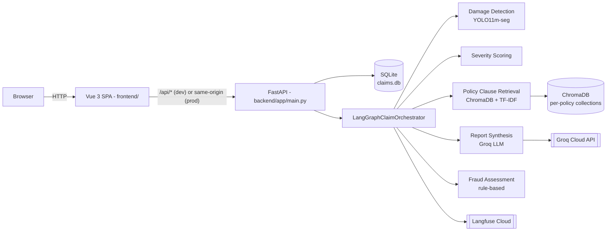
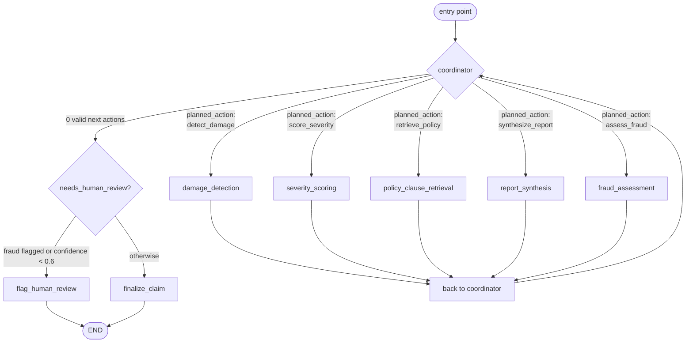
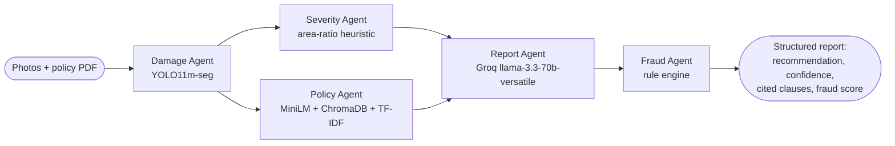

# Comprehensive Technical Documentation

**Multimodal Damage Assessment for Insurance Claims — Milestone 6**
Group 1, Data Science & AI Lab, May 2026

This is the single-file "how it works, what's inside, how to reproduce" reference for the system, covering the six required areas: Overview, Technical Documentation, User Documentation, API Documentation, Licensing & Dataset References, and Future Work / Maintenance. For the project's narrative — abstract, literature review, dataset/methodology, training, and evaluation results — see [`Final_Project_Report.md`](Final_Project_Report.md). For the six per-milestone source reports this document synthesizes and cites, see [`Milestone1_Report.md`](Milestone1_Report.md) through [`Milestone5_Report.md`](Milestone5_Report.md) and [`RAG_Component.md`](RAG_Component.md).

---

## Table of Contents

**A. [Overview](#a-overview)**
**B. [Technical Documentation](#b-technical-documentation)**
1. [Environment Setup](#b1-environment-setup)
2. [Data Pipeline](#b2-data-pipeline)
3. [Model Architecture](#b3-model-architecture)
4. [Training Summary](#b4-training-summary)
5. [Evaluation Summary](#b5-evaluation-summary)
6. [Inference Pipeline](#b6-inference-pipeline)
7. [Deployment Details](#b7-deployment-details)
8. [System Design Considerations](#b8-system-design-considerations)
9. [Error Handling & Monitoring](#b9-error-handling--monitoring)
10. [Reproducibility Checklist](#b10-reproducibility-checklist)

**C. [User Documentation](#c-user-documentation)**
**D. [API Documentation](#d-api-documentation)**
**E. [Licensing & Dataset References](#e-licensing--dataset-references)**
**F. [Future Work / Maintenance Notes](#f-future-work--maintenance-notes)**

---

# A. Overview

## Purpose

Insurance claim processing for vehicle damage is slow and inconsistent: a claim assessor manually reviews submitted photographs, cross-references the relevant sections of the policyholder's insurance document, and writes a preliminary assessment report — a workflow that is both time-consuming and prone to inter-assessor variability (full problem statement and stakeholder analysis: [`Milestone1_Report.md`](Milestone1_Report.md), §1–2).

This project is an AI-assisted decision-support system that automates the *initial* stage of that pipeline — not the final claim decision, which always remains with a human adjuster. Given a set of damage photos and a policy on file, it:

1. Detects and localises visible vehicle damage (dent, scratch, crack, broken lamp, flat tyre, shattered glass) using a fine-tuned YOLO model.
2. Scores severity per detection from the damaged area relative to the photo.
3. Retrieves the specific policy clauses relevant to the detected damage from the claimant's own policy document (RAG).
4. Synthesizes a structured preliminary report (recommendation, confidence, cited coverage, next steps) via an LLM grounded in the retrieved clauses.
5. Runs deterministic fraud checks (name mismatch, policy status/expiry, cumulative claimed amount) that can force human review or override an LLM "Approve" recommendation.

The system serves four role-based portals — **Claimant** (submit a claim), **Adjuster** (review AI findings, decide), **SIU** (investigate high-fraud-score claims), and **Supervisor** (portfolio analytics) — sharing one claim pipeline.

## What was proposed vs. what was actually built

Milestone 1 (`Milestone1_Report.md`) scoped this project's *proposal*: a four-agent pipeline (no dedicated fraud agent), GPT-4o with a Gemini 1.5 Flash fallback for report generation, the Policy Agent exposed as a FastMCP tool, and delivery as a Gradio app on Hugging Face Spaces. By Milestone 3 the orchestration layer itself was still listed as "planned — not implemented yet" (`Milestone3_Report.md`, §2.5).

What is actually running today, verified directly against the source in this repository, differs in several concrete ways:

| Area | Proposed (M1–M3) | Actually shipped |
| --- | --- | --- |
| Orchestration | LangGraph "planned" (M3) | A real `StateGraph` in `backend/app/services/langgraph_orchestrator.py` — a `coordinator` node with conditional edges to each of 5 agent nodes, looping back to the coordinator |
| Agents | 4 (Damage, Severity, Policy, Report) | **5** — the same 4, plus a **Fraud Assessment** agent (deterministic rule engine) never scoped in M1 |
| Report LLM | GPT-4o primary, Gemini 1.5 Flash fallback | **Groq-hosted `llama-3.3-70b-versatile`**, with a deterministic (non-LLM) fallback report if Groq is unavailable |
| Policy tool exposure | FastMCP tool | Wrapped with LangChain's `@tool` decorator as an in-process name registry, invoked as a plain Python function call — not a real MCP client/server boundary (see §B3 below) |
| Interface | Gradio on Hugging Face Spaces | **FastAPI REST API + Vue 3 SPA**, four separate role-based portals with login/signup |
| Deployment target | Hugging Face Spaces, CPU-basic | Docker Compose (local dev) / single production container / Kubernetes manifests for GKE — no live public deployment currently (see "Deployed Components" below) |

This gap is not hidden — it reflects genuine engineering evolution across the project's milestones, and both are legitimate: the milestone reports (`Milestone1_Report.md`–`Milestone5_Report.md`) are the accurate historical record of what was *planned, trained, and evaluated*; this document and the root `README.md` describe what is *actually running* in this repository today.

## Architecture summary

### High-level data flow



### The 5-agent LangGraph coordinator loop



Every hop above is a real LangGraph edge — the coordinator's conditional edge routes directly to whichever agent node `planned_action` names; there is no intermediate dispatcher node. When more than one action is simultaneously valid (only `score_severity`/`retrieve_policy` overlap this way), Groq picks which runs next via constrained tool-calling, falling back to a fixed order if Groq is unavailable. Full mechanics: §B6 below.

The project's original architecture diagrams from the Milestone 1–3 design phase are also preserved for reference: [`multiagent_architecture_staged.svg`](multiagent_architecture_staged.svg) and [`multimodal_damage_assessment_architecture.svg`](multimodal_damage_assessment_architecture.svg).

## Deployed components

| Component | What it is | Where it runs |
| --- | --- | --- |
| Backend | FastAPI app (`backend/app/main.py`) — REST API, LangGraph orchestrator, YOLO inference, RAG retrieval | Local `uvicorn`, Docker Compose, single production container, or Kubernetes (GKE manifests in `k8s/`) |
| Frontend | Vue 3 SPA (`frontend/`) — 4 role portals + login/signup | Vite dev server locally; built as static assets and served by FastAPI in the single-container/K8s deployment |
| Database | SQLite (`backend/data/claims.db`) | Local file / persisted to a Kubernetes PVC in the GKE deployment |
| Vector store | ChromaDB, per-policy collections | Local disk (rebuilt on container restart — see §B8 for the implication) |
| LLM | Groq Cloud API (`llama-3.3-70b-versatile`) | External hosted API, not self-hosted |
| Observability | Langfuse Cloud | External hosted API, optional (silently disabled if keys are absent) |

**No live public URL is currently published for this deployment.** The CI/CD pipeline to GKE (`.github/workflows/deploy-gke.yml`, documented in [`gke-cicd.md`](gke-cicd.md)) is built and functional, but running it against a real GCP project/cluster is an operational step for whoever owns those cloud resources, not something this repository itself stands up. The verified, reproducible way to run this system today is local — Docker Compose or a single `docker run`, both documented in §B7 and the root [`README.md`](README.md) §8.

---

# B. Technical Documentation

This section covers the system **as actually implemented** (verified directly against source in this repository). For the project's design history, dataset preparation, training experiments, and evaluation results — each with full detail this section only summarizes — see [`Milestone1_Report.md`](Milestone1_Report.md) through [`Milestone5_Report.md`](Milestone5_Report.md) and [`RAG_Component.md`](RAG_Component.md).

## B1. Environment Setup

| Requirement | Version | Source |
| --- | --- | --- |
| Python | 3.12 | `.github/workflows/deploy-gke.yml`, `Dockerfile` |
| Node.js | 20 | `.github/workflows/deploy-gke.yml`, `Dockerfile` (`node:20-alpine`) |
| Hardware (inference) | CPU-only (small YOLO model, no GPU code path) | `damage_detection_service.py` uses plain `ultralytics.YOLO`, no `.cuda()`/device selection |
| Hardware (training, historical) | Tesla T4, 15.6GB VRAM, Google Colab free tier | [`notebooks/Yolov11m_Training&HyperparameterTuning.ipynb`](Yolov11m_Training&HyperparameterTuning.ipynb), [`Milestone4_Report.md`](Milestone4_Report.md) §4.1 — the training notebook is checked into this repo, but the raw VehiDE dataset itself is not (downloaded fresh via `kagglehub` at notebook run time; see §B2) |

**Backend:**
```bash
cd backend
python -m venv .venv
.\.venv\Scripts\Activate.ps1   # Windows; source .venv/bin/activate on macOS/Linux
pip install -r requirements.txt
```

**Frontend:**
```bash
cd frontend
npm install
```

Full pinned dependency list: `backend/requirements.txt`, `frontend/package.json` (also transcribed in §E below alongside each package's license).

Configuration is via a `.env` file at the repository root, loaded through `pydantic-settings` (`backend/app/core/config.py`). `GROQ_API_KEY` is the one variable that materially changes behavior — without it, every claim gets a deterministic fallback report instead of a real LLM assessment. Full variable table: root [`README.md`](README.md) §3.

## B2. Data Pipeline

### Vision data (damage-detection training)

The Damage Agent's YOLO11m-seg model was fine-tuned on **VehiDE** (Vehicle Damage Detection Dataset, Kaggle, Apache-2.0) — 13,945 images / 36,081 raw annotated instances, reduced after preprocessing to **13,655 images / 32,672 instances** across a 6-class taxonomy (`scratch`, `dent`, `crack`, `broken_lamp`, `flat_tyre`, `shattered_glass`; the native `lost_parts` class was dropped as it has no visible-damage equivalent).

Preprocessing pipeline (`scripts/preprocess_vehide.py`, `scripts/preprocess_images.py` — historical training-side scripts, not part of this repository's runtime): corrupt-file check (0 found), 7→6 class remap via a versioned JSON lookup, exact-duplicate removal (18 images, MD5) and near-duplicate removal (272 images, perceptual hash ≤8 bits), letterbox resize to 1280×1280 (data-driven target, not the common 640px default), and an automated face/license-plate PII scan (0 flagged). Full methodology, class-distribution tables, and EDA plots: [`Milestone2_Report.md`](Milestone2_Report.md) §5–6, and the plots themselves under [`eda_outputs/plots/`](eda_outputs/plots/) (class distribution, bounding-box area/aspect-ratio, instances-per-image, class co-occurrence, image resolution, spatial distribution).

**Class imbalance**: 6.59:1 (`scratch` at 44.0% of instances vs. `shattered_glass` at 6.7%) — a significant, unresolved factor in per-class model performance (§B5 below and the Final Project Report §7).

**The training notebook ships in this repository** ([`notebooks/Yolov11m_Training&HyperparameterTuning.ipynb`](notebooks/Yolov11m_Training&HyperparameterTuning.ipynb)), though the raw VehiDE dataset itself does not — it's downloaded fresh via `kagglehub` when the notebook runs. `backend/models/model.pt` is the resulting fine-tuned checkpoint, used as a pre-trained artifact at inference time; an unused `model_old.pt` also sits alongside it.

### Policy document corpus (RAG)

Two publicly available IRDAI-registered policy wordings (Universal Sompo, United India) were used **only as structural reference** while authoring five fully **team-authored synthetic policy PDFs** — the actual corpus the running app serves (`backend/app/rag_scripts/data/policy_pdfs/synthetic/`). Each PDF's own text states it is a specimen document "for research and educational use only. Not a valid insurance contract." An 8-word n-gram overlap check against the two reference documents found no distinctively-worded clause copied wholesale — only IRDAI-standard boilerplate overlaps ([`Milestone2_Report.md`](Milestone2_Report.md) §2.2, full licensing detail in §E below).

Chunking (`preprocess_policy_pdfs.py`, historical): `pdfplumber` full-page text extraction → structure-aware splitting (300 chars / 40-char overlap, `RecursiveCharacterTextSplitter`) that keeps headings as a running breadcrumb prepended to each chunk → embedded with `sentence-transformers/all-MiniLM-L6-v2` → indexed into ChromaDB. Result: **185 chunks** across the 5 policies, auto-tagged by damage class and clause type (exclusion/coverage/general/sub_limit/condition/definition). Full chunking rationale and the extraction bug found and fixed along the way: [`Milestone2_Report.md`](Milestone2_Report.md) §6.2.

At runtime, `PolicyClauseService.ensure_all_seeded_policies_ingested()` auto-ingests these PDFs into per-policy ChromaDB collections on first app startup — this is a live part of the running application, not a one-off offline step.

### Claim data

Claim photos are uploaded by the claimant (1–5 required) and stored under `UPLOAD_DIR` at `<upload_dir>/<claim_id>/<uuid>.<ext>` (`photo_storage_service.py`). Seed policies (`POL-001`–`POL-005`) and their claims are fictional, seeded at startup (`policy_service.py::SEED_POLICIES`).

## B3. Model Architecture

**Model pipeline** (the 5 agents and how a claim flows through them — distinct from the system-infrastructure diagram in §A, which also shows the SPA/API/DB layers around this pipeline):



**Key hyperparameters** (Damage Agent, the only trained component — full table and search methodology: §B4 below): YOLO11m-seg, 40 epochs, batch 8, 640×640 input, AdamW, `lr0=0.0001047`, `weight_decay=0.000292`, `degrees=5.5` (Optuna-tuned). The other four agents are either deterministic (Severity, Fraud) or use frozen pretrained/hosted models with no fine-tuning (Policy's `all-MiniLM-L6-v2` embeddings, Report's Groq-hosted LLM) — "hyperparameters" in the training sense only apply to the Damage Agent.

**Damage Agent** — YOLO11m-seg (Ultralytics), COCO-pretrained base fine-tuned to the project's 6-class taxonomy, ~22.3M parameters. Trained at 640×640 input (architecture-selection rationale vs. YOLOv8/Mask R-CNN/DETR/SSD and modern VLMs: [`Milestone1_Report.md`](Milestone1_Report.md) §3.4, [`Milestone3_Report.md`](Milestone3_Report.md) §5.1). Loaded lazily and cached on the service instance at inference time (`damage_detection_service.py`).

**Severity Agent** — deterministic area-ratio heuristic (not a trained model): detected mask/bbox area relative to the real photo dimensions, binned into Minor/Moderate/Severe (`severity_scoring_service.py`). A learned classifier alternative was considered and rejected as under-data for reliable training ([`Milestone1_Report.md`](Milestone1_Report.md) §10.2).

**Policy Agent** — hybrid dense + sparse retrieval: `all-MiniLM-L6-v2` (384-dim) dense embeddings in ChromaDB, fused via weighted Reciprocal Rank Fusion (3:1 dense:sparse) with a `scikit-learn` TF-IDF sparse signal, plus a two-query-per-damage-class + general-coverage-fallback retrieval strategy (`policy_clause_service.py`, wrapping `backend/app/rag_scripts/src/retrieval/`). Full model-selection benchmarking against BGE-small and FAISS: [`RAG_Component.md`](RAG_Component.md) §1, [`Milestone2_Report.md`](Milestone2_Report.md) §6.2 Step 3.

**Report Agent** — Groq Cloud, `llama-3.3-70b-versatile`, prompted only (no fine-tuning), with a deterministic non-LLM fallback report if Groq is unavailable (`report_synthesis_service.py`).

**Fraud Agent** — deterministic rule engine (`fraud_agent_service.py`): claimant/policyholder name mismatch, expired/inactive policy, cumulative claimed amount vs. policy limit. Not a trained classifier, and not part of the original Milestone 1–3 proposal (§A above).

**Orchestration** — LangGraph `StateGraph` (`langgraph_orchestrator.py`): a `coordinator` node with conditional edges to each of the 5 agent nodes above, each looping back to the coordinator; Groq's constrained tool-calling breaks ties when more than one action is simultaneously valid. Full diagram: §A above.

## B4. Training Summary

**⚠️ Provisional.** All headline training/validation numbers below are cross-verified against the actual executed training notebook, [`notebooks/Yolov11m_Training&HyperparameterTuning.ipynb`](notebooks/Yolov11m_Training&HyperparameterTuning.ipynb), and against [`Milestone4_Report.md`](Milestone4_Report.md) and [`Milestone5_Report.md`](Milestone5_Report.md). Milestone 5 explicitly flags its own numbers as **validation-split results, not test-split results** — a held-out test-split evaluation, confusion matrix, and robustness check were prepared but not executed at the time that report was written ([`Milestone5_Report.md`](Milestone5_Report.md) §10). This document carries that same caveat forward rather than presenting the numbers as final.

**Selected checkpoint**: YOLO11m-seg, COCO-pretrained, **Optuna-tuned** — hyperparameters, epoch/batch settings, and the final validation metrics below are read directly from the notebook's own executed cell output (`engine/trainer:` config line and the final `val()` summary row), not just cited from the milestone report.

| Setting | Value |
| --- | --- |
| Epochs | 40 |
| Training time | **5.887 hours** (final tuned run, notebook cell output: `"40 epochs completed in 5.887 hours"`) |
| Batch size | **8** |
| Image size | 640×640 |
| Optimizer | AdamW |
| Learning rate (`lr0`) | 0.0001047 |
| Weight decay | 0.000292 |
| Rotation augmentation (`degrees`) | 5.5° |
| Loss | Composite YOLO loss — CIoU box, BCE classification, DFL, segmentation mask loss |
| Hardware | Tesla T4, 15.6GB VRAM, Google Colab |

The 12-trial Optuna search itself (5-epoch proxy runs) took considerably longer in wall-clock terms than the final full run — each trial averaged roughly 47–48 minutes (per-trial timestamps in the notebook), totalling **~9.6 hours** across all 12 trials, before the winning configuration was retrained to completion above.

The learning rate was found via a **12-trial Optuna search** (TPE sampler) over `lr0` (5×10⁻⁵–1×10⁻²), `weight_decay` (0–1×10⁻³), and `degrees` (0°–15°), each trial a 5-epoch proxy run maximizing validation mask mAP50; all 12 trials' logged results (best: trial 7, `lr0=0.0001047`, mask mAP50=0.3511) match exactly between the notebook's own output and [`Milestone5_Report.md`](Milestone5_Report.md) §7. The search initially had a methodological bug — `optimizer="auto"` silently ignores any explicitly-passed `lr0`, so the first search pass varied `lr0` in name only — found via inspecting training logs and corrected by explicitly setting `optimizer="AdamW"`.

**Training dataset, as actually downloaded by the notebook**: Kaggle dataset `m4rcuseryx/vehide-segmentation-dataset` — a pre-built, YOLO-segmentation-format package (polygon labels + a ready `damage-seg.yaml`), not the raw VIA-annotation VehiDE release. This notebook's own counts (13,639 images; 9,545 / 2,047 / 2,047 train/val/test) are close to but not identical to [`Milestone2_Report.md`](Milestone2_Report.md)'s reported 13,655 images / 9,558 / 2,048 / 2,049 split from the `hendrichscullen/vehide-dataset-automatic-vehicle-damage-detection` source. Both are genuine VehiDE-derived artifacts; nothing in this repository establishes whether they are the same underlying data repackaged (e.g. the team's own processed output re-hosted under a different Kaggle handle) or a materially different snapshot, so this discrepancy is reported rather than silently resolved one way or the other. The notebook's own `CLASS_MAP` dictionary (a Vietnamese-label → class-index remap, defining `rach` → class 1 "scratch") also does not match §2's `mat_bo_phan`/`rach` remap table from `Milestone2_Report.md`, but is never actually invoked in the notebook's executed cells — the downloaded dataset arrives pre-labelled in the 6-class YOLO format already, so this dictionary appears to be unused legacy code from an earlier, different preprocessing approach, not evidence of a live class-mapping conflict.

**Baseline vs. tuned** (validation split):

| Metric | Baseline | Tuned | Relative change |
| --- | ---: | ---: | ---: |
| Box mAP50 | 0.438 | 0.485 | +9.5% |
| Box mAP50-95 | 0.269 | 0.300 | +11.5% |
| Mask mAP50 | 0.401 | 0.449 | +12.3% |
| Mask mAP50-95 | 0.209 | 0.241 | +15.3% |

The only configuration difference between the two runs is the actual learning rate applied (0.001 vs. ~0.000105) and a small amount of rotation augmentation; epochs, batch size, dataset, and seed are held constant, isolating the gain to the hyperparameter correction rather than random variation ([`Milestone5_Report.md`](Milestone5_Report.md) §6).

**Comparative benchmark** (not the shipped checkpoint, run to measure the value of domain-specific pretraining): YOLOv8s-seg fine-tuned from a CarDD-pretrained checkpoint, 80 total epochs across baseline → augmentation → DFL-reweighting stages, reaching **test-split mask mAP50 = 0.3549**. This used a different backbone generation/scale and a different (held-out test, not validation) split than the primary track, so the two numbers are not directly comparable — see [`Milestone4_Report.md`](Milestone4_Report.md) §10.1 for why the COCO-pretrained checkpoint was still selected as the production candidate (architecture-generation consistency with the Milestone 3 decision) despite the CarDD track's higher raw benchmark score.

No evidence of overfitting was observed in any completed run (validation loss tracked training loss throughout, no divergence). Full hyperparameter experiment log (7 experiments across both tracks), regularization settings, and challenges encountered (GPU memory limits, a lost ~25-epoch run to a Kaggle session termination, a P100/PyTorch compatibility failure): [`Milestone4_Report.md`](Milestone4_Report.md) §6–11.

## B5. Evaluation Summary

**Per-class performance** (tuned checkpoint, validation split — [`Milestone5_Report.md`](Milestone5_Report.md) §5.2):

| Class | Train instances | Mask mAP50 | Mask mAP50-95 |
| --- | ---: | ---: | ---: |
| shattered_glass | 1,513 | **0.816** | 0.578 |
| broken_lamp | 1,920 | 0.476 | 0.229 |
| flat_tyre | 1,631 | 0.508 | 0.261 |
| crack | 3,763 | 0.319 | 0.145 |
| dent | 3,888 | 0.279 | 0.117 |
| scratch | 10,070 | 0.297 | 0.114 |

**Key finding**: class-instance count does **not** predict per-class performance. `scratch` has the most training instances of any class (10,070) yet is among the worst-performing; `shattered_glass` has the fewest (1,513) yet performs best by a wide margin (2.7× `scratch`'s mask mAP50). The consistent explanation across both the primary (COCO) and comparative (CarDD) tracks — trained on different platforms, different hyperparameters, different pretraining sources, yet reproducing the identical class-difficulty ranking — is visual distinguishability: shattered glass has a strong, unambiguous visual signature; dents and scratches are subtle, low-contrast, and can resemble ordinary panel reflections or shadows. Full error analysis: [`Milestone5_Report.md`](Milestone5_Report.md) §8.

**RAG retrieval and generation** (shared 5-policy corpus, 50 synthetic incidents — [`RAG_Component.md`](RAG_Component.md) §2):

| Metric | Value |
| --- | ---: |
| Mean Precision@3 | **0.9133** (vs. 0.1634 random baseline — 5.59× lift) |
| MRR@5 | 0.9767 |
| Zero-hit incidents | 0 / 50 |
| Deterministic faithfulness composite (10 claims) | 1.00 |
| RAGAs `context_precision` (LLM-judged, independent of generator) | 0.832 |
| RAGAs `faithfulness` / `answer_correctness` (`llama-3.3-70b-versatile`) | 0.630 / 0.524 |

The deterministic and LLM-judged numbers diverge by design, not by error: the deterministic checks verify citation bookkeeping (does a cited chunk exist and match its claimed type); the RAGAs LLM-judge layer actually reads whether the model's prose is entailed by the clause text against hand-written reference verdicts (7 of 14 references disagree with what the models produced, so this is not the models grading themselves). A real retrieval bug was found and fixed mid-evaluation — a claim's `crack`/`broken_lamp` items were citing an unrelated tyre-damage clause as if it granted coverage — by adding a class-agnostic general-coverage-clause fallback to the retrieval query. Full before/after, and an explicit caveat that the post-fix re-measurement also swapped generator models (Groq quota exhaustion), so the retrieval fix and the model change are not cleanly separable in that specific comparison: [`RAG_Component.md`](RAG_Component.md) §3.

**No automated evaluation suite runs as part of this repository's CI.** The evaluation numbers above come from standalone scripts (`ragas_eval.py`, `eval_report_agent.py`, `sweep_rag_params.py`, `sweep_significance.py` under `backend/app/rag_scripts/scripts/`) run during development, not from the pytest/vitest suites that do run in CI.

## B6. Inference Pipeline

Entry point: `LangGraphClaimOrchestrator.run(claim, policy)` (`langgraph_orchestrator.py`), invoked from `run_claim_analysis()` — a FastAPI `BackgroundTasks` job, so `POST /claims` returns immediately and the frontend polls `GET /claims/{id}/detail` until `analysis_result.status` is `completed` or `failed`.

```python
# backend/app/services/agent_toolkit.py — one of five @tool-wrapped service calls,
# invoked directly as a Python function via _call_tool(), not through a real MCP
# server boundary or an LLM tool-call loop.
@tool
def detect_damage_tool(image_path: str) -> list[dict]:
    """Detect damage classes, bounding boxes, and confidence scores from an image path."""
    return damage_service.detect_from_path(image_path)
```

Sequence: damage detection runs first (always); severity scoring and policy-clause retrieval become valid once detection completes (Groq's coordinator picks which runs next when both are valid, via constrained tool-calling); report synthesis runs once both feed into it; fraud assessment runs last. If confidence is low or a fraud rule fires, the claim is routed to `flag_human_review` instead of `finalize_claim`. Full graph wiring and Mermaid diagram: §A above.

Example request/response and the full endpoint list are in §D below.

## B7. Deployment Details

**No live public deployment is currently running for this system.** Three reproducible deployment paths exist, none of which is a hosted demo right now:

**Local: Docker Compose**
```bash
docker compose up --build
```
Backend on `http://localhost:8000`, frontend dev server on `http://localhost:5173`.

**Single production-style container** — `Dockerfile` builds the Vue frontend and copies its static output into the FastAPI image; FastAPI serves both the API and the compiled SPA from one process/port:
```bash
docker build -t claims-portal .
docker run --rm -p 8000:8000 -v ${PWD}/.local-data:/data claims-portal
```

**Kubernetes (GKE)** — manifests in `k8s/` (`namespace.yaml`, `pvc.yaml`, `deployment.yaml`, `service.yaml`, `kustomization.yaml`); `.github/workflows/deploy-gke.yml` builds, Trivy-scans, pushes to Artifact Registry, and deploys via `kubectl` with a post-deploy smoke test and automatic rollback. This pipeline is built and functional but requires a real GCP project/cluster to actually run against — required secrets and manual `kubectl` commands: [`gke-cicd.md`](gke-cicd.md). `replicas: 1` is deliberate: the app persists to a single SQLite file and local-disk ChromaDB index, neither safe to share across pods.

**How to interact with a running deployment**, whichever path above was used — same for all three, since they all serve the same FastAPI + Vue app on port 8000 (or 5173 for the separate frontend dev server in Docker Compose):

- **Via the UI**: open `http://localhost:8000` (single container / K8s) or `http://localhost:5173` (Docker Compose dev) in a browser, sign up or log in, and use the four portals — see §C for a full walkthrough with screenshots.
- **Via the API directly**, e.g. to check liveness or submit a claim without the UI:
  ```bash
  curl http://localhost:8000/health
  # {"status": "ok"}

  curl -X POST http://localhost:8000/claims \
    -H "Content-Type: application/json" \
    -d '{"policy_number": "POL-001", "claimant_name": "Ada Lovelace", "contact_info": "ada@example.com", "incident_date": "2026-08-01", "incident_description": "Rear bumper dent", "claimed_amount": 1200}'
  ```
  Full endpoint reference, request/response shapes: §D below.

## B8. System Design Considerations

- **RAG is per-user, not a shared catalog.** An earlier design tried to infer which of a fixed set of catalog policies applied to a claim from the damage profile alone — a 315-case census measured only **20% top-1 accuracy**, so the catalog approach was dropped entirely: the claimant's own policy PDF is ingested into a private, per-policy ChromaDB collection instead of trying to solve policy identification ([`RAG_Component.md`](RAG_Component.md) §1).
- **SQLite + local-disk ChromaDB caps the deployment at a single replica.** Scaling out needs a Postgres migration and a shared/hosted vector store first. The ChromaDB index also rebuilds inside the container's own filesystem on every restart (not on the mounted PVC), adding a few seconds of startup latency each time.
- **`@tool`-wrapped services are an in-process registry, not real MCP.** `agent_toolkit.py`'s `@tool` decorators give each service function a name/schema (used to build the tool-calling options Groq sees during coordinator planning) but execution is a direct Python function call (`_call_tool`) — no client/server protocol boundary is crossed. See §A's comparison table.
- **Two-tier auth (`user`/`admin`), not yet gating anything.** Signup/login (`POST /auth/signup`, `POST /auth/login`, bcrypt + JWT) exist and are enforced by the frontend router (unauthenticated visits redirect to `/login`), but no backend route currently requires the issued token — `/claims/*`, `/policies/*`, and `/analytics/*` remain open at the API layer regardless of login state. The `role` captured at signup is not yet tied to which of the four portals an account can reach.
- **No LangGraph checkpointer wired in.** If the process restarts mid-analysis, the claim stays `pending`; `_fail_orphaned_pending_analyses` (`main.py`) marks it `failed` on the next startup rather than resuming it.

## B9. Error Handling & Monitoring

- **Langfuse** provides live per-claim tracing: one nested trace per claim covering all 5 agents plus the coordinator's own planning decisions, as spans/generations (`langfuse_observability.py`). Silently disabled if `LANGFUSE_PUBLIC_KEY`/`LANGFUSE_SECRET_KEY` are absent — the app degrades gracefully rather than failing.
- **Groq unavailability** (rate limit or network failure) falls back to a deterministic, non-LLM report (`report_json.is_fallback == true`, surfaced in the Adjuster UI) rather than failing the claim.
- **Orphaned `pending` analyses** (from a crash or `--reload` restart mid-analysis) are automatically marked `failed` with an explanatory message on the next app startup, rather than staying silently stuck.
- Full troubleshooting log of issues actually encountered during development (module-not-found in CI, ECONNREFUSED from the dev proxy, corporate-proxy TLS interception, OneDrive/cloud-sync interference with the live SQLite file, etc.): root [`README.md`](README.md) §11.

## B10. Reproducibility Checklist

- **Random seed**: 42, used consistently for the VehiDE train/val/test split ([`Milestone2_Report.md`](Milestone2_Report.md) §9, [`Milestone4_Report.md`](Milestone4_Report.md) §2.2).
- **Dataset checksums**: SHA-256 hashes of raw downloaded dataset archives recorded in `data/checksums.txt` (training-side, historical — not part of this repository's runtime).
- **Config files**: a single `configs/pipeline_config.yaml` (historical, training-side) stores split ratios, seed, chunk size/overlap, and embedding model name for the data-preparation pipeline; `.env` (this repository, runtime) holds all app configuration.
- **Application reproducibility** (this repository, verified end-to-end): clone → `cp .env.example .env` (set `GROQ_API_KEY`) → backend `pip install -r requirements.txt` + `uvicorn app.main:app --reload` → frontend `npm install` + `npm run dev` → submit a claim against seed policy `POL-001`. Full step-by-step with exact commands: root [`README.md`](README.md) §7. Verify with `cd backend && python -m pytest -q` and `cd frontend && npm test`.
- **Model checkpoint**: `backend/models/model.pt` is committed directly. The notebook that trained it, [`notebooks/Yolov11m_Training&HyperparameterTuning.ipynb`](notebooks/Yolov11m_Training&HyperparameterTuning.ipynb), is also checked in and re-runnable end-to-end (downloads its own dataset copy via `kagglehub`, same seed 42) — see §F below.

---

# C. User Documentation

This section is for someone **using** the app, not building it.

## App overview

The Claims Portal helps process motor-insurance damage claims faster. It has **four portals** behind a single login:

- **Claimant** — file a new claim with photos of the damage.
- **Adjuster** — review the AI's findings on submitted claims and approve/deny/request more info.
- **SIU** (Special Investigation Unit) — investigate claims the AI flagged as higher fraud risk.
- **Supervisor** — a portfolio-wide dashboard of claim volume, fraud, and severity trends.

Every claim you submit is automatically analyzed: the photos are scanned for visible damage, a severity level is estimated, your policy document is checked for the relevant coverage clauses, and a preliminary recommendation report is generated — usually within a few seconds. **This is always a preliminary, AI-assisted assessment; a human adjuster makes the actual decision.**

## Getting started

There is no public website for this system yet (see §A) — it runs on your organization's own server or your own machine. If someone else set it up for you, ask them for the URL and skip to "Logging in" below.

If you're starting it yourself and have Docker installed, the simplest way is one command from the project folder:
```bash
docker compose up --build
```
Then open `http://localhost:5173` in a browser. (This is a one-time technical setup step — once it's running, everything below is point-and-click.)

## Logging in

Every page requires an account. If you're not logged in, you're sent straight to the login screen.


**No account yet?** Click "Sign up" and create one with an email, a password (8+ characters), and a role (`User` or `Admin`) — both roles can currently reach all four portals.


Once logged in, you land on the portal selection screen:


**Troubleshooting:** "Invalid email or password" means the credentials don't match an existing account — double check for typos or use Sign up instead. If the page won't load at all, the backend server may not be running (see §B1 to start it).

## Filing a claim (Claimant portal)

1. Click **Claimant** in the sidebar.
2. Optionally use **Policy lookup** to confirm your policy number is active before filing.
3. Fill in the **Submit a new claim** form: policy number, your name, contact info, the date of the incident, a description of what happened, and the amount you're claiming.
4. Attach **1 to 5 photos** of the damage — clear, well-lit photos of the specific damaged area work best.


5. Click **Submit Claim**. You'll immediately get a confirmation with your claim ID (e.g. `CLM-1002`) — the AI analysis runs in the background after this, it does not block your submission.


6. To check status later, use **Claim status** on the same page with your claim ID.

**Troubleshooting:** "Upload between 1 and 5 photos" means you attached none or more than 5 — adjust and resubmit. "Unable to lookup policy" / a 404 on submission usually means the policy number was mistyped, or (for the seeded demo data) `POL-003` specifically is intentionally inactive for testing.

## Reviewing claims (Adjuster portal)

The Adjuster dashboard lists claims awaiting review, with the AI's predicted damage photo, current status, and claimed amount at a glance:


Open a claim to see the full AI assessment — detected damage, estimated severity, the specific policy clauses that apply (with citations back to the policy text), a confidence score, and a recommendation (Approve / Investigate / Deny) with the AI's stated reasoning. Record your own decision (approve, deny, or request more info) with a note — your decision, not the AI's recommendation, is what actually changes the claim's status.

**What "under review" vs "pending" means:** `pending` is the brief window while the AI pipeline is still running; `under review` means analysis finished and it's waiting on you.

## Investigating fraud risk (SIU portal)

Only claims the AI flagged with a fraud score of 0.65 or higher appear here — this is a deliberately narrow, high-signal list, not every claim.


Each entry shows why it's here (fraud score, whether it needs human review) and lets you open or update an investigation (mark under investigation, add notes, or confirm/clear fraud). Common triggers behind a high fraud score: the claimant's name doesn't match the policyholder on record, the policy was expired or inactive on the incident date, or the cumulative amount claimed against the policy exceeds its limit.

## Portfolio overview (Supervisor portal)

A read-only dashboard: total claims, how many are pending/approved/denied, the average fraud score across the portfolio, a severity breakdown (Minor/Moderate/Severe), and what share of claims raised a coverage-limit concern.


## Logging out

Click **Log out** in the top-right corner of any portal. You'll be returned to the login page, and every portal becomes unreachable again until you sign back in.

## General troubleshooting

- **A claim's analysis seems stuck on "pending" for a long time.** This can happen if the AI's language-model provider is rate-limited or briefly unreachable — the system automatically falls back to a simpler, rule-based report rather than failing outright (you'll see `is_fallback: true` in the report if this happened). If it's still stuck after a couple of minutes, check with whoever runs the deployment.
- **The page won't load / shows a connection error.** The backend service may be down — this is a self-hosted app with no public live demo currently (see §A), so it needs to be running locally or on your organization's server.
- **I can reach a portal I don't think I should have access to.** Correct for now — login is required to reach any portal, but which of the four portals an account can open isn't yet restricted by role. See §B8 and §F for the current state and planned fix.

---

# D. API Documentation

Every endpoint, field name, and status code below was read directly from `backend/app/routes/*.py` and `backend/app/schemas/*.py` in this repository (not copied from another document on trust).

## Base URL

**No live public deployment exists for this project** (see §A, "Deployed Components"). All examples below assume a local run:

```
http://127.0.0.1:8000
```

Start it with `cd backend && uvicorn app.main:app --reload --host 127.0.0.1 --port 8000` (full setup: §B1).

## Authentication

`POST /auth/signup` and `POST /auth/login` issue a JWT access token, but **no endpoint below currently requires it** — there is no `get_current_user` dependency applied to any route in this backend. Login/signup gates the *frontend's* routes (unauthenticated visits redirect to `/login`), not the API itself. See §B8.

## Endpoint reference

| Method | Path | Purpose |
| --- | --- | --- |
| GET | `/health` | Liveness/readiness check |
| POST | `/policies/lookup` | Look up a policy by number |
| POST | `/claims` | Submit a new claim (multipart or JSON) |
| GET | `/claims` | List claims (optional `?status=`) |
| GET | `/claims/{claim_id}` | Get a single claim |
| GET | `/claims/{claim_id}/detail` | Get a claim plus its AI analysis result |
| GET | `/claims/{claim_id}/annotated-photo` | The claim's primary photo with detected-damage boxes drawn on it |
| POST | `/claims/{claim_id}/decision` | Adjuster records approve/deny/request-more-info |
| GET | `/claims/adjuster-dashboard` | Pending claims + counts for the Adjuster portal |
| GET | `/claims/siu-dashboard` | Claims with `fraud_score >= 0.65` for the SIU portal |
| POST | `/claims/{claim_id}/siu-action` | SIU opens/updates an investigation |
| GET | `/analytics/summary` | Supervisor portfolio analytics |
| POST | `/auth/signup` | Create an account |
| POST | `/auth/login` | Authenticate, returns a JWT access token |

---

### `GET /health`

```bash
curl http://127.0.0.1:8000/health
```
```json
{"status": "ok"}
```

---

### `POST /policies/lookup`

```bash
curl -X POST http://127.0.0.1:8000/policies/lookup \
  -H "Content-Type: application/json" \
  -d '{"policy_number": "POL-001"}'
```
Response (`PolicyRead`) — `404 {"detail": "policy not found"}` if the number doesn't exist:
```json
{
  "policy_number": "POL-001",
  "coverage_type": "Comprehensive",
  "status": "active",
  "effective_date": "2026-01-01",
  "policy_limit": "500000.00"
}
```

---

### `POST /claims`

Accepts **either** `multipart/form-data` (photo files) or `application/json` (no photos, all fields required). Required fields: `policy_number`, `claimant_name`, `contact_info`, `incident_date` (ISO date), `incident_description`, `claimed_amount` (> 0). Multipart submissions must include **1–5** photo files (`422` otherwise); JSON submissions skip the photo-count check.

```bash
curl -X POST http://127.0.0.1:8000/claims \
  -H "Content-Type: application/json" \
  -d '{
    "policy_number": "POL-001",
    "claimant_name": "Ada Lovelace",
    "contact_info": "ada@example.com",
    "incident_date": "2026-08-01",
    "incident_description": "Rear bumper dent from a parking collision",
    "claimed_amount": 1200
  }'
```
Response (`201 Created`, `ClaimRead`):
```json
{
  "claim_id": "CLM-1001",
  "status": "submitted",
  "message": "Claim received",
  "claimant_name": "Ada Lovelace",
  "incident_date": "2026-08-01",
  "incident_description": "Rear bumper dent from a parking collision",
  "claimed_amount": "1200.00",
  "submitted_at": "2026-08-13T00:00:00",
  "photos": [],
  "analysis_result": null
}
```
`analysis_result` is `null` immediately after submission — the AI pipeline runs as a `BackgroundTasks` job (§B6). Poll `GET /claims/{claim_id}/detail` for status.

---

### `GET /claims`

```bash
curl "http://127.0.0.1:8000/claims?status=submitted"
```
Response (`ClaimListResponse`):
```json
{
  "claims": [
    {"claim_id": "CLM-1001", "status": "submitted", "claimant_name": "Ada Lovelace", "claimed_amount": "1200.00", "submitted_at": "2026-08-13T00:00:00"}
  ]
}
```

---

### `GET /claims/{claim_id}`

Returns the same `ClaimRead` shape as `POST /claims`, with `photos` and `analysis_result` populated once available.

---

### `GET /claims/{claim_id}/detail`

Purpose-built for the Adjuster/SIU UI — returns the claim status plus the full `analysis_result`. Before analysis starts:
```json
{"claim_id": "CLM-1001", "status": "submitted", "analysis_result": {"status": "pending"}}
```
Once complete:
```json
{
  "claim_id": "CLM-1001",
  "status": "under review",
  "analysis_result": {
    "status": "completed",
    "severity_label": "Minor",
    "severity_score": "0.04",
    "policy_findings": [{"clause_id": "CL-001", "source_citation": "section 3.1", "text": "..."}],
    "recommendation": "Approve",
    "confidence_score": "0.82",
    "explanation": "Structured report generated by the AI pipeline.",
    "fraud_score": "0.10",
    "report_json": { "...": "full structured report, incl. fraud_assessment" },
    "needs_human_review": false
  }
}
```

---

### `GET /claims/{claim_id}/annotated-photo`

Returns the claim's primary photo with YOLO bounding boxes drawn on it (`image/jpeg`). Falls back to the raw uploaded photo if detections aren't available yet. `404` if no photo was uploaded, or if the photo file is missing on disk.

---

### `POST /claims/{claim_id}/decision`

`decision` must be exactly one of `approved`, `denied`, `request_more_info`:
```bash
curl -X POST http://127.0.0.1:8000/claims/CLM-1001/decision \
  -H "Content-Type: application/json" \
  -d '{"decision": "approved", "reasoning_note": "Damage matches policy coverage.", "settlement_amount": 1200}'
```
Response (`DecisionRead`):
```json
{"decision": "approved", "reasoning_note": "Damage matches policy coverage.", "settlement_amount": "1200.00", "decided_at": "2026-08-14T10:00:00"}
```
Also updates the claim's own `status` (`approved` → `approved`, `denied` → `denied`, `request_more_info` → `under review`).

---

### `GET /claims/adjuster-dashboard`

```json
{
  "summary": {"pending_count": 3, "approved_count": 12, "denied_count": 2},
  "claims": [
    {"claim_id": "CLM-1001", "claimant_name": "Ada Lovelace", "status": "submitted", "claimed_amount": "1200.00"}
  ]
}
```

---

### `GET /claims/siu-dashboard`

Only claims with `analysis_result.fraud_score >= 0.65` and status `submitted`/`under review`:
```json
{
  "summary": {"high_risk_count": 1, "under_investigation_count": 0, "confirmed_fraud_count": 0},
  "claims": [
    {
      "claim_id": "CLM-1002", "claimant_name": "...", "claim_type": "...",
      "claimed_amount": "5000.00", "fraud_score": "0.71",
      "needs_human_review": true, "investigation_status": "not_started"
    }
  ]
}
```

---

### `POST /claims/{claim_id}/siu-action`

```bash
curl -X POST http://127.0.0.1:8000/claims/CLM-1002/siu-action \
  -H "Content-Type: application/json" \
  -d '{"investigator_id": "inv-01", "status": "under_investigation", "notes": "Escalated for name mismatch."}'
```
```json
{"claim_id": "CLM-1002", "status": "under_investigation"}
```

---

### `GET /analytics/summary`

```json
{
  "summary": {
    "total_claims": 42,
    "pending_count": 3,
    "approved_count": 30,
    "denied_count": 5,
    "average_fraud_score": 0.18,
    "severity_counts": {"Minor": 20, "Moderate": 15, "Severe": 7},
    "coverage_flag_rate": 0.05,
    "claims_processed_today": 4,
    "system_status": {
      "pipeline_status": "operational",
      "avg_analysis_time_seconds": 3.2,
      "claims_awaiting_analysis": 0,
      "recent_failure_count": 0
    }
  }
}
```
`pipeline_status` is `"degraded"` if any analysis has failed in the last hour, else `"operational"`. `avg_analysis_time_seconds` is `null` if no analysis has completed yet.

---

### `POST /auth/signup`

`role` must be exactly `user` or `admin` — anything else, or a duplicate email, returns `422`.
```bash
curl -X POST http://127.0.0.1:8000/auth/signup \
  -H "Content-Type: application/json" \
  -d '{"email": "user1@example.com", "password": "supersecret1", "role": "user"}'
```
Response (`201`, `UserRead`):
```json
{"id": 1, "email": "user1@example.com", "role": "user", "is_active": true}
```

### `POST /auth/login`

```bash
curl -X POST http://127.0.0.1:8000/auth/login \
  -H "Content-Type: application/json" \
  -d '{"email": "user1@example.com", "password": "supersecret1"}'
```
Response (`TokenResponse`) — `401` on wrong credentials:
```json
{
  "access_token": "eyJhbGciOiJIUzI1NiIs...",
  "token_type": "bearer",
  "user": {"id": 1, "email": "user1@example.com", "role": "user", "is_active": true}
}
```

A default admin account is seeded automatically on first startup: `admin@gmail.com` / `admin` (role `admin`) — see `AuthService.seed_default_admin()`.

---

# E. Licensing & Dataset References

## Code license

This repository's original source code (`backend/`, `frontend/`, `k8s/`, `Dockerfile`, etc.) is licensed under the **MIT License** — see [`LICENSE`](LICENSE) at the repository root. The MIT license covers code written by this project's team. It does **not** cover the third-party datasets, pretrained models, and libraries the project depends on — those keep their own licenses, listed below.

## Datasets

| Dataset | Source | License | Used for | Notes |
| --- | --- | --- | --- | --- |
| **VehiDE** (Vehicle Damage Detection Dataset) | [Kaggle: hendrichscullen/vehide-dataset-automatic-vehicle-damage-detection](https://www.kaggle.com/datasets/hendrichscullen/vehide-dataset-automatic-vehicle-damage-detection) | **Apache-2.0** | Primary training/evaluation dataset for the YOLO11m-seg damage-detection model (13,655 images / 32,672 instances after preprocessing) | Commercial use permitted under Apache-2.0 with standard attribution. Full description and licensing rationale: [`Milestone2_Report.md`](Milestone2_Report.md), §2.1–2.3, §4.1. |
| Universal Sompo "Motor Private Car 3 Years Policy Wordings" (IRDAN134RP0003V01201819) | Public IRDAI regulatory filing | Publicly available IRDAI filing | **Structural reference only** — clause vocabulary/section-hierarchy guidance while authoring the synthetic policy corpus below. **Not indexed, not served by the running app.** | An 8-word n-gram overlap check found no distinctively-worded clause copied wholesale — only IRDAI-standard boilerplate overlaps. Full check: `Milestone2_Report.md` §2.2. |
| United India Insurance "Private Car Standalone Own Damage Policy" (IRDAN545RP0001V01201920) | Public IRDAI regulatory filing | Publicly available IRDAI filing | Same role as above — structural reference only, not indexed. | Same overlap-check methodology and result. |
| 5 synthetic insurance policy PDFs (`backend/app/rag_scripts/data/policy_pdfs/synthetic/`) | Authored entirely by this project's team | **Team-owned, no third-party restrictions** | The actual RAG corpus served by the running app | Each PDF's own text states: *"This is a synthetic specimen policy for research and educational use only. Not a valid insurance contract."* |
| Seed policy/claim data (`POL-001`–`POL-005`, seeded claims) | Authored entirely by this project's team | Team-owned | Demo/seed data for the running application | Fictional; no real policyholder data. |

**Dataset licensing considered but not used in the shipped application:** `Milestone1_Report.md` (§9.1) also scoped CarDD, COCO Car Damage, and the Car Damage Severity dataset as candidates. Of these, only **CarDD**-*pretrained checkpoints* (via Hugging Face, not the raw CarDD dataset itself) were actually used, as a **comparative benchmark track**, not the shipped model.

## Pretrained model checkpoints

| Checkpoint | Source | License | Role |
| --- | --- | --- | --- |
| `yolo11m-seg.pt` (COCO-pretrained base) | Ultralytics | **AGPL-3.0** (see caveat below) | Base checkpoint fine-tuned into the **shipped** Damage Agent model (`backend/models/model.pt`) |
| `abdullahg7/cardd-yolov8s` v2.0 | Hugging Face Hub, fine-tuned on CarDD | Inherits Ultralytics **AGPL-3.0** | Comparative-benchmark track only (not shipped) |
| `harpreetsahota/car-dd-segmentation-yolov11` | Hugging Face Hub, fine-tuned on CarDD | Inherits Ultralytics **AGPL-3.0** | Comparative-benchmark track only (not shipped) |

## Model / library citations and licenses

Transcribed directly from `backend/requirements.txt` and `frontend/package.json`.

**Backend (Python):**

| Package | Version pinned | License |
| --- | --- | --- |
| fastapi | 0.141.1 | MIT |
| uvicorn[standard] | 0.34.0 | BSD-3-Clause |
| sqlalchemy | 2.0.51 | MIT |
| pydantic / pydantic-settings | ≥2.0,<3 / 2.7.1 | MIT |
| httpx | 0.28.1 | BSD-3-Clause |
| requests | 2.34.2 | Apache-2.0 |
| pytest | 9.1.1 | MIT |
| python-multipart | 0.0.21 | Apache-2.0 |
| bcrypt | 5.0.0 | Apache-2.0 |
| PyJWT | 2.13.0 | MIT |
| langfuse | 2.60.0 | MIT |
| openai (Python SDK — used against Groq's OpenAI-compatible endpoint) | 2.54.0 | Apache-2.0 |
| langgraph / langgraph-sdk | 1.2.10 / 0.4.2 | MIT |
| langchain-core / langchain-text-splitters | 1.5.3 / 1.1.2 | MIT |
| **ultralytics** (YOLO) | 8.4.116 | **AGPL-3.0** — see caveat below |
| Pillow | 12.3.0 | MIT-CMU (HPND-style) |
| chromadb | 1.5.9 | Apache-2.0 |
| sentence-transformers | 5.7.0 | Apache-2.0 |
| scikit-learn | 1.9.0 | BSD-3-Clause |
| pdfplumber | 0.11.10 | MIT |
| pip-system-certs | 5.3 | MIT |

**Frontend (Node):**

| Package | License |
| --- | --- |
| vue / vue-router | MIT |
| primevue / @primevue/themes / primeicons | MIT |
| axios | MIT |
| vite | MIT |
| vitest / @vue/test-utils | MIT |

**Hosted model actually used at inference time:**

| Model | Provider | License | Role |
| --- | --- | --- | --- |
| `llama-3.3-70b-versatile` | Meta, served via Groq Cloud's OpenAI-compatible API | **Llama 3.3 Community License** (Meta) — not MIT/Apache; includes acceptable-use restrictions | Report synthesis and the LangGraph coordinator's LLM-based next-step planning |
| `sentence-transformers/all-MiniLM-L6-v2` | Hugging Face Hub | Apache-2.0 | RAG query/chunk embeddings |

**⚠️ Licensing caveat that needs a decision before any commercial/public deployment:**

- **Ultralytics YOLO is AGPL-3.0-licensed**, not MIT/Apache. AGPL-3.0 requires that if this application (which embeds the `ultralytics` package and its fine-tuned weights) is made available to users over a network, the complete corresponding source code of the whole application must also be made available under AGPL-3.0 — unless an [Ultralytics Enterprise license](https://www.ultralytics.com/license) is purchased instead. This project's own MIT license applies to the team's original code; it does **not** relicense the AGPL-3.0-covered `ultralytics` dependency or override AGPL-3.0's network-use clause. This is an academic project and the license choice reflects that; anyone deploying this system commercially should resolve this before doing so.
- **Meta's Llama 3.3 Community License** carries its own acceptable-use policy and a clause requiring a separate license from Meta if the deploying company has more than 700 million monthly active users — not a concern at this project's scale, but worth knowing if this code is reused elsewhere.

## Attribution

- **VehiDE dataset**: H. Scullen, "VehiDE: Vehicle Damage Detection Dataset," Kaggle, 2023.
- **YOLO / Ultralytics**: G. Jocher et al., "YOLO by Ultralytics," Zenodo, 2023, doi:10.5281/zenodo.7347926.
- **Sentence-BERT / MiniLM**: N. Reimers and I. Gurevych, "Sentence-BERT: Sentence Embeddings using Siamese BERT-Networks," EMNLP-IJCNLP 2019.
- Full academic reference list (21 citations covering vision, RAG, and insurance-AI literature) is in [`Milestone1_Report.md`](Milestone1_Report.md), §12.

---

# F. Future Work / Maintenance Notes

**Possible extensions:**
- Apply CarDD-style domain-specific pretraining to the selected YOLO11m-seg architecture (rather than switching architectures) — the comparative benchmark track's strong result is attributed substantially to domain pretraining, not to a better architecture ([`Milestone4_Report.md`](Milestone4_Report.md) §10.2, §12.2).
- Complete the pending test-split evaluation, confusion matrix, and robustness checks flagged as provisional in [`Milestone5_Report.md`](Milestone5_Report.md) §9–10.
- Wire the existing `role` (`user`/`admin`) captured at signup into actual per-portal access control — currently captured but unused for authorization.
- Add a LangGraph checkpointer (`SqliteSaver` or similar) so mid-analysis process restarts can resume rather than fail the claim.

**Known limitations:**
- Single SQLite/ChromaDB replica ceiling (§B8) — needs Postgres + a shared/hosted vector store to scale horizontally.
- Class imbalance (6.59:1) and the `dent`/`scratch`/`crack` visual-distinguishability gap are not resolved by more training alone — both the COCO and CarDD-pretrained tracks reproduce the identical class-difficulty ranking ([`Milestone5_Report.md`](Milestone5_Report.md) §8.1).
- All 5 policy documents are synthetic specimens explicitly marked "not a valid insurance contract"; the fraud-scoring model is a hand-written rule engine, not a trained classifier.
- Ultralytics YOLO's AGPL-3.0 license has real implications for any commercial/production use of this system — see §E above.

**Retraining the model**: the actual training/hyperparameter-tuning notebook is checked into this repository at [`notebooks/Yolov11m_Training&HyperparameterTuning.ipynb`](notebooks/Yolov11m_Training&HyperparameterTuning.ipynb) — it downloads its own dataset copy (`kagglehub`, `m4rcuseryx/vehide-segmentation-dataset`) and reruns end-to-end on a Colab T4, including the 12-trial Optuna search. Retraining means running this notebook and replacing `backend/models/model.pt` with the resulting `best.pt`. It does not, however, reproduce the broader from-scratch VIA-annotation preprocessing pipeline (dedup, PII scan, letterboxing) narrated in `Milestone2_Report.md` — that pipeline's own scripts are not present in this repository, only its output described in that report.

**Contacts / maintainers** (Group 1, DS & AI Lab):

| Name | Email | GitHub |
| --- | --- | --- |
| Satyajeet Kumar | 23f1003132@ds.study.iitm.ac.in | [HiveCase](https://github.com/HiveCase) |
| Anuj Gautam | 21f1002407@ds.study.iitm.ac.in | [anujgautam1](https://github.com/anujgautam1) |
| Pranab Kumar Manna | 22f1000887@ds.study.iitm.ac.in | [pranab92](https://github.com/pranab92) |
| Venkata Siva Kamal Guddanti | 22f2000094@ds.study.iitm.ac.in | [22f2000094](https://github.com/22f2000094) |
| Harsh Pal | 21f1002562@ds.study.iitm.ac.in | [HarshPalaps1](https://github.com/HarshPalaps1) |

See also the Contribution Summary and Declaration sign-off in the root [`README.md`](README.md) and the [`Final_Project_Report.md`](Final_Project_Report.md).
