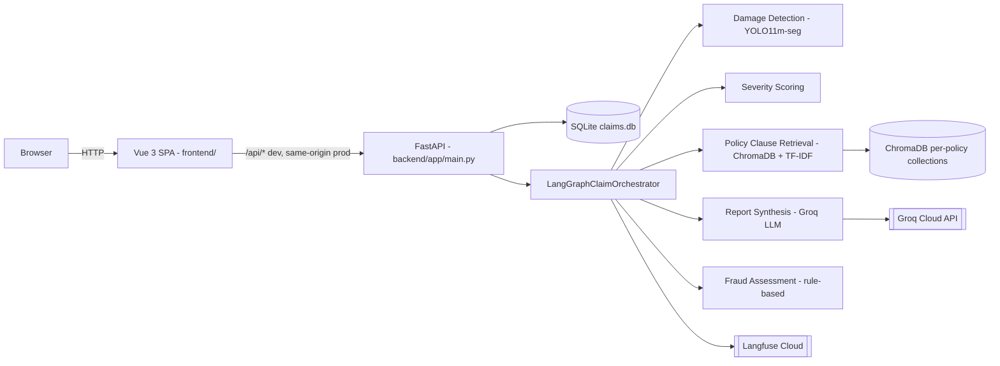
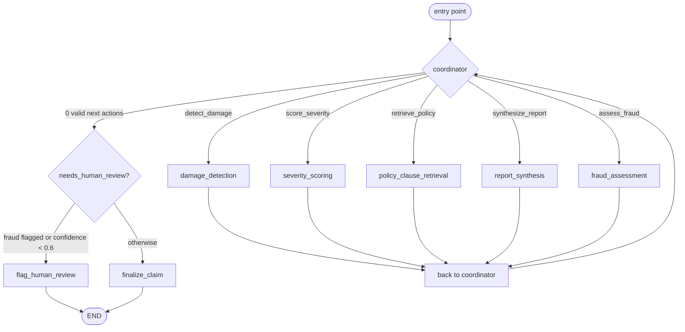

<div align="center">


<b>***Data Science & AI Lab May 2026***</b>
<br>


<h1 style="font-size:26em;">Multimodal Damage Assessment for Insurance Claims</h1>

<h2> Milestone 6: Final Project Report</h2>

<h3>Group 1</h3>

<br>

  ***Prepared by:***

  
| **Name** | **Email ID** | **GitHub Profile** |
| --- | --- | --- |
| SATYAJEET KUMAR | 23f1003132@ds.study.iitm.ac.in | [HiveCase](https://github.com/HiveCase) |
| ANUJ GAUTAM | 21f1002407@ds.study.iitm.ac.in | [anujgautam1](https://github.com/anujgautam1) |
| PRANAB KUMAR MANNA | 22f1000887@ds.study.iitm.ac.in | [pranab92](https://github.com/pranab92) |
| VENKATA SIVA KAMAL GUDDANTI | 22f2000094@ds.study.iitm.ac.in | [22f2000094](https://github.com/22f2000094) |
| HARSH PAL | 21f1002562@ds.study.iitm.ac.in | [HarshPalaps1](https://github.com/HarshPalaps1) |

</div>

---

# Table of Contents

1. [Title Page](#title-page)
2. [Abstract](#2-abstract)
3. [Introduction](#3-introduction)
4. [Literature Review (Milestone 1)](#4-literature-review-milestone-1)
5. [Dataset and Methodology (Milestones 2–3)](#5-dataset-and-methodology-milestones-23)
6. [Model Development and Hyperparameter Tuning (Milestone 4)](#6-model-development-and-hyperparameter-tuning-milestone-4)
7. [Evaluation & Analysis (Milestone 5)](#7-evaluation--analysis-milestone-5)
8. [Deployment & Documentation (Milestone 6)](#8-deployment--documentation-milestone-6)
9. [Conclusion and Future Work](#9-conclusion-and-future-work)
10. [References and Appendix](#10-references-and-appendix)

---

## 2. Abstract

Vehicle insurance claim processing is a slow, manual, and inconsistent first-pass task: an assessor reviews submitted damage photographs, cross-references a multi-page policy document, and writes a preliminary report — a workflow that does not scale well and varies assessor to assessor. This project builds an AI-assisted decision-support system that automates that initial stage. A fine-tuned YOLO11m-seg model detects and classifies visible vehicle damage (dent, scratch, crack, broken lamp, flat tyre, shattered glass) from claimant-submitted photographs; a deterministic severity scorer rates each detection; a retrieval-augmented generation (RAG) pipeline retrieves the specific clauses relevant to the detected damage from the claimant's own policy PDF; and a large language model synthesizes a structured, policy-grounded preliminary report with a recommendation and confidence score. A deterministic fraud-rule engine screens for name mismatches, expired policies, and over-limit claims, and can force human review or override an "Approve" recommendation. The five components are coordinated by a LangGraph state machine and served through a FastAPI backend and Vue 3 frontend across four role-based portals (Claimant, Adjuster, SIU, Supervisor). The damage-detection model reaches a validation mask mAP50 of 0.449 (up from 0.401 at an untuned baseline, via an Optuna hyperparameter search), and the RAG retrieval pipeline reaches a mean Precision@3 of 0.9133 against a 50-incident synthetic evaluation set. The system's proposed architecture evolved substantially between the initial project proposal and what was ultimately shipped — most notably the addition of a fraud-detection agent, a switch from GPT-4o to a Groq-hosted open-weight model, and a move from a Gradio/Hugging Face Spaces demo to a full FastAPI/Vue application deployable via Docker and Kubernetes — and this report documents that evolution honestly rather than presenting the final system as the original plan.

## 3. Introduction

### 3.1 Problem and motivation

When a vehicle is damaged, a policyholder submits photographs and an incident description; a claims assessor then manually examines the photos, identifies which policy clauses apply, and writes a preliminary assessment — a process that typically takes one to several business days and is subject to real, well-documented pain points: assessor variability, the throughput bottleneck of reviewing photos one claim at a time, the latency of manually cross-referencing multi-page policy documents, and an inability to absorb claim surges (e.g. after a hailstorm or flood) at the same pace as normal operations. India's motor insurance market alone was valued at over $10 billion in 2026, so even a modest reduction in per-claim assessment time has real operational value. Full motivation and stakeholder analysis: [`docs/Milestone1_Report.md`](docs/Milestone1_Report.md) §1–2.

### 3.2 What this project builds — and what it does not

This system automates the **initial, preliminary** stage of claim assessment only. It is explicitly **not** a final claim-decision system: every AI-generated report is reviewed by a human adjuster, whose own decision — not the AI's recommendation — is what actually changes a claim's status. Repair-cost estimation, internal/mechanical damage assessment, multi-vehicle accident scenarios, and third-party liability are all out of scope (full scope definition: `docs/Milestone1_Report.md` §1.3).

### 3.3 The originally proposed architecture

The project was proposed as a four-agent pipeline — Damage, Severity, Policy, and Report agents — coordinated (eventually) by LangGraph, with the Policy Agent exposed as a FastMCP tool and the whole system served as a Gradio app on Hugging Face Spaces:


*Figure 1 — the project's original design-phase architecture, preserved here for reference. Section 8.1 documents how this evolved by the time the system was actually built.*

### 3.4 From proposal to shipped system

This project ran across six milestones. Milestone 1 proposed the problem, literature grounding, and the initial architecture above; Milestones 2–3 prepared the data and selected the model architecture; Milestone 4 trained the damage-detection model and tuned the RAG pipeline; Milestone 5 evaluated both; this milestone (6) covers deployment and documentation of the system as it was actually built.

The system that ships **differs from the original Milestone 1–3 proposal** in several concrete ways, verified directly against this repository's source code:

| Area | Proposed (Milestones 1–3) | Actually shipped |
| --- | --- | --- |
| Orchestration | LangGraph, still listed as "planned — not implemented yet" as of Milestone 3 | A real LangGraph `StateGraph` — a coordinator node with conditional edges to each of 5 agent nodes, looping back to the coordinator |
| Agents | 4 (Damage, Severity, Policy, Report) | **5** — the same 4, plus a **Fraud Assessment** agent (deterministic rule engine) never scoped in Milestone 1 |
| Report-generation model | GPT-4o primary, Gemini 1.5 Flash fallback | **Groq-hosted `llama-3.3-70b-versatile`** (open-weight, via Groq's OpenAI-compatible API), with a deterministic non-LLM fallback if Groq is unavailable |
| Policy retrieval exposure | A FastMCP tool | An in-process LangChain `@tool`-wrapped function registry, invoked as a direct Python call — not a real MCP client/server boundary |
| User interface | Gradio, single demo page | **FastAPI REST API + Vue 3 SPA**, four separate role-based portals with login/signup |
| Deployment target | Hugging Face Spaces (CPU-basic) | Docker Compose (local dev) / single production container / Kubernetes manifests for GKE |

This is presented plainly rather than smoothed over: the milestone reports remain the accurate historical record of what was planned, trained, and evaluated; this report's Section 8 and the accompanying `README.md`/`Comprehensive_Technical_Documentation.md` describe what is actually running today. The gap itself is a legitimate finding — it reflects real engineering constraints (Groq's free tier vs. paid GPT-4o access; a full application proving more useful for a 4-portal claims workflow than a single-page Gradio demo; a genuine fraud-detection gap identified after the original proposal) rather than scope creep for its own sake. Section 8.1 shows the actual, as-built architecture side by side with Figure 1 above.

---

## 4. Literature Review (Milestone 1)

*Full literature review, comparison tables, and all 21 references: [`docs/Milestone1_Report.md`](docs/Milestone1_Report.md) §3, §12. Summarized here.*

Vehicle damage detection has been studied since at least 2017, when Patil et al. showed CNNs could distinguish damaged from undamaged vehicles on small datasets; the field has since moved from binary classification toward localisation and type classification, with YOLO-series models becoming dominant for their speed/accuracy trade-off. Published work fine-tuning YOLOv8/YOLO11/YOLO11-variants on vehicle-damage datasets reports mAP@50 in the 0.71–0.81 range depending on dataset and class set; Mask R-CNN offers higher segmentation fidelity at significantly greater compute cost; the CarDD dataset (USTC, 2023) established a pixel-level segmentation benchmark this project's comparative track later drew on directly (§6).

Retrieval-Augmented Generation (Lewis et al., NeurIPS 2020) grounds LLM outputs in retrieved document context to reduce hallucination — directly relevant here, since an ungrounded LLM asked about insurance coverage will fabricate plausible-sounding but incorrect entitlements. Prior RAG literature informed three concrete design choices later validated empirically in this project (§5, §7): small chunk sizes (200–400 tokens) for precise clause-level recall, bi-encoder embedding models over sparse BM25 for semantic matching, and explicit source attribution to reduce hallucination.

Industry systems (Tractable, CCC Intelligent Solutions, Mitchell) already deploy vision-based damage assessment in production, but published technical detail is limited by proprietary constraints, and none combine vision detection, policy-grounded retrieval, and LLM report generation into one accessible, open pipeline — the specific gap this project targets. A comparison against modern end-to-end Vision-Language Models (Florence-2, Qwen2.5-VL, LLaVA, GPT-4V) concluded a **modular** YOLO + RAG + LLM architecture was better suited to this project's goals than a monolithic VLM: modular components are independently debuggable and measurable against ground truth (a VLM's free-text damage description isn't directly comparable to bounding-box annotations), and a small fine-tuned YOLO model is far cheaper to host than a large VLM (full rationale: `docs/Milestone1_Report.md` §3.4).

The project's stated contribution was explicitly **not** a new model architecture, but (1) an accessible, deployable end-to-end pipeline, (2) the specific integration of YOLO detections with policy-grounded LLM generation, and (3) a deliberately scoped, reproducible benchmark for the preliminary-assessment task (three-category severity, visible damage only, all conclusions grounded in retrieved policy text).

---

## 5. Dataset and Methodology (Milestones 2–3)

*Full dataset preparation, EDA, licensing checks, and architecture-selection rationale: [`docs/Milestone2_Report.md`](docs/Milestone2_Report.md) and [`docs/Milestone3_Report.md`](docs/Milestone3_Report.md). Summarized here.*

### 5.1 Vision dataset

**VehiDE** (Kaggle, Apache-2.0 license) — 13,945 images, 36,081 raw annotated instances across 7 native (Vietnamese-labelled) classes, remapped to this project's 6-class taxonomy (`scratch`, `dent`, `crack`, `broken_lamp`, `flat_tyre`, `shattered_glass`; the native `lost_parts` class was dropped as it has no visible-damage equivalent). After preprocessing — corrupt-file check (0 found), exact-duplicate removal (18 images, MD5) and near-duplicate removal (272 images, perceptual hash), and a PII scan (0 faces/plates flagged) — **13,655 images / 32,672 instances** remained, split 70/15/15 (stratified, seed 42) into train/validation/test.

The class distribution is significantly imbalanced:


*Figure 2 — `scratch` accounts for 44.0% of instances, `shattered_glass` only 6.7% — a 6.59:1 ratio between the largest and smallest class. This imbalance is a real, unresolved factor in the model's per-class performance (§7).*

Images were letterboxed to 1,280×1,280 (a data-driven choice — the instance-weighted mean source resolution was ~1,395px on the long axis, well above the common 640px default). Damage instances also co-occur within a single photo more often than not:


*Figure 3 — 24.6% of images contain 4 or more co-occurring damage instances; `scratch` co-occurs most frequently with every other class. Full EDA (bounding-box area/aspect-ratio distributions, spatial distribution of damage centres): `docs/Milestone2_Report.md` §5, all plots in [`docs/eda_outputs/plots/`](docs/eda_outputs/plots/).*

A documented ethics consideration: VehiDE was collected primarily in Vietnam/Southeast Asia, whose vehicle fleet, damage patterns (e.g. monsoon-related oxidation, pothole damage common in India), and claimant photography style differ from the target Indian deployment context — a domain-shift risk carried forward into Milestone 5's evaluation discussion (`docs/Milestone2_Report.md` §4.4).

### 5.2 Policy document corpus

No public dataset pairs insurance policy documents with vehicle-damage annotations. Two publicly available IRDAI-registered policy wordings (Universal Sompo, United India) were used **only as structural reference**; the actual RAG corpus is **five fully team-authored synthetic policy PDFs**, each explicitly marked "for research and educational use only. Not a valid insurance contract." An 8-word n-gram overlap check against the two reference documents found no distinctively-worded clause reproduced wholesale — only IRDAI-standard regulatory boilerplate overlaps (`docs/Milestone2_Report.md` §2.2). The five policies were deliberately varied in phrasing, distractor-clause density (≥5 distractor clauses per damage class per policy), and structural format (numbered lists vs. tables) specifically to stress-test the retrieval pipeline rather than make it artificially easy.

Chunking: `pdfplumber` full-page extraction → structure-aware splitting (300 characters / 40-character overlap) that keeps each clause's governing heading as a prepended "breadcrumb" (found, during development, to meaningfully improve retrieval precision — a chunk without its governing heading carries no textual signal that it is, say, an exclusion) → embedded with `all-MiniLM-L6-v2` → indexed in ChromaDB. Result: **185 chunks**, auto-tagged by damage class and clause type.

### 5.3 Architecture selection

Four candidate architectures were evaluated for the Damage Agent (`docs/Milestone3_Report.md` §5.1): YOLO11-seg was selected over Mask R-CNN (higher compute cost), DETR (needs substantially more training data/epochs than this project's compute budget allowed), and SSD (consistently lower mAP on small/occluded objects in published benchmarks) — for its combination of detection accuracy, native segmentation-head support, training speed on available hardware, and deployment ecosystem maturity.

For the Policy Agent, `all-MiniLM-L6-v2` was selected over the larger BGE-small/MPNet/E5 embedding models (marginal retrieval gains at 3–5× the parameter count, not justified at this corpus's scale) and ChromaDB over raw FAISS (FAISS's raw speed advantage — roughly 50–60× lower per-query latency — is not operationally meaningful at 185 chunks, and ChromaDB provides persistent storage and metadata filtering out of the box). Full benchmarking numbers for both decisions: `docs/Milestone2_Report.md` §6.2 Step 3, [`docs/RAG_Component.md`](docs/RAG_Component.md) §1.

---

## 6. Model Development and Hyperparameter Tuning (Milestone 4)

*Full experiment log (7 hyperparameter experiments, 2 model-scale probes), training curves, and challenges encountered: [`docs/Milestone4_Report.md`](docs/Milestone4_Report.md). Summarized here, cross-checked against [`docs/Milestone5_Report.md`](docs/Milestone5_Report.md) and against the actual executed training notebook, [`notebook/Yolov11m_Training&HyperparameterTuning.ipynb`](notebook/Yolov11m_Training&HyperparameterTuning.ipynb) — every number below is read directly from that notebook's own cell output, not just cited secondhand.*

The **selected checkpoint** is YOLO11m-seg, fine-tuned from a COCO-pretrained base, with hyperparameters found via a 12-trial Optuna search (TPE sampler):

| Setting | Value |
| --- | --- |
| Epochs | 40 |
| Training time | **5.887 hours** for the final tuned run (notebook: `"40 epochs completed in 5.887 hours"`), plus ~9.6 hours for the 12-trial Optuna search that preceded it |
| Batch size | 8 |
| Image size | 640×640 |
| Optimizer | AdamW |
| Learning rate (`lr0`) | 0.0001047 |
| Weight decay | 0.000292 |
| Rotation augmentation | 5.5° |
| Loss | Composite YOLO loss (CIoU box, BCE classification, DFL, segmentation mask) |
| Hardware | Tesla T4, 15.6GB VRAM, Google Colab |

The Optuna search itself surfaced a real methodological bug worth documenting: an earlier search pass used `optimizer="auto"`, which Ultralytics silently uses to **ignore** any explicitly-passed `lr0` — so that first search varied `lr0` in name only, every trial training at the same fixed rate. This was found by inspecting the optimizer-initialisation line in each trial's training log and corrected by explicitly setting `optimizer="AdamW"`. The corrected 12-trial search then revealed a clear, near-monotonic relationship between `lr0` and validation mAP: performance peaked in the `lr0 ≈ 5×10⁻⁵–1.3×10⁻⁴` band and degraded steadily above it, collapsing to roughly a quarter of peak performance above `lr0 ≈ 4×10⁻³` — explaining why the untuned baseline (which had been fixed at `lr0=0.001` by the same `optimizer="auto"` bug) underperformed. All 12 trials' logged results match exactly between the notebook and `docs/Milestone5_Report.md` §7, including the winning trial (trial 7: `lr0=0.0001047`, 5-epoch proxy mask mAP50 = 0.3511).

**A dataset-provenance discrepancy worth stating plainly**: the notebook downloads its training data from the Kaggle handle `m4rcuseryx/vehide-segmentation-dataset` — a pre-built, YOLO-segmentation-format package — not the `hendrichscullen/vehide-dataset-automatic-vehicle-damage-detection` source cited in `docs/Milestone2_Report.md`. The notebook's own counts (13,639 images; 9,545/2,047/2,047 train/val/test) are close to but not identical to Milestone 2's reported 13,655 images / 9,558/2,048/2,049 split. Both are genuine VehiDE-derived artifacts; this repository does not contain enough evidence to determine whether they're the same underlying data repackaged or a materially different snapshot, so the discrepancy is reported here rather than silently resolved.


*Figure 4 — the tuned run improves on **every** reported metric with no regression. Only `lr0` and a small amount of rotation augmentation differ between the two runs — epochs, batch size, dataset, and seed are held constant — supporting attribution of the gain to the hyperparameter correction itself rather than to random variation.*

**Comparative benchmark track**: as a separate experiment (not the production candidate), a YOLOv8s-seg model fine-tuned from a **CarDD-pretrained** checkpoint was trained across three stages (30 baseline epochs → 20 augmentation epochs → 30 DFL-reweighting epochs, 80 total), reaching **test-split mask mAP50 = 0.3549**. This used a different backbone generation/scale and a held-out test split (not validation), so it is not directly comparable to the primary track's numbers — but its comparatively strong result, attributable substantially to CarDD's domain-specific (vs. generic COCO) pretraining, is carried forward as a concrete recommendation for future work (§9): apply the same domain-pretraining strategy to the already-selected YOLO11m-seg architecture, rather than switching architectures to chase this track's benchmark numbers.

No evidence of overfitting was observed in any completed run — validation loss tracked training loss in the same direction throughout every run, and Ultralytics' early-stopping patience (15–20 epochs) never triggered, meaning every completed run used its full configured epoch budget productively.

Two documented engineering challenges shaped which experiments were completed: Kaggle's free-tier GPU quota required building a custom multi-session checkpoint-relay mechanism after an unplanned session termination lost an entire ~25-epoch run mid-training, and an attempted P100 GPU session failed outright with a CUDA kernel-compatibility error against the installed PyTorch build (resolved by switching back to a T4). Full detail: `docs/Milestone4_Report.md` §11.

---

## 7. Evaluation & Analysis (Milestone 5)

*Full per-class breakdown, error analysis, and RAG evaluation: [`docs/Milestone5_Report.md`](docs/Milestone5_Report.md) and [`docs/RAG_Component.md`](docs/RAG_Component.md). Summarized here.*

**⚠️ This section, consistent with Milestone 5's own stated position, should be read as provisional.** All headline numbers below are **validation-split**, not test-split, results — Milestone 5 explicitly flags a held-out test-split evaluation, confusion matrix, and image-quality robustness check as prepared but not executed at the time that report was written. This report carries that caveat forward rather than presenting the numbers as final.

### 7.1 Damage detection


*Figure 5 — the central finding of this milestone: class-instance count does not predict per-class performance. `scratch` has the most training instances of any class (10,070) yet is among the worst-performing; `shattered_glass` has the fewest (1,513) yet performs best by a wide margin (2.7× `scratch`'s score).*

This ranking reproduces **identically** across two independently trained tracks — the primary COCO-pretrained model and the comparative CarDD-pretrained model, trained on different platforms with different hyperparameters — which is strong corroborating evidence that the pattern reflects an intrinsic property of the damage types (shattered glass has a strong, unambiguous visual signature; dents and scratches are subtle, low-contrast, and easily confused with ordinary panel reflections) rather than an artifact of either track's specific setup.

### 7.2 Policy retrieval (RAG)


*Figure 6 — mean Precision@3 of 0.9133 against a 50-synthetic-incident evaluation set, a 5.59× lift over a random-retrieval baseline, with 0 zero-hit incidents. Mean Reciprocal Rank@5 = 0.9767; deterministic faithfulness composite (10 claims) = 1.00; RAGAs `context_precision` (independent LLM judge) = 0.832.*

A real retrieval bug was found and fixed during this evaluation work: for one test claim, `crack` and `broken_lamp` items were being marked as covered by citing an unrelated tyre-damage clause, because the policy's actual general coverage clause was never surfaced for those classes. The fix — adding a class-agnostic general-coverage query merged into each class-specific retrieval — was verified against the live corpus and swept across all 5 policies × 6 damage classes, with every bucket afterward returning a non-empty, correct coverage set. An 84-configuration parameter sweep (chunk size, RRF weighting, candidate-pool size, dedup threshold) additionally found the retrieval pipeline notably robust to its own tuning knobs: only one of 15 tested configurations (sparse-only retrieval) was statistically distinguishable from the production configuration, and it was worse. Full detail, including an explicit caveat that one post-fix re-measurement also involved an unrelated generator-model swap (forced by a Groq quota exhaustion) and so cannot cleanly isolate the retrieval fix's effect in that specific comparison: `docs/RAG_Component.md` §2–3.

### 7.3 Report generation faithfulness

RAGAs LLM-judged evaluation (`gemini-2.5-flash` as an independent judge, scoring neither generator model's own output) against hand-written reference verdicts: `llama-3.3-70b-versatile` scored 0.630 faithfulness / 0.524 answer-correctness. These sit well below the deterministic citation-bookkeeping checks (which scored a perfect 1.00 composite) by design — the deterministic checks verify a cited clause exists and matches its claimed type; the RAGAs layer actually judges whether the generated prose is entailed by the clause text against an independently-derived correct answer (7 of 14 hand-written reference verdicts disagreed with what the models actually produced, confirming this is a genuine, non-circular check).

### 7.4 Limitations

- All numbers in §7.1 are validation-split, not test-split (see the caveat above).
- The synthetic evaluation set (50 incidents, 10 detailed RAGAs claims) is small; Milestone 5 itself notes that at this sample size, mean Precision@3 can only move in increments of ~0.0067, meaning the *evaluation set size*, not the retrieval configuration, is often the binding constraint on measured precision.
- A confusion matrix, qualitative failure-case gallery, and an image-quality robustness check (synthetic blur/brightness perturbation) were prepared but not executed at the time `docs/Milestone5_Report.md` was written.
- The class-imbalance and dent/scratch/crack visual-distinguishability gap identified in §7.1 was not resolved by any single-milestone intervention (augmentation, DFL-loss reweighting) attempted so far.

---

## 8. Deployment & Documentation (Milestone 6)

This section covers what was actually built and verified in this milestone — no gaps or pending items here, unlike §4–7.

### 8.1 What was built

**The as-built architecture**, verified directly against source, is what actually runs today — shown here alongside Figure 1 (§3.3) for direct comparison:


*Figure 7 — the actual, verified data flow: a full FastAPI + Vue 3 application, five agents (Fraud Assessment added), Groq instead of GPT-4o, no Gradio/Hugging Face Spaces.*


*Figure 8 — the LangGraph coordinator loop. A graph-wiring defect was found and fixed during this milestone: the coordinator and a `tool_execution` dispatcher node were originally the only nodes connected by real graph edges — the five agent methods were registered as LangGraph nodes but never reachable via any edge; `tool_execution` called the matching agent as a plain Python function instead. This was rewired so the coordinator's conditional edge routes **directly** to each of the 5 agent nodes, each looping back to the coordinator — matching LangGraph's own execution trace/checkpointing to the system's actual behavior. Verified via the existing 52-test backend suite plus an updated graph-topology assertion.*

Also built this milestone:

- **Authentication wired into the frontend.** Signup/login (`POST /auth/signup`, `POST /auth/login`) existed as standalone backend infrastructure with no frontend page and no route guards. This milestone added a Login/Signup UI, a router guard redirecting unauthenticated visitors to `/login` (and authenticated visitors away from `/login`/`/signup`), and a seeded default admin account (`admin@gmail.com` / `admin`) created idempotently on first startup.
- **Deployment packaging**: a `Dockerfile` (multi-stage — builds the Vue frontend, serves it from the FastAPI image), `docker-compose.yml` for local development, and Kubernetes manifests (`k8s/`) with a GitHub Actions CI/CD pipeline (`.github/workflows/deploy-gke.yml`) that builds, Trivy-scans, pushes to Artifact Registry, and deploys via `kubectl` with an automatic rollback on a failed smoke test.
- **This documentation set** — the root `README.md`, this report, and `Comprehensive_Technical_Documentation.md` (Overview, Technical Documentation, User Documentation, API Documentation, Licensing & Dataset References, Future Work), plus a `LICENSE` file (MIT) added for the first time this milestone.

### 8.2 Deployment status

**No live public deployment is currently running.** The GKE CI/CD pipeline is built and functional but requires a real GCP project/cluster to actually execute against — that is an operational step for whoever owns those cloud resources, not something this repository stands up on its own. The verified, reproducible way to run this system today is local:

```bash
docker compose up --build
```
or, for the production-style single-container image:
```bash
docker build -t claims-portal .
docker run --rm -p 8000:8000 -v ${PWD}/.local-data:/data claims-portal
```

Full deployment detail (ports, known limitations, manual `kubectl` commands): [`Comprehensive_Technical_Documentation.md`](Comprehensive_Technical_Documentation.md) §B7, [`docs/gke-cicd.md`](docs/gke-cicd.md).

### 8.3 The application, in use

The four portals as actually running, driven end-to-end (a real claim submitted with a real photo, analyzed by the live pipeline, and reviewed by an adjuster):


*Figure 9 — the four role-based portals behind a single login.*


*Figure 10 — the Adjuster dashboard, showing a real submitted claim with its AI-annotated damage photo, after the full LangGraph pipeline (Figure 8) ran end-to-end against it. Full screenshot walkthrough of all four portals: [`Comprehensive_Technical_Documentation.md`](Comprehensive_Technical_Documentation.md) §C.*

### 8.4 API surface

14 REST endpoints across auth, policy lookup, claim submission/review/decisioning, SIU investigation actions, and supervisor analytics — full reference with verified request/response shapes: [`Comprehensive_Technical_Documentation.md`](Comprehensive_Technical_Documentation.md) §D.

### 8.5 Inputs and outputs, concretely

**Input**: a claim submission (`POST /claims`) — policy number, claimant name, contact info, incident date/description, claimed amount, and 1–5 damage photos.

**Output**, within seconds (real Groq call) to a few minutes (rate-limited or on a cold start), via `GET /claims/{id}/detail`: detected damage regions with class/confidence, an overall severity label, the specific policy clauses retrieved with source citations, a recommendation (Approve/Investigate/Deny) with a stated reason and confidence score, a fraud score, and a `needs_human_review` flag — exactly as shown for the real claim in Figure 10 above.

---

## 9. Conclusion and Future Work

This project set out to automate the initial, preliminary stage of vehicle-insurance damage assessment — not to replace human adjusters — and delivered a working, five-agent, LangGraph-coordinated pipeline that detects damage (validation mask mAP50 0.449), retrieves policy-grounded coverage clauses (mean P@3 0.9133), generates a structured recommendation, and screens for fraud signals, all served through a four-portal web application with reproducible local and containerized deployment paths. The project's own most consistent, cross-validated finding — that `dent`/`scratch`/`crack` detection difficulty is an intrinsic property of those damage types' low visual distinguishability, not an artifact of dataset size or training configuration, reproducing identically across two independently trained model tracks (Figure 5) — is arguably as valuable a result as the headline metrics themselves, since it directly informs where future effort should (and should not) go.

**Recommended future work**, prioritized by what the evaluation evidence in §7 actually points to:

1. **Apply CarDD-style domain-specific pretraining to the selected YOLO11m-seg architecture.** The comparative benchmark's stronger result is attributable to domain pretraining, not architecture choice — this is the most evidence-backed next step, not a speculative one.
2. **Complete the pending test-split evaluation, confusion matrix, and robustness checks** flagged as provisional in Milestone 5 — the current validation-only numbers should not be treated as final.
3. **Wire the existing `user`/`admin` role into actual per-portal access control** — currently captured at signup but not used for authorization anywhere.
4. **Add a LangGraph checkpointer** so a mid-analysis process restart can resume a claim rather than force resubmission.
5. **Move off SQLite/local-disk ChromaDB** (Postgres + a shared/hosted vector store) before attempting to scale beyond a single replica.

**Known limitations, stated plainly**: this system has never been evaluated against real (non-synthetic) insurance policy documents or real claimant-submitted photos; the fraud model is a hand-written rule engine, not a trained classifier; Ultralytics YOLO's AGPL-3.0 license carries real obligations for any commercial deployment of this system (§10.2, `Comprehensive_Technical_Documentation.md` §E); and — as documented plainly throughout this report — the shipped system diverges from the original Milestone 1 proposal in several material ways (§3.4, Figures 1 vs. 7). None of these are hidden; they are the honest starting point for whoever continues this work.

---

## 10. References and Appendix

### 10.1 Software, library, and model citations

- G. Jocher et al., "YOLO by Ultralytics," Zenodo, 2023, doi:10.5281/zenodo.7347926.
- N. Reimers and I. Gurevych, "Sentence-BERT: Sentence Embeddings using Siamese BERT-Networks," EMNLP-IJCNLP 2019.
- P. Lewis et al., "Retrieval-Augmented Generation for Knowledge-Intensive NLP Tasks," NeurIPS 2020.
- H. Scullen, "VehiDE: Vehicle Damage Detection Dataset," Kaggle, 2023.
- S. Wang et al., "CarDD: A New Dataset for Vision-Based Car Damage Detection," USTC, 2023.

Full pinned software/library dependency list with individual licenses (FastAPI, LangGraph, ChromaDB, Groq/Llama-3.3, Vue, PrimeVue, etc.): [`Comprehensive_Technical_Documentation.md`](Comprehensive_Technical_Documentation.md) §E.

### 10.2 Full academic reference list

The complete 21-entry literature review reference list (vehicle damage detection, RAG, insurance-AI, and VLM literature) is in [`docs/Milestone1_Report.md`](docs/Milestone1_Report.md) §12 and is not reproduced here in full, consistent with this report's practice of summarizing and citing rather than duplicating the milestone reports (§4 above).

### 10.3 Licensing summary

This repository's original code is MIT-licensed (`LICENSE`). The damage-detection model depends on **Ultralytics YOLO (AGPL-3.0)** — a real licensing consideration for any deployment beyond this academic context, since AGPL-3.0's network-use clause would require this application's full source to be released under AGPL-3.0 unless an Ultralytics Enterprise license is obtained instead. VehiDE (Apache-2.0), the two IRDAI reference policy documents (public regulatory filings, structural reference only), and the five team-authored synthetic policy PDFs (team-owned) are all detailed with their exact usage terms in [`Comprehensive_Technical_Documentation.md`](Comprehensive_Technical_Documentation.md) §E.

### 10.4 Appendix — figures index

| Figure | Content |
| --- | --- |
| 1 | Originally proposed architecture (Milestones 1–3) |
| 2 | VehiDE class distribution |
| 3 | Instances-per-image and class co-occurrence |
| 4 | Baseline vs. Optuna-tuned validation metrics |
| 5 | Per-class mask mAP50 |
| 6 | RAG retrieval precision vs. random baseline |
| 7 | As-built system architecture |
| 8 | LangGraph coordinator loop |
| 9 | Portal selection screen (live app) |
| 10 | Adjuster dashboard with a real analyzed claim (live app) |

Additional diagrams not reproduced in-line: [`docs/multimodal_damage_assessment_architecture.svg`](docs/multimodal_damage_assessment_architecture.svg); full 8-screenshot UI walkthrough: [`Comprehensive_Technical_Documentation.md`](Comprehensive_Technical_Documentation.md) §C.

### 10.5 Appendix — full API reference

[`Comprehensive_Technical_Documentation.md`](Comprehensive_Technical_Documentation.md) §D — all 14 endpoints with verified request/response examples.

### 10.6 Appendix — presentations

Per-milestone technical presentations: [`docs/Presentation/`](docs/Presentation/) (Milestones 1–5).

### 10.7 Appendix — training notebook

The actual executed training and hyperparameter-tuning run behind §6's numbers: [`notebook/Yolov11m_Training&HyperparameterTuning.ipynb`](notebook/Yolov11m_Training&HyperparameterTuning.ipynb) (Google Colab, Tesla T4). Every hyperparameter, epoch count, and metric reported in §6 was cross-checked directly against this notebook's own cell output rather than taken solely from `docs/Milestone4_Report.md`/`docs/Milestone5_Report.md`.

---

***Declaration:***

I have read and reviewed this submission in its entirety and confirm that it accurately represents the work of our group. By entering my initials and the date below, I acknowledge my approval of this submission.

| Name | Date of Review | Sign |
|---|---|---|
| Satyajeet Kumar |  |  |
| Pranab Kumar Manna |13-08-2026 | PK Manna |
| Venkata Siva Kamal Guddanti | | |
| Anuj Gautam | |  |
| Harsh Pal | | |

---
Demo Video : [https://drive.google.com/file/d/1GixhfgLSFee5t9_m8pY_c1VvJ23hkR1j/view?usp=drive_link](url)
