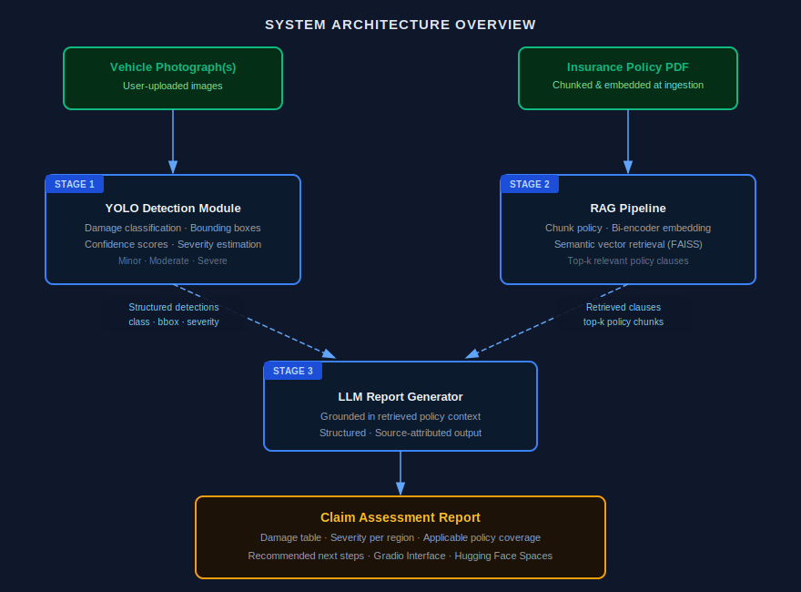

---

<b>***Data Science & AI Lab May 2026***</b>
 

<h1 style="font-size:26em;">Multimodal Damage Assessment for Insurance Claims</h1>

<h2>Milestone 1: Problem Definition & Literature Review</h2>

<h3>Group 1</h3>

 

  ***Prepared by:***

  
| **Name** | **Email ID** | **GitHub Profile** |
| --- | --- | --- |
| SATYAJEET KUMAR | 23f1003132@ds.study.iitm.ac.in | [HiveCase](https://github.com/HiveCase) |
| ANUJ GAUTAM | 21f1002407@ds.study.iitm.ac.in | [anujgautam1](https://github.com/anujgautam1) |
| PRANAB KUMAR MANNA | 22f1000887@ds.study.iitm.ac.in | [pranab92](https://github.com/pranab92) |
| VENKATA SIVA KAMAL GUDDANTI | 22f2000094@ds.study.iitm.ac.in | [22f2000094](https://github.com/22f2000094) |

---

# Table of Contents

- [1. Problem Statement](#1-problem-statement)
  - [1.1 What problem are we solving?](#11-what-problem-are-we-solving)
  - [1.2 Who are the stakeholders?](#12-who-are-the-stakeholders)
  - [1.3 Scope Definition](#13-scope-definition)
- [2. Problem Motivation](#2-problem-motivation)
- [3. Existing Solutions and Prior Research](#3-existing-solutions-and-prior-research)
  - [3.1 Computer Vision Approaches to Vehicle Damage Detection](#31-computer-vision-approaches-to-vehicle-damage-detection)
  - [3.2 Retrieval-Augmented Generation (RAG) for Document Understanding](#32-retrieval-augmented-generation-rag-for-document-understanding)
  - [3.3 Multimodal Insurance AI - Industry and Academic Work](#33-multimodal-insurance-ai---industry-and-academic-work)
  - [3.4 Comparison of Modern VLMs and a Modular YOLO + RAG + LLM Architecture](#34-comparison-of-modern-vlms-and-a-modular-yolo--rag--llm-architecture)
  - [3.5 Literature Comparison Summary](#35-literature-comparison-summary)
- [4. Metrics and Success Definitions](#4-metrics-and-success-definitions)
  - [4.1 Vision Model Metrics](#41-vision-model-metrics)
  - [4.2 RAG Pipeline Metrics](#42-rag-pipeline-metrics)
  - [4.3 End-to-End and Usability Metrics](#43-end-to-end-and-usability-metrics)
- [5. Gaps in Existing Solutions](#5-gaps-in-existing-solutions)
- [6. Nature of Our Contribution](#6-nature-of-our-contribution)
- [7. System Architecture Overview](#7-system-architecture-overview)
- [8. Evaluation Plan](#8-evaluation-plan)
  - [8.1 Vehicle Damage Detection](#81-vehicle-damage-detection)
  - [8.2 Policy Retrieval](#82-policy-retrieval)
  - [8.3 Generated Claim Reports](#83-generated-claim-reports)
- [9. Dataset Plan](#9-dataset-plan)
  - [9.1 Vision Datasets](#91-vision-datasets)
  - [9.2 Synthetic Data](#92-synthetic-data)
- [10. Expected Challenges and Project Risks](#10-expected-challenges-and-project-risks)
  - [10.1 Dataset Imbalance](#101-dataset-imbalance)
  - [10.2 Severity Estimation Reliability](#102-severity-estimation-reliability)
  - [10.3 Domain Shift Between Training Data and Real Claims](#103-domain-shift-between-training-data-and-real-claims)
  - [10.4 RAG Faithfulness with Synthetic Policies](#104-rag-faithfulness-with-synthetic-policies)
  - [10.5 LLM Hallucination on Edge Cases](#105-llm-hallucination-on-edge-cases)
- [11. References](#11-references)

---

## 1. Problem Statement

### 1.1 What problem are we solving?

Insurance claim processing for vehicle damage is a slow, labour-intensive, and inconsistent process. When a vehicle is damaged, a claim assessor must manually examine submitted photographs, cross-reference the relevant sections of the policyholder's insurance document, and produce a written preliminary assessment report - a workflow that is both time-consuming and susceptible to inter-assessor variability.

This project builds an AI-powered decision-support system that automates the initial stage of this assessment pipeline.

### 1.2 Who are the stakeholders?

| **Stakeholder** | **Type** | **Interest in the system** |
| --- | --- | --- |
| Insurance claim assessors | Primary | Faster, consistent first-pass reports; reduced repetitive manual work |
| Insurance companies | Primary | Reduced processing time per claim; standardised initial assessments |
| Policyholders (vehicle owners) | Secondary | Faster claim decisions; transparent, traceable damage documentation |

### 1.3 Scope Definition

**In Scope**

- Detection and localisation of visible vehicle damage from uploaded photographs using a fine-tuned YOLO object detection model.

- Classification of damage into types: dent, scratch, crack, broken lamp, flat tyre, shattered glass.

- Severity estimation per detected damage region, categorised as Minor, Moderate, or Severe, based on the proportion of the damaged area relative to the vehicle surface visible in the image.

- Retrieval of relevant insurance policy clauses from a user-provided policy PDF using a RAG pipeline.

- LLM-generated preliminary claim assessment report containing: detected damage summary table, estimated severity per damage, applicable policy coverage, and recommended next steps for the assessor.

- A Gradio-based web interface accessible via Hugging Face Spaces for live demonstration.

**Out of Scope**

- Final claim approval or rejection: The system produces a preliminary report only, all final decisions remain with a qualified human assessor.

- Repair costs depend on numerous variables such as vehicle make, model, manufacturing year, spare-part prices, labour rates, geographic location of service centre, and other policies none of which are determinable from photographs alone. Hence the final repair cost estimation is out of scope of this project.

- Detection of damage not visible in photographs such as internal mechanical damage, frame damage or anything that requires expertise is out of scope for this project.

- Synthetic policy will be used throughout the project due to the proprietary nature of real insurer documents.

- Multi-vehicle accident scenarios, fraud detection, or third-party liability assessment are out of scope for this project.

---

## 2. Problem Motivation

Vehicle insurance is one of the largest lines of general insurance globally. In India alone, the motor insurance market was valued at over $10 billion in 2026 and continues to grow rapidly and is expected to cross $15 billion by 2031 [13]. Despite this scale, the claims assessment process remains heavily manual at its initial stage.

After a vehicle is damaged, the policyholder submits photographs and a written incident description through an insurer's app or portal. A claims assessor then reviews this submission, identifies the relevant policy sections, and writes a preliminary report. This process typically takes one to several business days [14]. Several pain points are well-documented in the insurance technology literature:

- **Throughput bottleneck:** A single assessor may handle dozens of claims per day. Manual photo review for each claim is the largest time cost in the pipeline.

- **Assessor variability:** Two assessors examining identical photographs may classify damage severity differently, leading to inconsistent outcomes for policyholders.

- **Policy cross-referencing:** Identifying which policy clauses apply to a given damage type requires reading through multi-page policy documents repeatedly, creating additional latency.

- **Scalability:** Surge events such as hailstorms or floods produce claim volumes that cannot be absorbed at the same pace as normal operations.

Automating the initial assessment stage addresses all four pain points simultaneously, and does so in a setting where the consequences of an error are bounded. The system outputs a preliminary report reviewed by a human, not a final binding decision. This makes it an appropriate and high-impact application for AI-assisted decision support.

---

## 3. Existing Solutions and Prior Research

### 3.1 Computer Vision Approaches to Vehicle Damage Detection

Vehicle damage detection has been an active research topic since at least 2017. The foundational work by [Kalpesh Patil (2017)](https://ieeexplore.ieee.org/document/8260613) demonstrated that convolutional neural networks could distinguish damaged from undamaged vehicles with reasonable accuracy on small datasets. Subsequent work shifted from binary classification toward damage localisation and type classification.

YOLO-series models (You Only Look Once) have become the dominant architecture for this task due to their speed and accuracy trade-off. Multiple published studies have fine-tuned YOLOv5, YOLOv8, and YOLOv11 on vehicle damage datasets:

- **YOLOv8 for damage segmentation:** A 2024 IEEE study trained YOLOv8 on a dataset of over 4,000 high-resolution vehicle images annotated with 21 car part classes and 8 damage type classes, achieving strong [mAP scores](https://jonathan-hui.medium.com/map-mean-average-precision-for-object-detection-45c121a31173) for both part and damage segmentation simultaneously.

- **HL-YOLO:** A 2025 MDPI Vehicles paper proposed HL-YOLO, a heterogeneous convolution variant of YOLO11, reporting gains of 2.5% precision, 5.8% recall, and approximately 3-4% mAP over the YOLO11 baseline on vehicle damage detection.

- **Mask R-CNN:** He et al.'s Mask R-CNN (ICCV 2017) has been applied in a two-stage pipeline: first segmenting the vehicle body, then classifying damage within detected regions. This achieves higher segmentation fidelity but at significantly greater computational cost.

- **CarDD dataset paper:** The CarDD dataset (USTC, 2023) introduced pixel-level damage annotations across six damage categories and served as a benchmark for segmentation-based damage models.

### 3.2 Retrieval-Augmented Generation (RAG) for Document Understanding

Lewis et al. (2020, NeurIPS) introduced RAG as a framework for grounding LLM outputs in retrieved document context, reducing hallucination in knowledge-intensive tasks. Since then, RAG has been applied extensively to legal, medical, and financial document understanding domains closely analogous to insurance policy retrieval.

Key findings from RAG literature relevant to this project:

- **Chunk size matters:** Smaller chunks (200-400 tokens with overlap) consistently outperform large-chunk retrieval for precise clause-level recall in legal documents.

- **Embedding model choice:** Bi-encoder models (e.g., MiniLM-L6-v2, MPNet) outperform BM25 sparse retrieval for semantic matching of insurance-style queries.

- **Faithfulness is critical:** Without explicit grounding, LLMs hallucinate coverage entitlements. RAG with source attribution substantially reduces this problem (ES-RAG, 2024).

### 3.3 Multimodal insurance AI - industry and academic work

Several insurtech companies (Tractable, CCC Intelligent Solutions, Mitchell) have deployed computer vision systems for vehicle damage assessment in production. Published technical details are limited due to proprietary constraints, but disclosed capabilities include:

- Automated identification of damaged parts (hood, door, bumper) from photographs.

- Integration with repair cost databases using vehicle VIN and local labour rates which is outside the scope of this project.

- Human-in-the-loop review for all final decisions.

Academic work combining vision and language for insurance is sparse. The closest published analogues are medical report generation systems (e.g., MIMIC-CXR radiology report generation using vision-language models), which share the similar structure as this project: a vision model produces detections, and an LLM generates a structured natural-language report grounded in those detections. This project adapts that paradigm to the vehicle damage domain.

### 3.4 Comparison of Modern VLMs and a Modular YOLO + RAG + LLM Architecture

Recent multimodal Vision Language Models (VLMs) such as Florence-2 [15], Qwen2.5-VL [16], LLaVA [17], and GPT-4V [18] are capable of jointly reasoning over images and text in a single model, making them a natural baseline architecture for this task. Furthermore, given an image of a damaged vehicle and a policy document, a sufficiently capable VLM could in principle produce an assessment report in a single end-to-end inference process. However, despite their strong multimodal reasoning capabilities, a modular architecture combining YOLO, Retrieval-Augmented Generation (RAG), and an LLM is better aligned with this project's objectives and implementation constraints for the following reasons:

- **Separation of concerns and independent debuggability.** In a modular design, each component can be tested and diagnosed in isolation. If the final report is incorrect, it is possible to determine whether the fault lies in the detection stage, the retrieval stage, or the generation stage, and fix it independently. A monolithic VLM is a black box in this regard: a poor output provides little signal as to what went wrong, slowing down iteration significantly within a time-boxed academic project.

- **Measurable, ground-truth-comparable detection.** YOLO produces precise, structured outputs - bounding boxes, class labels, and confidence scores - that can be directly evaluated against the annotated ground truth in datasets such as VehiDE using standard metrics (mAP@50, F1 per class). VLMs describe damage in natural language, which is not directly comparable to bounding-box annotations. Calibrated localisation and severity scoring from VLM outputs would require an additional post-processing step and would still be difficult to score reliably, undermining the evaluation framework defined in Section 4.1.

- **Cost, latency, and deployment.** A fine-tuned YOLO small or nano variant runs on CPU or a small GPU and can be hosted on Hugging Face Spaces within the available memory and compute budget. Large VLMs require either paid API access or dedicated GPU memory that Spaces cannot reliably provide. The modular pipeline keeps each component lightweight and independently replaceable.

Therefore, although modern VLMs offer an attractive end-to-end paradigm, the proposed modular pipeline better satisfies the project's requirements for interpretability, quantitative evaluation, computational efficiency, and iterative development.

### 3.5 Literature Comparison Summary

The table below provides a structured critical comparison of the key prior works reviewed, covering datasets, models, reported metrics, and limitations.

| **Paper / System** | **Dataset** | **Model / Method** | **Metrics Reported** | **Key Limitations** |
| --- | --- | --- | --- | --- |
| Patil et al. (2017) | Custom small dataset | CNN (classification only) | Accuracy (binary) | No localisation; very small dataset; no severity estimation; no report generation |
| He et al. Mask R-CNN (ICCV 2017) | COCO | Mask R-CNN | mAP (COCO) | High compute cost; requires pre-segmented vehicle; no insurance domain adaptation |
| CarDD benchmark (USTC, 2023) | CarDD (pixel-level) | Various (benchmark evaluation) | mAP, segmentation IoU | Detection only; no downstream report generation; limited damage classes |
| YOLOv8 damage segmentation (IEEE, 2024) | Custom 4k images, 21 part + 8 damage classes | YOLOv8-seg | mAP@50 (part and damage) | No policy integration; no structured report; severity not defined; proprietary dataset |
| HL-YOLO (MDPI, 2025) | Custom vehicle dataset | YOLO11 + heterogeneous convolutions | Precision, Recall, mAP | Detection only; no NLP or policy component; severity not addressed |
| Lewis et al. RAG (NeurIPS, 2020) | NaturalQuestions, TriviaQA | DPR + BART | Exact Match, F1 | Text-only; not applied to visual or insurance contexts; hallucination risk without strict grounding |
| **This project (2026)** | **VehiDE + CarDD + synthetic policy PDFs** | **YOLO11 + FAISS RAG + GPT-4o** | **mAP@50, Retrieval P@3, MRR, Human Eval** | **Synthetic policies; bounding-box severity proxy; single-vehicle images only** |

---

## 4. Metrics and Success Definitions

### 4.1 Vision Model Metrics

Object detection and segmentation research uses the following standard metrics:

| **Metric** | **Definition** | **Target** |
| --- | --- | --- |
| mAP@50 | Mean average precision at IoU threshold 0.50. Primary detection metric. | ≥ 0.70 overall |
| mAP@50-95 | mAP averaged over IoU thresholds 0.50-0.95. Stricter localisation metric. | ≥ 0.50 overall |
| Per-class F1 | Harmonic mean of precision and recall per damage class. | ≥ 0.65 all classes |
| Inference speed | Frames per second on a CPU/GPU at 640px input. | Report only |

### 4.2 RAG Pipeline Metrics

| Metric | Definition | Target |
|---|---|---|
| Retrieval precision @3 | Proportion of test queries for which the relevant policy clause is retrieved within the top three retrieved chunks. | ≥ 0.80 |
| Faithfulness score | Proportion of generated reports whose conclusions are fully supported by the retrieved policy clauses, assessed through manual evaluation of a 20-sample test set. | ≥ 0.85 |

### 4.3 End-to-End and Usability Metrics

| Metric | Definition | Target |
|---|---|---|
| Human evaluation accuracy | 3 raters score each generated report for factual accuracy on a 1-5 scale. | Mean ≥ 4.0 |
| Human evaluation clarity | 3 raters score report clarity and usefulness to a claim assessor. | Mean ≥ 4.0 |
| Ablation delta | mAP and report quality improvement of full system vs. baseline (ResNet50 classifier, no RAG, no LLM). | Positive across all metrics |
| Severity accuracy | Agreement rate between model-assigned Minor/Moderate/Severe and human-assigned severity on a 30-image test set. | ≥ 0.75 |

---

## 5. Gaps in Existing Solutions

Despite meaningful progress in both vehicle damage detection and document-grounded generation, no publicly available system integrates all three components: vision-based damage detection, policy RAG retrieval, and LLM report generation into a single end-to-end pipeline. The following specific gaps motivate this project:

**Gap 1: Detection without structured reporting**

Existing vision models for vehicle damage (YOLOv8 fine-tunes, CarDD benchmark models) produce bounding boxes and class labels, but do not generate human-readable structured outputs. A claim assessor receiving a list of bounding-box coordinates and class indices still needs to manually interpret and write the assessment. No published open-source system bridges the detection output and the final report.

**Gap 2: LLM reports without grounding in policy documents**

General-purpose LLMs (GPT-4, Gemini) can produce plausible insurance-related text, but without access to the specific policy document, they hallucinate coverage entitlements, cite incorrect exclusions, or fabricate deductible values. RAG over the actual policy document is necessary for any claim report to be trustworthy. This grounding step is absent in all existing publicly demonstrated systems.

**Gap 3: No accessible decision-support demo for this domain**

Industry systems (Tractable, CCC) are closed, proprietary, and inaccessible to researchers and small insurers. There is no open, deployable demonstration of a vision-plus-language claim assessment tool that a claim assessor could realistically interact with. Deployment on Hugging Face Spaces addresses this accessibility gap directly.

---

## 6. Nature of Our Contribution

This project's primary contribution is not a new model architecture. It lies in three other dimensions:

- **Deployment context and usability:** We will develop publicly accessible, open-source end-to-end pipeline combining vision-based damage detection with policy-aware LLM report generation. The system is specifically designed for practical use by claim assessors significantly reducing the time required to produce the first draft of insurance claim assessment report.

- **Pipeline integration:** The YOLO detection results will be converted into a structured format and provided to an LLM together with relevant policy information retrieved using RAG. This enables the LLM to generate responses that are accurate, grounded in policy, and easy for non-technical assessors to understand. The integration of YOLO-based object detection with a RAG-supported LLM forms the core of this project.

---

## 7. System Architecture Overview

The system consists of three sequential stages that interact as follows:

**Stage 1 - YOLO Detection Module:** The uploaded vehicle image is passed through a fine-tuned YOLOv8/YOLOv11 model. The model outputs a list of detected damage regions, each with a class label (dent, scratch, crack, broken lamp, flat tyre, shattered glass), a bounding box, a confidence score, and a severity category (Minor, Moderate, Severe) derived from the proportion of the bounding box area relative to the visible vehicle surface.

**Stage 2 - RAG Pipeline:** At ingestion time, the policy PDF is chunked (200-400 tokens with overlap), embedded using a bi-encoder model, and stored in a vector index. At inference time, a query is constructed from the detected damage classes and submitted to the retriever, which returns the top-k most relevant policy clauses.

**Stage 3 - LLM Report Generator:** The structured detection output from Stage 1 and the retrieved clauses from Stage 2 are combined into a prompt. An LLM generates the preliminary claim assessment report, constrained to the retrieved policy context to minimise hallucination.

---

## 8. Evaluation Plan 

The proposed system will be evaluated at both the component and system levels. Evidence will be gathered to assess the accuracy of vehicle damage detection, the relevance of retrieved policy information, and the quality of the generated claim reports, providing a comprehensive evaluation of the end-to-end pipeline.

### 8.1 Vehicle Damage Detection

The computer vision component will be evaluated using standard object detection metrics, including mAP@50, mAP@50–95, Precision, Recall, and F1-score on unseen test images. These metrics will indicate how accurately the YOLO model detects and classifies different types of vehicle damage.

### 8.2 Policy Retrieval

The RAG component will be evaluated by measuring whether it retrieves the correct policy clauses for detected damage. Retrieval Precision@3 will be used to determine how often the relevant policy information appears within the top three retrieved results. This demonstrates that the language model is provided with appropriate supporting evidence before generating a report.

### 8.3 Generated Claim Reports

The final reports will be assessed for three key qualities:

- **Accuracy:** whether the report correctly reflects the detected damage.

- **Faithfulness:** whether policy recommendations are supported by the retrieved policy clauses rather than generated from the LLM's internal knowledge.

- **Clarity:** whether the report is understandable and useful for a claims assessor.

These aspects will be evaluated through human assessment using a predefined scoring rubric.

Together, these evaluations will demonstrate the effectiveness of each individual component as well as the overall end-to-end claim assessment pipeline.

---

## 9. Dataset Plan

### 9.1 Vision Datasets

| **Dataset** | **Size** | **Annotation type** | **Role** |
| --- | --- | --- | --- |
| VehiDE | 13,945 images | Bounding boxes, 32k+ instances | Primary training and evaluation dataset |
| CarDD | Varies by split | Pixel-level segmentation masks | Supplementary segmentation fine-tuning |
| COCO Car Damage | ~500 images | COCO-format bounding boxes | Supplementary for architecture comparison |
| Car Damage Severity | ~2,300 images | Minor / Moderate / Severe labels | Severity classifier calibration |

### 9.2 Synthetic Data

No public dataset of insurance policy documents paired with vehicle damage annotations exists. The team will produce:

- Five synthetic insurance policy PDFs (approximately 8-12 pages each) covering collision coverage, comprehensive coverage, deductibles, exclusions, claim limits, and third-party liability.

- Each policy will have coverage clauses mapped to all six damage classes so that the RAG pipeline can be evaluated against known ground-truth clause retrievals.

- Fifty synthetic incident descriptions paired with test images, for end-to-end report quality evaluation.

---

## 10. Expected Challenges and Project Risks

## 10.1 Dataset Imbalance

Real-world vehicle damage distributions are highly skewed. Dents and scratches are far more frequent than flat tyres or shattered glass, and this imbalance is reflected in publicly available datasets including VehiDE. A model trained on an imbalanced dataset will likely exhibit high precision on common classes but poor recall on rare ones, directly threatening the per-class F1 target of >= 0.65 set in Section 4.1. Mitigation strategies include class-weighted loss functions, oversampling minority classes with augmentation, and monitoring per-class metrics separately rather than relying solely on overall mAP.

## 10.2 Severity Estimation Reliability

The severity estimation approach in this project relies on the ratio of bounding box area to visible vehicle surface area as a proxy for damage extent. This is a practical approximation but has known failure modes: a large but shallow scratch may be classified as Severe, while a small but deep crack may be classified as Minor. Additionally, image angle, zoom level, and occlusion all affect the apparent size of a damage region. The severity accuracy target of >= 0.75 (Section 4.3) is achievable but will require careful calibration against the Car Damage Severity dataset and human annotator consensus.

## 10.3 Domain Shift Between Training Data and Real Claims

The YOLO model will be trained on datasets collected under controlled or near-controlled conditions (studio photography, consistent lighting, unoccluded vehicles). Real insurance claim photographs are submitted by policyholders using mobile phones under variable lighting, angles, and occlusion conditions. This domain shift is a standard challenge in applied computer vision and may cause a significant drop in mAP when moving from the test set to realistic inputs. Mitigation includes augmenting training data with brightness, contrast, and perspective transforms, and stress-testing the model on a manually collected set of realistic claim-style photographs.

## 10.4 RAG Faithfulness with Synthetic Policies

Because real insurer policy documents cannot be used due to proprietary constraints, the RAG pipeline will be developed and evaluated against synthetic policies authored by the project team. This introduces a risk that the synthetic policies are structurally simpler or more consistently formatted than real documents, making retrieval artificially easy. The team will deliberately vary clause phrasing, introduce negations and exceptions, and include distractor clauses to stress-test the retrieval component and produce a more robust faithfulness evaluation.

## 10.5 LLM Hallucination on Edge Cases

Even with RAG grounding, LLMs can introduce inaccuracies when the retrieved clauses are ambiguous or when no relevant clause is found for a detected damage type. In such cases, the model may fall back on parametric knowledge and fabricate plausible-sounding but incorrect coverage details. This risk is mitigated by the faithfulness evaluation (Section 4.2) and by including explicit instructions in the prompt to state "not covered under retrieved policy" rather than infer coverage from general knowledge.

---

# 11. References

[1] K. Patil, S. Kulkarni, S. M. P. B., and V. K. Bairagi, "Car Damage Detection Using Convolutional Neural Networks," International Journal of Engineering Research & Technology (IJERT), vol. 6, no. 2, 2017.

[2] K. He, G. Gkioxari, P. Dollár, and R. Girshick, "Mask R-CNN," in Proceedings of the IEEE International Conference on Computer Vision (ICCV), Venice, Italy, 2017, pp. 2961-2969.

[3] J. Redmon and A. Farhadi, "YOLOv3: An Incremental Improvement," arXiv preprint, arXiv:1804.02767, 2018.

[4] P. Lewis et al., "Retrieval-Augmented Generation for Knowledge-Intensive NLP Tasks," in Advances in Neural Information Processing Systems (NeurIPS), vol. 33, pp. 9459-9474, 2020.

[5] S. Wang et al., "CarDD: A New Dataset for Vision-Based Car Damage Detection," University of Science and Technology of China (USTC), 2023.

[6] H. Scullen, "VehiDE: Vehicle Damage Detection Dataset," Kaggle, 2023. Available: [https://www.kaggle.com/datasets/hendrichscullen/vehide-dataset-automatic-vehicle-damage-detection](https://www.kaggle.com/datasets/hendrichscullen/vehide-dataset-automatic-vehicle-damage-detection)

[7] G. Jocher et al., "Ultralytics YOLOv8," GitHub Repository, 2023. Available: [https://github.com/ultralytics/ultralytics](https://github.com/ultralytics/ultralytics)

[8] "Advanced Car Damage Assessment Using YOLOv8: A Hybrid Approach to Detection and Masking," IEEE, 2024. doi:10.1109/ICCV.2025.10983960.

[9] A. E. W. Johnson et al., "MIMIC-CXR: A Large Publicly Available Database of Labelled Chest Radiographs," arXiv preprint, arXiv:1901.07042, 2019.

[10] "HL-YOLO: Improving Vehicle Damage Detection with Heterogeneous Convolutions," Vehicles (MDPI), 2025.

[11] N. Reimers and I. Gurevych, "Sentence-BERT: Sentence Embeddings using Siamese BERT-Networks," in Proceedings of the 2019 Conference on Empirical Methods in Natural Language Processing (EMNLP-IJCNLP), Hong Kong, China, 2019.

[12] J. Johnson, M. Douze, and H. Jégou, "Billion-Scale Similarity Search with GPUs," IEEE Transactions on Big Data, vol. 7, no. 3, pp. 535-547, 2021.

[13] Mordor Intelligence, "India Motor Insurance Market Size & Share Analysis - Growth Trends & Forecasts (2026-2031)," Mordor Intelligence Industry Reports, 2026. Available: https://www.mordorintelligence.com/industry-reports/india-motor-insurance-market

[14] Bajaj Allianz General Insurance, "Motor Insurance Claim Process," Bajaj General Insurance, 2024. Available: https://www.bajajgeneralinsurance.com/motor-insurance/motor-insurance-claim-process.html

[15] B. Xiao et al., "Florence-2: Advancing a Unified Representation for a Variety of Vision Tasks," in Proceedings of the IEEE/CVF Conference on Computer Vision and Pattern Recognition (CVPR), 2024.

[16] Qwen Team, "Qwen2.5-VL Technical Report," Alibaba Group, arXiv preprint, arXiv:2502.13923, 2025.

[17] H. Liu, C. Li, Q. Wu, and Y. J. Lee, "Visual Instruction Tuning," in Advances in Neural Information Processing Systems (NeurIPS), vol. 36, 2023.

[18] OpenAI, "GPT-4 Technical Report," arXiv preprint, arXiv:2303.08774, 2023.

---

***Declaration:***

I have read and reviewed this submission in its entirety and confirm that it accurately represents the work of our group. By entering my initials and the date below, I acknowledge my approval of this submission.

| Name | Date of Review | Sign |
|---|---|---|
| Satyajeet Kumar | 02 July 2026 | S.K. |
|Pranab Kumar Manna | 02 July 2026| P.K.Manna|
| Venkata Siva Kamal Guddanti | 02 July 2026 | Kamal G |
| Anuj Gautam | 02 July 2026 | Anuj Gautam |
| | | |

---
