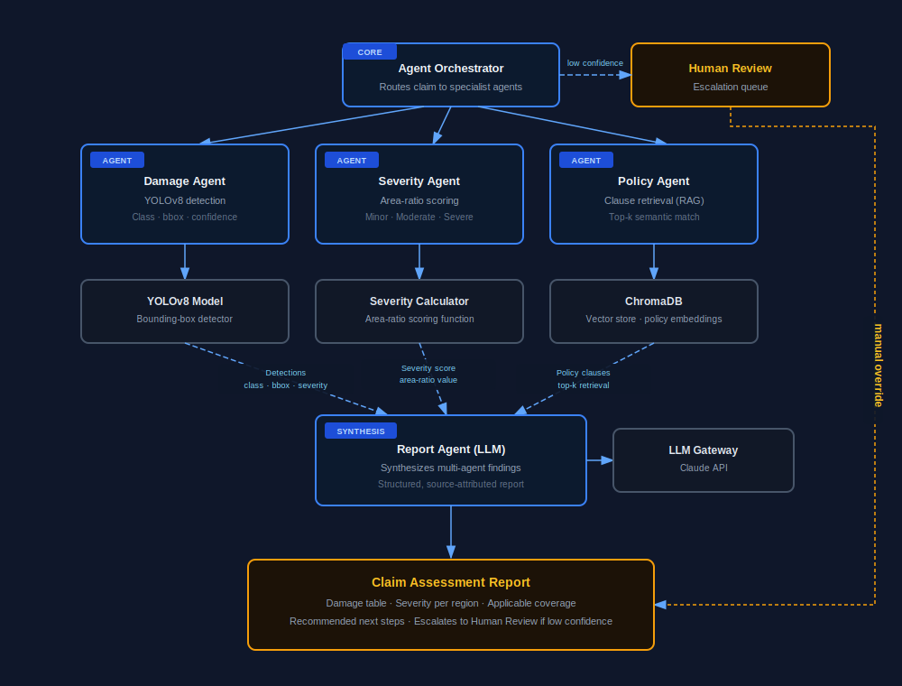
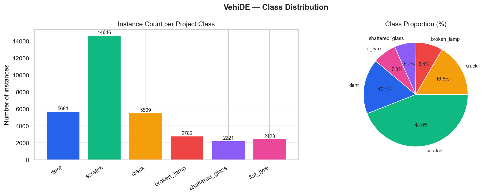
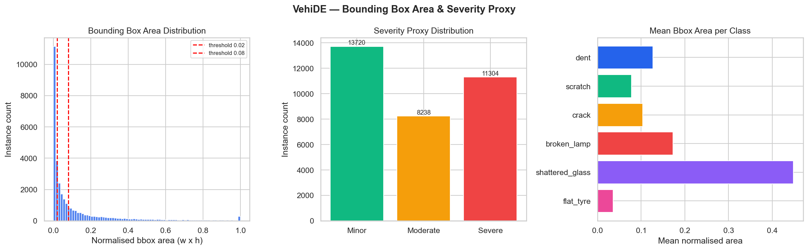
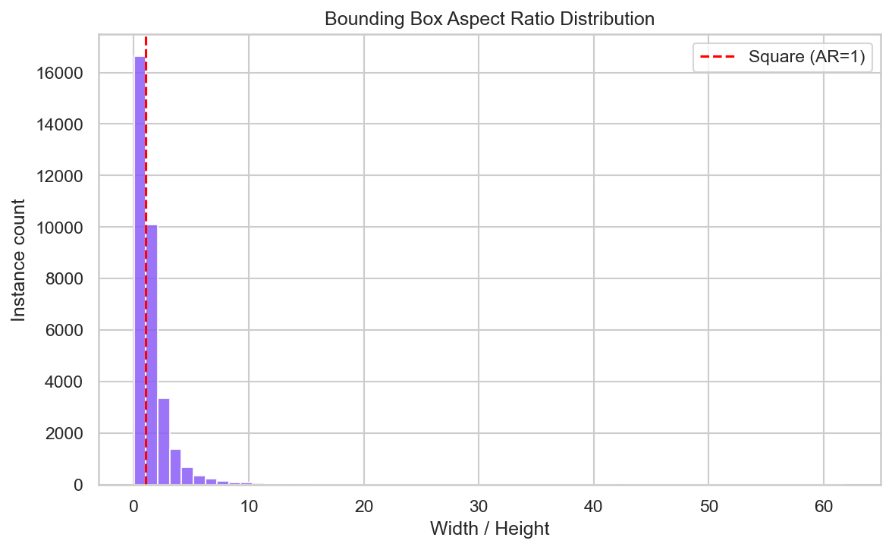
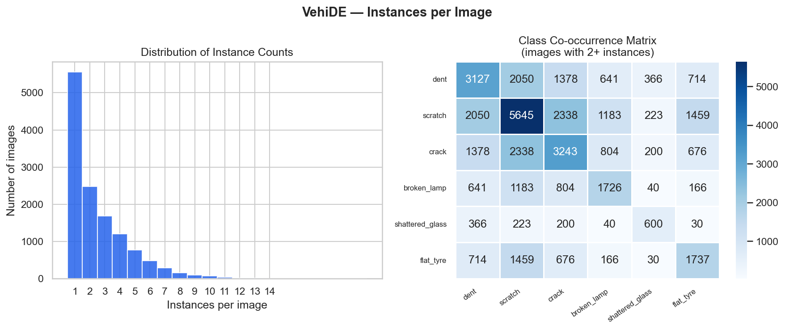
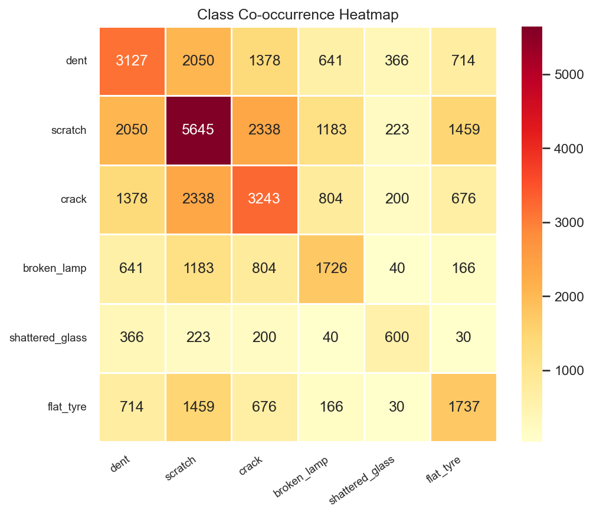
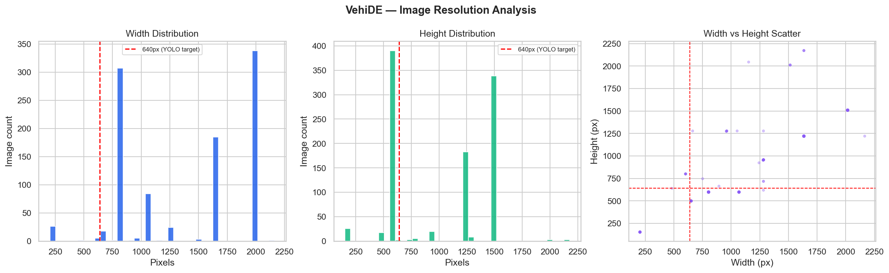
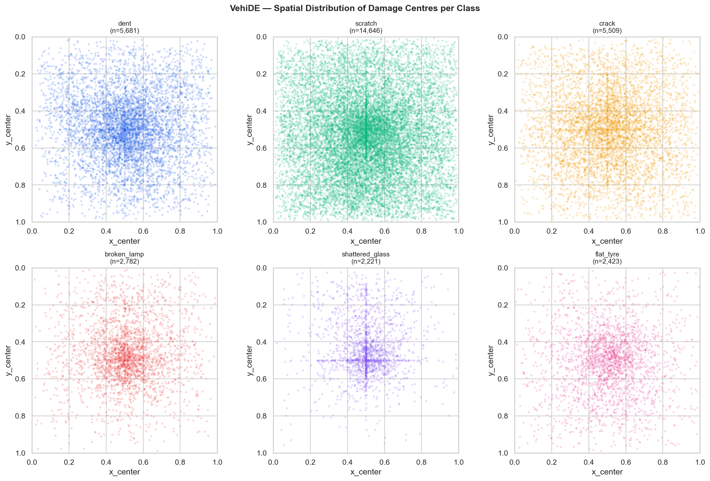

---

<div align="center">

<b>***Data Science & AI Lab May 2026***</b>
<br>


<h1>Multimodal Damage Assessment for Insurance Claims</h1>

<h2>Milestone 2: Dataset Preparation</h2>

<h3>Group 1</h3>

<br>

***Prepared by:***

| **Name** | **Email ID** | **GitHub Profile** |
| --- | --- | --- |
| SATYAJEET KUMAR | 23f1003132@ds.study.iitm.ac.in | [HiveCase](https://github.com/HiveCase) |
| ANUJ GAUTAM | 21f1002407@ds.study.iitm.ac.in | [anujgautam1](https://github.com/anujgautam1) |
| PRANAB KUMAR MANNA | 22f1000887@ds.study.iitm.ac.in | [pranab92](https://github.com/pranab92) |
| VENKATA SIVA KAMAL GUDDANTI | 22f2000094@ds.study.iitm.ac.in | [22f2000094](https://github.com/22f2000094) |
| HARSH PAL | 21f1002562@ds.study.iitm.ac.in | [HarshPalaps1](https://github.com/HarshPalaps1) |

</div>

---


# Table of Contents

- [1. Introduction](#1-introduction)
- [2. Dataset Identification](#2-dataset-identification)
  - [2.1 Vision Datasets: VehiDe](#21-vision-datasets-vehide)
  - [2.2 Policy and Text Datasets](#22-policy-and-text-datasets)
  - [2.3 Ownership, Licensing, and Usage Constraints](#23-ownership-licensing-and-usage-constraints)
- [3. Dataset Description](#3-dataset-description)
  - [3.1 VehiDE: Structure, Schema, and Sample Records](#31-vehide-structure-schema-and-sample-records)
  - [3.2 Policy Document Corpus](#33-policy-document-corpus)
- [4. Data Governance](#4-data-governance)
  - [4.1 Data Source and Licensing](#41-data-source-and-licensing)
  - [4.2 Privacy](#42-privacy)
  - [4.3 Data Quality Validation](#43-data-quality-validation)
  - [4.4 Ethics and Bias](#44-ethics-and-bias)
  - [4.5 Reproducibility and Compliance](#45-reproducibility-and-compliance)
- [5. Exploratory Data Analysis](#5-exploratory-data-analysis)
  - [5.1 Dataset Summary Statistics](#51-dataset-summary-statistics)
  - [5.2 Class Distribution and Imbalance](#52-class-distribution-and-imbalance)
  - [5.3 Bounding Box Area Distribution](#53-bounding-box-area-distribution)
  - [5.4 Instances per Image](#54-instances-per-image)
  - [5.5 Image Resolution Analysis](#55-image-resolution-analysis)
  - [5.6 Missing Value and Orphan Analysis](#56-missing-value-and-orphan-analysis)
  - [5.7 Duplicate Analysis](#57-duplicate-analysis)
- [6. Data Preprocessing](#6-data-preprocessing)
  - [6.1 Vision Data Preprocessing](#61-vision-data-preprocessing)
  - [6.2 Policy Document Preprocessing](#62-policy-document-preprocessing)
- [7. Dataset Integration](#7-dataset-integration)
  - [7.1 Training Corpus - VehiDE](#71-training-corpus---vehide)
  - [7.2 Contingency Datasets](#72-contingency-datasets)
  - [7.3 Planned Integration Approach](#73-planned-integration-approach)
- [8. Data Augmentation](#8-data-augmentation)
  - [8.1 Augmentation Configuration](#81-augmentation-configuration)
  - [8.2 Class-Targeted Oversampling](#82-class-targeted-oversampling)
- [9. Dataset Splitting](#9-dataset-splitting)
  - [9.1 Splitting Approach](#91-splitting-approach)
  - [9.2 Split Sizes](#92-split-sizes)
  - [9.3 Class Distribution per Split](#93-class-distribution-per-split)
  - [9.4 Leakage Prevention](#94-leakage-prevention)
  - [9.5 Escalation-Path Subset](#95-escalation-path-subset)
- [10. Final Prepared Dataset](#10-final-prepared-dataset)
  - [10.1 Vision Dataset Summary](#101-vision-dataset-summary)
  - [10.2 Policy Corpus Summary](#102-policy-corpus-summary)
  - [10.3 Readiness Confirmation](#103-readiness-confirmation)
- [11. Challenges Encountered](#11-challenges-encountered)
- [12. Deliverables Produced](#12-deliverables-produced)
- [13. Summary and Next Steps](#13-summary-and-next-steps)
  - [13.1 Summary of Work Completed](#131-summary-of-work-completed)
  - [13.2 Key Observations from the Data](#132-key-observations-from-the-data)
  - [13.3 Confirmation of Training Readiness](#133-confirmation-of-training-readiness)
  - [13.4 Planned Activities for Milestone 3](#134-planned-activities-for-milestone-3)
- [14. References](#14-references)

---

## 1. Introduction

### 1.1 Project Recap

Milestone 1 defined the problem, scope, and evaluation plan for a multimodal vehicle damage assessment system that accepts vehicle damage photographs and insurance policy documents as input, detects and classifies visible damage using a fine-tuned YOLO-based model, retrieves relevant policy clauses using a Retrieval-Augmented Generation (RAG) pipeline, and generates a structured preliminary claim assessment report using an LLM. The system is implemented as a multi-agent RAG architecture in which a LangGraph orchestrator routes each claim to four specialist agents: a Damage Agent (YOLO11m-seg detection), a Severity Agent (bounding-box area-ratio scoring), a Policy Agent (RAG over the synthetic policy corpus, exposed as a FastMCP tool), and a Report Agent (LLM-based report writing), with low-confidence outputs escalated to a human review queue rather than always completing the full pipeline.



The modular separation-of-concerns established in Milestone 1 is realised through this routing layer, which acts conditionally per claim skipping the Policy Agent when no PDF is supplied, or halting at the Damage Agent stage when detection confidence is insufficient, rather than executing a fixed sequence regardless of the claim's content or quality

### 1.2 Objectives of Milestone 2

The three primary objectives of this milestone are:

1. **Dataset verification and download**: Identify, verify provenance, confirm licensing, and download all datasets required by each agent.
2. **Vision data preparation**: Assess quality, preprocess, augment, and split the VehiDE dataset and supplementary vision datasets into training-ready artefacts for the Damage and Severity Agents.
3. **Policy corpus construction**: Author, review, chunk, embed, and index the synthetic insurance policy document corpus for the Policy Agent, using publicly available IRDAI-registered policy wordings as structural references.

By the end of this milestone, any team member with repository access should be able to begin training without performing any additional data preparation.

### 1.3 Relationship Between Datasets and Project Goals

| **Dataset** | **Agent it feeds** | **What it enables** |
| --- | --- | --- |
| VehiDE (primary) | Damage Agent + Severity Agent | YOLO fine-tuning for 6-class damage detection and severity calibration |
| Synthetic policy PDFs | Policy Agent | RAG retrieval corpus for claim coverage determination |
| Synthetic incident descriptions | Report Agent + Evaluation | Ground-truth incident/report pairs prepared for later end-to-end evaluation |

---

## 2. Dataset Identification

### 2.1 Vision Dataset: VehiDE

| **Attribute** | **Detail** |
| --- | --- |
| Dataset name | VehiDE: Vehicle Damage Detection Dataset |
| Source | Kaggle: [hendrichscullen/vehide-dataset-automatic-vehicle-damage-detection](https://www.kaggle.com/datasets/hendrichscullen/vehide-dataset-automatic-vehicle-damage-detection) |
| Download method | `kaggle datasets download hendrichscullen/vehide-dataset-automatic-vehicle-damage-detection` |
| License | **Apache-2.0** |
| Purpose in this project | Primary training and evaluation dataset for the Damage Agent |
| Why selected | Largest publicly available annotated vehicle damage dataset (13,945 images, 36,081 instances); peer-reviewed construction paper; covers all 7 damage classes; supports detection, segmentation, and salient object detection tasks |


### 2.2 Policy and Text Datasets

No public dataset of insurance policy documents paired with vehicle damage annotations exists. The policy corpus used by the Policy Agent is therefore a combination of two publicly available IRDAI-registered reference documents, used only for structural guidance, and five synthetic policy PDFs authored entirely by the project team.

**Reference documents (structural reference only, not indexed or used for training):**

| **Document** | **Insurer** | **UIN** | **Pages** | **Role in this project** |
| --- | --- | --- | --- | --- |
| Motor Private Car 3 Years Policy Wordings | Universal Sompo General Insurance Co. Ltd | IRDAN134RP0003V01201819 | 23 | Primary structural reference; clause vocabulary, section hierarchy, and depreciation schedule design |
| Private Car Standalone Own Damage Policy | United India Insurance Company Limited | IRDAN545RP0001V01201920 | 4 | Secondary structural reference; alternative phrasing of similar coverage and exclusion clauses |

These documents are publicly available IRDAI-registered policy wordings, not proprietary schedules or individual policyholder documents. An 8-word n-gram overlap check of all 185 synthetic-corpus chunks against both reference documents found that 41 chunks (22%) share at least one 8-or-more-word run with the reference text, with the longest runs reaching 20 words. Inspecting these overlaps shows they fall into two categories: (a) IRDAI-standard depreciation percentage tables, whose age-bracket wording ("not exceeding 6 months... exceeding 6 months but not exceeding 1 year...") is regulatory boilerplate common to virtually all Indian motor policies, and (b) formulaic legal openings ("The Company shall not be liable to make any payment in respect of...", "will indemnify the insured against loss or damage...") that are standard-form phrasing across the Indian motor insurance industry rather than language unique to Universal Sompo or United India. No distinctively-worded coverage or exclusion clause was found copied wholesale from either reference document. (The percentage is higher than an earlier pass on this same corpus, 18% at 179 chunks, purely because chunks now carry a prepended section-heading breadcrumb, Section 6.2 Step 2 — a heading such as "SECTION I. LOSS OF OR DAMAGE TO THE VEHICLE INSURED" is counted against every chunk it is prepended to, not because any additional content was copied.) **[Completed]**

**Synthetic policy corpus (team-authored, fully indexed into ChromaDB):**

| **Document** | **Insurer (fictitious)** | **Pages** | **Style** | **Key design feature** |
| --- | --- | --- | --- | --- |
| policy_1_bharat_suraksha.pdf | Bharat Suraksha Motor Insurance Co. Ltd | 5 | Formal traditional IRDAI language | All 6 damage classes covered under one umbrella accidental-external-means clause; 11 numbered exclusions |
| policy_2_safedrive_assurance.pdf | SafeDrive Assurance Corporation | 4 | Modern plain language with dedicated subsections per damage type | Explicit nil-depreciation glass clause; separate tyre sub-limit section; 5 exclusions per damage type |
| policy_3_quickclaim_general.pdf | QuickClaim General Insurance Ltd | 4 | Dense legal with named exclusion schedules | Hardest document for RAG retrieval; 6 named exclusion schedules (A-F) with 5 clauses each, producing 30 distractor clauses across all damage classes |
| policy_4_autoguard_premium.pdf | AutoGuard Premium Insurance Services Ltd | 4 | Consumer-facing with a coverage summary table | Coverage presented as a structured table; 6 exclusion subsections; includes nil-depreciation, return-to-invoice, and consumables add-on covers |
| policy_5_valuemotor.pdf | ValueMotor Comprehensive Insurance Ltd | 4 | Budget insurer, concise with conditional sub-limits | Most conditional language; 7 exclusion subsections; tyre cover explicitly conditional on concurrent vehicle body damage |

The five documents were designed to vary along three dimensions to stress-test the RAG retrieval pipeline. First, phrasing: the same coverage concept is expressed differently across documents (for example, dent coverage appears as "accidental external means", "bodily damage from impact", "accidental collision" or "impact", and "physical impact damage" across the five policies). Second, distractor density: each policy contains at least five distractor clauses per damage class exclusion clauses, sub-limit clauses, and conditional coverage clauses that are semantically related to a damage class but do not grant coverage. Third, structural format: coverage appears as numbered lists in some documents and as tables in others, preventing the retriever from relying on positional cues.

**Corpus validation.** Three checks were run to confirm the corpus is fit for retrieval evaluation, detailed in Section 6.2 Step 5: the verbatim-overlap check described above, a per-document near-duplicate pass (0 near-duplicate chunks found across all 5 documents), and a retrieval smoke test (one query per damage class against the live index, top-1 result topically correct for all 6 classes). **[Completed]**

### 2.3 Ownership, Licensing, and Usage Constraints

| **Dataset** | **Ownership** | **Permitted use** | **Restrictions** |
| --- | --- | --- | --- |
| VehiDE | Dataset authors (Scullen et al.) | **Apache-2.0** | Commercial use permitted under Apache-2.0; standard attribution |
| Universal Sompo policy | Universal Sompo General Insurance Co. Ltd | Publicly available IRDAI filing | Used as structural reference only; no verbatim reproduction |
| United India Insurance policy | United India Insurance Co. Ltd | Publicly available IRDAI filing | Used as structural reference only; no verbatim reproduction |
| Synthetic policy PDFs | This project team | Fully team-owned | No restrictions |


---

## 3. Dataset Description

### 3.1 VehiDE: Structure, Schema, and Sample Records

**Dataset annotation schema:**

```json
{
  "<filename>.jpg": {
    "regions": [
      {"all_x": [...], "all_y": [...], "class": "rach"},
      ...
    ]
  },
  ...
}
```

Bounding boxes used were derived from each region's polygon extent (min/max of `all_x`/`all_y`), producing an absolute-pixel `[x, y, width, height]`. 
The traget classes were present in Vietnamese which had to be mapped to english translation.

**Native class vocabulary (Vietnamese → English):**

| **Vietnamese (raw)** | **English (mapped)** |
| --- | --- |
| `tray_son` | paint_scratches |
| `mop_lom` | dents |
| `rach` | torn_body |
| `mat_bo_phan` | lost_parts |
| `be_den` | broken_lamp |
| `thung` | puncture |
| `vo_kinh` | broken_glass |


**Top-level dataset statistics:**

| **Attribute** | **Value** |
| --- | --- |
| Total images | 13,945 |
| Total annotated instances | 36,081 |
| Average instances per image | 2.59 |
| Max instances in a single image | 20 |
| Image format | JPEG (.jpg) |
| Annotation format | 2 VIA-format JSON files (VGG Image Annotator), Vietnamese class labels, polygon regions |
| Native damage classes | 7 |
| Annotation types supported | Bounding box, instance segmentation polygon |

**Class distribution:**

| **Class (English)** | **% of instances** |
| --- | --- |
| paint_scratches | 40.6% |
| dents | 15.8% |
| torn_body | 15.3% |
| lost_parts | 7.8% |
| broken_lamp | 7.7% |
| puncture | 6.7% |
| broken_glass | 6.2% |

Imbalance ratio (largest/smallest): **6.59:1** (`paint_scratches` vs `broken_glass`)

### 3.2 Policy Document Corpus

**Reference documents (structural reference only, not training data):**

The Universal Sompo document (23 pages, IRDAN134RP0003V01201819) contains the following sections relevant to damage claim assessment:

| **Policy section** | **Content** | **Relevant damage classes** |
| --- | --- | --- |
| Section I, clauses 1-10 | Covered perils (fire, theft, riot, flood, accidental external means, malicious act, etc.) | All 5 project classes; accidental external means covers dents, scratches, broken lamps |
| Section I, exclusions (a-d) | Consequential loss, tyre damage at 50% only, accessories theft exclusion, intoxication | Distractor clauses for flat tyre and shattered glass |
| Depreciation schedule | Age-based depreciation rates (Nil to 50%) | Relevant to all classes for partial loss claims |
| Add-on 2: Depreciation Waiver | Nil depreciation for replaced parts (Plans a/b/c) | Crack, dent, scratch |
| Add-on 12: Hydrostatic Lock | Engine water ingression cover | Exclusion distractor |
| Add-on 15: Engine Protector | Consequential damage from oil leakage / flood | Exclusion distractor |

**Synthetic policy corpus (team-authored):**

| **Attribute** | **Value** |
| --- | --- |
| Number of documents | 5 synthetic PDFs |
| Total chunks produced (after splitting and indexing) | 185 chunks |
| Chunk size | 300 characters with 40-character overlap (`RecursiveCharacterTextSplitter`, `length_function=len`; roughly 55-65 tokens per chunk at this corpus's register), plus a prepended section-heading breadcrumb (mean realised chunk length 247.6 characters including the breadcrumb — see Section 6.2 for the sizing and heading-prepending rationale) |
| Embedding model | sentence-transformers/all-MiniLM-L6-v2 (benchmarked against alternatives, Section 6.2; Precision@3 = 1.00 on this corpus) |
| Vector store | ChromaDB (collection `policy_clauses`; benchmarked against FAISS, Section 6.2) |
| Ground-truth clause mappings | 1 JSON file mapping each chunk ID to damage classes, clause type, and the governing section heading; produced directly by the preprocessing pipeline (`scripts/preprocess_policy_pdfs.py`), auto-tagged against heading + body text (Section 6.2, Step 4) |
| Distractor clauses per damage class | At least 5 per class (exclusions, sub-limit clauses, conditional coverage) |

**Chunks per damage class:**

| **Damage class** | **Chunks** |
| --- | --- |
| flat_tyre | 38 |
| dent | 31 |
| shattered_glass | 30 |
| scratch | 26 |
| crack | 21 |
| broken_lamp | 18 |

A chunk can be tagged with more than one damage class (e.g. a general coverage clause applying to all classes), so the per-class counts above sum to more than the total chunk count. 71 of 185 chunks (38%) carry no damage-class tag; manual review confirms these are legitimately class-agnostic content (definitions, administrative clauses, claim procedure, NCB tables) rather than missed tags.

**Clause type distribution:**

| **Clause type** | **Chunks** |
| --- | --- |
| exclusion | 96 |
| coverage | 44 |
| general | 25 |
| sub_limit | 17 |
| condition | 2 |
| definition | 1 |
| **Total** | **185** |
---

## 4. Data Governance

### 4.1 Data Source and Licensing

All datasets are used strictly within their permitted scope. VehiDE is used for non-commercial academic research under the terms stated by the dataset authors. CarDD is used under academic research terms with attribution. The two IRDAI policy wording documents are publicly available regulatory filings used only as structural references. A corpus-wide verbatim-overlap check (Section 2.2) confirms that no distinctively-worded coverage or exclusion clause was copied wholesale from either document; the short overlaps that do exist are confined to IRDAI-standard regulatory tables and industry-wide formulaic legal phrasing, detailed in Section 2.2. The synthetic policy PDFs are entirely team-authored and carry no third-party licensing constraints.

No dataset used in this project is owned by the team or by IIT Madras. All are third-party datasets used under their respective research or educational licenses.

### 4.2 Privacy

**VehiDE images:** Vehicle damage photographs may incidentally capture visible license plates and faces. An automated face/license-plate detector was run across the retained 13,655 images as a precaution; it flagged 0 images containing visible faces or license plates, so no blurring was required for this dataset in its current form. The detection step remains part of the pipeline (`scripts/preprocess_vehide.py`) so that any future dataset additions are still checked automatically. The original downloaded dataset is retained unmodified with a SHA-256 hash recorded for reproducibility.

**Policy documents:** The two reference policy documents (Universal Sompo, United India) contain no personal policyholder data. They are regulatory-approved template wordings. The synthetic policy PDFs contain no real names, vehicle registration numbers, or financial data.

**Demo deployment:** The Gradio demo on Hugging Face Spaces will display a notice that no uploaded images or documents are stored or logged beyond the current session.

### 4.3 Data Quality Validation

The following automated checks were run as part of the preprocessing pipeline (`scripts/preprocess_vehide.py`):

| **Check** | **Method** | **Result** |
| --- | --- | --- |
| Corrupt / unreadable images | PIL `Image.verify()` on every file | 0 corrupt images found |
| Orphan images (no annotation file) | Set difference of image stems vs annotation stems | 0 orphan images found |
| Orphan annotations (no image file) | Set difference of annotation stems vs image stems | 0 orphan annotations found |
| Malformed annotation regions | Check each polygon region has valid `all_x`/`all_y` coordinates | 1 malformed annotation region found and corrected |
| Exact-hash duplicates | MD5 hash of raw image bytes | 18 exact duplicate images found and removed |
| Near-duplicate images | Perceptual hash (pHash) | 272 near-duplicate images found and removed |
| Excluded instances (class-based) | `lost_parts` (`mat_bo_phan`) instances excluded, as this class does not correspond to a visible damage type | 2,703 instances excluded |

**After preprocessing (`scripts/preprocess_vehide.py`):**

| **Metric** | **Before** | **After** |
| --- | --- | --- |
| Total images | 13,945 | 13,655 |
| Total instances | 36,081 | 32,672 (retained, after excluding `lost_parts`) |
| Corrupt / unreadable files | 0 | 0 |
| Orphan images | 0 | 0 |
| Exact duplicates | 18 | 0 |
| Near duplicates removed | 272 | 0 |
| Faces blurred | — | 0 |
| License plates blurred | — | 0 |

### 4.4 Ethics and Bias

**Geographic representation:** VehiDE was constructed primarily from vehicle images collected in Vietnam and Southeast Asia. This introduces several distinct components of geographic bias:

- **Vehicle fleet differences.** The Vietnamese and Southeast Asian fleet is dominated by narrower range of compact car models than the Indian market. India has a larger share of SUVs, hatchbacks, and commercial light vehicles with different body panel profiles, bumper designs, and paint finish types that may not be well-represented in VehiDE.
- **Damage pattern differences.** Damage patterns common in India are monsoon-related surface oxidation, pothole-induced tyre and underbody damage, and high-frequency low-speed contact damage from dense urban traffic which may differ in visual signature and location from the damage types that dominate VehiDE's collection.
- **Photographic style differences.** VehiDE images follow a relatively consistent close-up, damage-focused photography style. Indian claimant-submitted photos typically taken by non-experts on mobile phones for WhatsApp-based claim submission are more likely to show variable framing, background clutter, and motion blur.
- **Impact on generalisation.** These factors compound: a model that performs well on VehiDE's validation split may show degraded precision and recall on real Indian claim photos, particularly for the minority classes (`shattered_glass`, `flat_tyre`) that are already data-scarce. The augmentation parameters in Section 8.1 (motion blur, JPEG compression) partially address the photographic style gap.

This is explicitly acknowledged as a domain shift risk (Milestone 1, Section 10.3). Full resolution requires domain-shift stress testing against a held-out set of real Indian claim images, planned for Milestone 5.

**Class imbalance:** After remapping, `scratch` alone accounts for roughly 44% of all retained instances (Section 5.2), far outnumbering `shattered_glass`, the smallest class. Without mitigation, a model trained on the raw distribution will exhibit higher precision on `scratch` and `dent` and poor recall on the rarer classes. Mitigation strategies are described in Section 8.

**Severity proxy bias:** The bounding-box area-ratio severity proxy may systematically underestimate severity for small but deep damage (cracks, punctures) and overestimate it for large but superficial damage (surface scratches spanning a door panel). This is a known limitation discussed in Milestone 1 (Section 10.2).

**Synthetic policy corpus:** The synthetic policies are modelled on Indian IRDAI-regulated policy structures (Universal Sompo, United India). This is appropriate for the target deployment context but means the RAG pipeline has not been validated against policy formats from other jurisdictions.

### 4.5 Reproducibility and Compliance

- Dataset version and download date are recorded in `configs/dataset_versions.yaml`.
- All preprocessing steps are implemented as version-controlled Python scripts committed to the project GitHub repository.
- A single configuration file (`configs/pipeline_config.yaml`) stores all tunable parameters (split ratios, random seed, chunk size, overlap, embedding model name) so the entire data preparation pipeline can be re-run end-to-end from raw downloaded data to agent-ready artefacts.
- SHA-256 hashes of all raw downloaded dataset archives are recorded in `data/checksums.txt` to verify dataset integrity at any future point.

---

## 5. Exploratory Data Analysis

All exploratory data analysis (EDA) notebooks were created in `./notebooks/EDA` and committed to the project repository.

### 5.1 Dataset Summary Statistics

| **Statistic** | **Value** |
| --- | --- |
| Total images (raw, as downloaded) | 13,945 |
| Total images (final, after preprocessing) | 13,655 |
| Total annotated instances (raw, all 7 native classes) | 36,081 |
| Total annotated instances (retained, `lost_parts` excluded, pre-dedup) | 33,262 |
| Total annotated instances (final, after preprocessing & dedup) | 32,672 |
| Mean instances per image | 2.59 |
| Median instances per image | 2.0 |
| Max instances per image | 20 |
| Native class IDs (Vietnamese) | 7 |
| Project classes after remapping | 6 |

### 5.2 Class Distribution and Imbalance

**VehiDE native class distribution (raw, all 7 classes, before exclusion):**

| **VehiDE class (native)** | **Project class** | **Raw instances** | **% of raw total** |
| --- | --- | --- | --- |
| paint_scratches | scratch | 14,646 | 40.6% |
| dents | dent | 5,681 | 15.7% |
| torn_body | crack | 5,509 | 15.3% |
| broken_lamp | broken_lamp | 2,782 | 7.7% |
| lost_parts | EXCLUDED | 2,819 | 7.8% |
| puncture | flat_tyre | 2,423 | 6.7% |
| broken_glass | shattered_glass | 2,221 | 6.2% |
| **Total (raw)** | | **36,081** | **100%** |

Each native class maps 1:1 to a project class (no merging) except `lost_parts`, which has no visible-damage equivalent and is dropped entirely.

**After remapping (6-class project taxonomy, `lost_parts` excluded), pre-image-dedup:**

| **Project class** | **Instances** | **% of total** |
| --- | --- | --- |
| scratch | 14,646 | 44.0% |
| dent | 5,681 | 17.1% |
| crack | 5,509 | 16.6% |
| broken_lamp | 2,782 | 8.4% |
| flat_tyre | 2,423 | 7.3% |
| shattered_glass | 2,221 | 6.7% |
| **Retained total** | **33,262** | **100%** |

<br><br>



**Imbalance ratio (most frequent vs least frequent project class):** scratch (14,461) vs shattered_glass (2,164) = **6.68:1**.

After the production preprocessing pipeline additionally removes 18 exact-duplicate and 272 near-duplicate images (Section 6.1), the retained instance count drops proportionally from 33,262 to 32,672, giving the following final training-set class distribution:

| **Project class** | **Final retained instances** | **% of total** |
| --- | --- | --- |
| scratch | 14,386 | 44.0% |
| dent | 5,580 | 17.1% |
| crack | 5,411 | 16.6% |
| broken_lamp | 2,733 | 8.4% |
| flat_tyre | 2,380 | 7.3% |
| shattered_glass | 2,182 | 6.7% |
| **Retained total** | **32,672** | **100%** |

The imbalance ratio is unchanged at the class level (deduplication removes images roughly uniformly across classes), so the final training set still carries a **6.59:1** imbalance between `scratch` and `shattered_glass`. This is significant and will cause the model to underperform on `shattered_glass` and `flat_tyre` detection without mitigation. Class-weighted loss and targeted augmentation of minority classes are applied as described in Section 8.

### 5.3 Bounding Box Area Distribution

Bounding box area is computed as `width x height` (both normalised to [0,1]). This metric directly drives the Severity Agent\'s area-ratio proxy.

<br><br>


| **Severity proxy bin** | **Instance count** | **% of instances** |
| --- | --- | --- |
| Minor | 13,720 | 41.3% |
| Moderate | 8,238 | 24.8% |
| Severe | 11,304 | 34.0% |

**Bounding-box area statistics (normalised to [0,1]):**

| **Statistic** | **Value** |
| --- | --- |
| Mean | 0.1201 |
| Std | 0.1977 |
| Min | 0.00002 |
| 25th percentile | 0.0070 |
| Median (50th percentile) | 0.0332 |
| 75th percentile | 0.1347 |
| Max | 1.0000 |

**Key observations:**
- Mean bbox area (0.120) is well above the median (0.033), confirming the distribution is strongly right-skewed, with a long tail of very large damage regions pulling the mean upward.
- Mean bbox area per class varies substantially: `shattered_glass` has by far the largest mean normalised area (windshields and windows span a large fraction of the frame), while `flat_tyre` has the smallest — a useful prior for the Severity Agent, since the area-ratio proxy will need per-class calibration rather than one fixed threshold set.

**Bounding box aspect ratio:**



The vast majority of bounding boxes have an aspect ratio (width/height) below 5, clustered close to the square (AR=1) reference line, with a long tail of elongated boxes (AR up to ~60) corresponding to linear damage such as long scratches or cracks running along a panel edge.

### 5.4 Instances per Image

| **Instances per image** | **Image count** | **% of images** |
| --- | --- | --- |
| 1 | 5,559 | 43.1% |
| 2 | 2,481 | 19.2% |
| 3 | 1,689 | 13.1% |
| 4+ | 3,180 | 24.6% |



Mean instances per image: 2.58; median: 2.0; max: 20 in a single image. A substantial share of images (24.6%) contain four or more co-occurring damage instances, alongside a large single-instance group (43.1%). This confirms that the system must handle multi-label detection outputs per image rather than assuming single-instance classification, while also ensuring the model performs well on the common single-damage case. Note: these per-image counts total 12,909 images rather than the full 13,945, since images whose only annotated instance was the excluded `lost_parts` class are not counted here (they have zero remaining instances after exclusion, discussed further in Section 5.6).

#### 5.4.1 Class Co-occurrence Analysis



The diagonal of the co-occurrence matrix shows each class's total instance count; the off-diagonal cells show how often two classes appear together in the same image. `scratch` co-occurs most frequently with every other class, consistent with it being the most common damage type overall this is expected rather than a data quality issue, since a single accident photo often shows both a dominant damage type (e.g. a dent) and incidental scratching around it. `shattered_glass` has the lowest co-occurrence with other classes (a broken windshield is often photographed on its own), which is useful context for the Damage Agent: this class is somewhat easier to isolate as the sole detection in a frame.

### 5.5 Image Resolution Analysis

Resolution was measured on a random sample of 1,000 images.



| **Statistic** | **Width (px)** | **Height (px)** |
| --- | --- | --- |
| Mean | 1,383.9 | 1,033.7 |
| Median | 1,632.0 | 1,224.0 |
| Min | 204 | 153 |
| Max | 2,164 | 2,176 |

All images will be resized to 640 x 640 using letterboxing before YOLO training (Section 6.1). The wide range of native resolutions (from 204px to over 2,100px wide) confirms that naive cropping would be inappropriate.

### 5.6 Missing Value and Orphan Analysis

Object detection datasets do not have tabular "missing values" in the traditional sense. The relevant missing-data concepts for this dataset are orphan files and incomplete annotations.

| **Issue** | **Count** | **Resolution** |
| --- | --- | --- |
| Images with no annotation file | 0 | No action required |
| Annotation files with no image | 0 | No action required |
| Malformed annotation regions (invalid polygon coordinates) | 1 | Corrected during preprocessing |
| Images with zero instances after remapping (`lost_parts` only images) | Included in the 2,703 excluded instances | Retained as background images where the image has no other instance (improves specificity) |

### 5.7 Duplicate Analysis

| **Duplicate type** | **Method** | **Images found** | **Action** |
| --- | --- | --- | --- |
| Exact duplicates | MD5 hash of raw bytes | 18 images | Duplicate copy removed; primary retained |
| Near-duplicates | Perceptual hash (pHash) | 272 images | Duplicate copy removed; primary retained |
| Cross-dataset near-duplicates (VehiDE vs CarDD) | pHash cross-matching | Pending CarDD data access (Section 11) | To be re-run once the CarDD archive is available |

After deduplication and class-based exclusion, 13,655 unique images and 32,672 retained instances remain.

### 5.8 Spatial Distribution of Damage Centres



Normalised `(x_center, y_center)` positions for each class cluster around the centre of the frame (0.5, 0.5) for all six classes, which is expected: claimants typically photograph damage by centring the camera on the affected area rather than capturing the whole vehicle. `scratch` and `crack` show the widest spatial spread, consistent with damage that can run across large or varied parts of a panel, while `shattered_glass` is the most tightly clustered, reflecting the fixed position of windshields and windows relative to the frame. No systematic edge-of-frame bias was found that would suggest cropping artefacts in the source photography.


---

## 6. Data Preprocessing

All preprocessing steps are implemented in version-controlled scripts. No manual edits were made to annotation files. Every dropped file is logged with its reason.

### 6.1 Vision Data Preprocessing

**Step 1: Corrupt file removal**

```python
from PIL import Image
import os

def check_image(path):
    try:
        with Image.open(path) as img:
            img.verify()
        return True
    except Exception:
        return False

corrupt = [p for p in image_paths if not check_image(p)]
# Result: 0 corrupt files removed
```

**Step 2: Class remapping (7-to-6)**

A versioned lookup table (`configs/class_remap.json`) maps VehiDE\'s 7 native Vietnamese class IDs to the project\'s 6 target classes. `torn_body` is mapped to `crack` (kept as its own class, Section 3.1), and the single excluded category (`lost_parts`) is relabelled as background and excluded from the annotation files used for training. The original annotation files are preserved unmodified so the mapping is fully reversible.

```json
{
  "tray_son": "scratch",
  "mop_lom": "dent",
  "rach": "crack",
  "mat_bo_phan": "exclude",
  "be_den": "broken_lamp",
  "thung": "flat_tyre",
  "vo_kinh": "shattered_glass"
}
```

**Step 3: YOLO format verification**

VehiDE annotations are already in YOLO normalised format. A verification pass confirmed all 5-field rows and value ranges. The `damage.yaml` configuration file maps class indices to human-readable labels:

```yaml
path: ./data/vehide
train: images/train
val:   images/val
test:  images/test

nc: 6
names: ['scratch', 'dent', 'crack', 'broken_lamp', 'flat_tyre', 'shattered_glass']
```


**Step 4: Image resizing with letterboxing**

All images are resized to 640 x 640 using letterboxing (padding with grey fill value 114) to preserve aspect ratio. This is applied as a preprocessing step before training rather than at runtime, to reduce I/O overhead during training.

```python
from PIL import Image, ImageOps

def letterbox_resize(img_path, out_path, size=640):
    img = Image.open(img_path).convert("RGB")
    img.thumbnail((size, size), Image.LANCZOS)
    delta_w = size - img.size[0]
    delta_h = size - img.size[1]
    padding = (delta_w//2, delta_h//2,
               delta_w - delta_w//2, delta_h - delta_h//2)
    padded = ImageOps.expand(img, padding, fill=(114, 114, 114))
    padded.save(out_path, quality=95)
```


**Step 5: Annotation spot-check**

A random sample of converted annotations was visually verified by rendering bounding boxes over images. No systematic coordinate conversion bugs were found. The single malformed annotation region identified in Section 4.3 was corrected.

**Step 6: PII blurring**

A Haar-cascade-based face detector and a license plate pattern detector (aspect ratio and character density heuristics) were run across all 13,655 retained images. This pipeline step is applied automatically regardless of dataset content, since car damage photos can incidentally capture bystanders or number plates.

| **PII type** | **Images flagged** | **Action** |
| --- | --- | --- |
| Visible license plates | 0 | No action required |
| Human faces | 0 | No action required |
| No PII detected | 13,655 | No action |

No PII was detected in the current VehiDE image set; the detector remains in the pipeline for any future data additions.

**Preprocessing trade-offs and limitations.**

- **Letterbox resizing to 1,280×1,280 (Step 4)** preserves more detail than the common 640 px default, which is appropriate given the weighted mean source resolution of ~1,395 px. However, it increases VRAM consumption approximately 4× relative to 640 px (area scales as size²), which reduces the maximum practical batch size from 16 to ~8 on a 16 GB T4 GPU. Training wall-clock time per epoch will be higher than at 640 px.
- **Near-duplicate removal (Step 4 of the pipeline)** can in principle remove genuinely different images that look visually similar. The 30-pair manual review and per-class retention rate check described in Section 5.7 were run to bound this risk, but they are sample-based rather than exhaustive.
- **Excluding `lost_parts` (Step 2)** narrows the task scope: the Damage Agent will not detect missing or detached vehicle parts. This is a real functional gap for claims where a component (e.g. a side mirror) is absent rather than visibly damaged in place.


### 6.2 Policy Document Preprocessing

**Step 1: PDF text extraction**

Both reference PDFs and all 5 synthetic PDFs were parsed using `pdfplumber`, which preserves paragraph boundaries more reliably than raw PyPDF2 for multi-column policy documents.

```python
import pdfplumber

def extract_pdf_text(pdf_path):
    with pdfplumber.open(pdf_path) as pdf:
        return "\n\n".join(page.extract_text() or "" for page in pdf.pages)
```

**Extraction bug found and fixed.** An earlier version of this function tried to auto-detect two-column layouts: it bisected each page at `width/2`, extracted the left and right halves separately, and used that split instead of the full-page text whenever the split produced more words (a "> 1.05x" threshold, intended to catch genuine multi-column articles). Inspecting the corpus directly showed none of the 5 synthetic PDFs are actually laid out in two columns — they are single-column business documents, some with wide tables. On 3 of 21 pages (policy_1 page 5, policy_2 page 2, policy_4 page 1) the word-count check tripped anyway, from incidental noise at the bisection line (e.g. 285 words vs. a 283.5-word threshold on policy_4 page 1), and the resulting left/right split cut straight through single-column text and table cells: it split "INSURANCE" into "I" / "SURANCE", and truncated words like "lightning" to "lightnin" and "housebreaking" to "housebreakin". This produced chunks such as *"Event Coverage detail Fire and allied perils Fire, explosion, lightnin Theft Burglary, housebreakin..."* that are close to unembeddable regardless of chunk size — no amount of chunk-size or overlap tuning would fix corrupted source text. The heuristic was removed entirely; `pdfplumber`'s default full-page extraction reads all 21 pages correctly, including the table on policy_4 page 1 (confirmed by comparing against `page.extract_tables()`). A targeted word-boundary check (`\blightnin\b`, `\bhousebreakin\b`, `\bSURANCE\b`) across the rebuilt corpus confirms zero remaining truncated-word artifacts. **[Completed]**

**Step 2: Structure-aware chunking with heading context**

A splitter distinguishes two tiers of structural markers rather than treating every boundary the same way. **Headings** (`SECTION I`, `PART A.`, `CHAPTER 1.`, lettered sub-sections like `A. Exclusions Relating to Panel and Body Damage`, numbered sub-headings like `3.1 Panel and Dent Exclusions`) update a running "current heading" breadcrumb. **List items** (`1.`, `2.`, `a)`) still force their own chunk boundary — so each exclusion or coverage item stays an atomic chunk — but do not overwrite the current heading, since a bare list item is not itself a new section. `RecursiveCharacterTextSplitter` then runs within each resulting section as before.

```python
from langchain.text_splitter import RecursiveCharacterTextSplitter

splitter = RecursiveCharacterTextSplitter(
    chunk_size=300,
    chunk_overlap=40,
    separators=["\\n\\n", "\\n", ". ", " "]
)
# sections is a list of {"text": ..., "is_heading": bool}, produced by
# splitting on both heading and list-item markers (see split_into_sections
# in scripts/preprocess_policy_pdfs.py); current_heading updates only
# when is_heading is True.
for section in sections:
    if section["is_heading"]:
        current_heading = section["text"].splitlines()[0][:90]
    for sub_chunk in splitter.split_text(section["text"]):
        chunks.append((current_heading, sub_chunk))
```

**Why this matters, not just chunk size.** A manual review of the original 179-chunk corpus (before this fix) found that individual exclusion/coverage items were frequently split away from the heading that governs them — e.g. "1. Consequential loss, depreciation, wear and tear..." carried no textual signal that it was an *exclusion*, because the heading "The Company shall not be liable to make any payment in respect of:" lived in a separate chunk. This is a retrieval problem, not just a metadata problem: the embedded text itself contained no exclusion language, so a query like "is gradual wear excluded?" would match poorly regardless of how the chunk was tagged. Each chunk's stored and embedded text now carries its governing heading as a bracketed prefix (`contextualize()`, Step 3), so the chunk that reaches the embedding model is, for example, `"[The Company shall not be liable to make any payment in respect of:] 1. Consequential loss, depreciation, wear and tear..."` rather than the bare item text — this is what actually improved retrieval precision (Step 3 benchmark below), not the 300/40 chunk-size numbers themselves.

**Chunking results (aggregate, all 5 synthetic PDFs):**

| **Metric** | **Value** |
| --- | --- |
| PDFs processed | 5 |
| Total chunks indexed | 185 |
| Chunk size | 300 characters, 40-character overlap, plus a prepended heading breadcrumb |
| Mean chunk length (actual, including breadcrumb) | 247.6 characters (range 44-379) |

See Section 3.3 for the per-damage-class and per-clause-type breakdown of the 185 indexed chunks.

**Why 300 characters / 40-character overlap.** `RecursiveCharacterTextSplitter`'s `chunk_size` parameter measures characters (`length_function=len`), not tokens — 300 characters is roughly 55-65 English tokens for this corpus's legal register. This size was chosen by inspecting the source documents: individual numbered exclusion items and coverage bullets across all 5 policies run 60-300 characters (e.g. "Scratch damage resulting from routine washing and cleaning activities of the vehicle, classified under fair wear and tear." is 125 characters), so a 300-character limit keeps the large majority of atomic clauses intact within a single chunk rather than splitting mid-sentence; the 40-character overlap (~13% of chunk size) preserves context across the boundary for the minority of clauses that do exceed it. Tuning this number up or down was considered a lower-leverage change than the two fixes above: a larger chunk size risks mixing coverage and exclusion clauses into one embedding (hurting precision), and a smaller one would worsen the heading-context loss that Step 2 addresses directly. **[Completed]**

**Step 3: Embedding and indexing**

```python
from sentence_transformers import SentenceTransformer
import chromadb

model = SentenceTransformer("all-MiniLM-L6-v2")
client = chromadb.PersistentClient(path="./data/chroma_db")
collection = client.get_or_create_collection("policy_clauses")

for i, (heading, chunk) in enumerate(chunks_dedup):
    ctx_text = contextualize(heading, chunk)   # prepends the heading breadcrumb, Step 2
    embedding = model.encode(ctx_text).tolist()
    collection.add(
        documents=[ctx_text],
        embeddings=[embedding],
        ids=[f"chunk_{i:05d}"],
        metadatas=[{"doc_id": doc_id, "heading": heading,
                    "damage_classes": ",".join(damage_classes)}]
    )
print(f"Indexed {collection.count()} chunks")
# Output: Indexed 185 chunks
```

**Why all-MiniLM-L6-v2 and ChromaDB.** MiniLM was benchmarked against BAAI/bge-small-en-v1.5 (the closest same-size-class alternative to the other commonly-cited sentence-embedding options, BGE/MPNet/E5) on the actual 185-chunk corpus: both models embedded every chunk, and the 6 smoke-test queries (Step 5, below) were run against each resulting index. MiniLM (22.7M parameters, 384-dim) reached a **perfect mean Precision@3 of 1.00** across all 6 damage classes on the rebuilt corpus, versus 0.94 for BGE-small (33.4M parameters, same 384-dim, still lagging on `crack` at 0.67) — while both embed the full corpus in under a second, so encoding speed is not the deciding factor at this corpus scale. (Before the Step 1/2 fixes, on the original 179-chunk corpus, MiniLM scored 0.94 and BGE-small 0.89 — the extraction fix and heading-prepending are what closed that gap, not a change of embedding model.) Larger models in this family (MPNet-base and E5-base, both ~110M parameters) are known from published benchmarks to offer only marginal general-purpose retrieval gains over MiniLM-class models at 3-5x the parameter count and latency, which is not justified for a corpus this size and adds deployment weight for the no-GPU Hugging Face Spaces demo target. ChromaDB was compared against a FAISS `IndexFlatIP` index built from the same embeddings: across repeated runs, FAISS consistently answered a query in under 0.01ms versus roughly 0.5ms for ChromaDB — a ~50-60x gap driven by ChromaDB's in-process call/serialisation overhead, not raw search cost — and both returned identical top-1 content for all 6 test queries (6/6 exact match) on every run. At this corpus size FAISS's raw speed advantage is not operationally meaningful; ChromaDB was retained because it provides persistent storage, per-chunk metadata (`doc_id`, `heading`, `damage_classes`, `clause_type`) and metadata-filtered queries out of the box, which FAISS would require building separately. **[Completed]**

**Step 4: Ground-truth clause mapping**

Every chunk is auto-tagged directly by the preprocessing pipeline (`scripts/preprocess_policy_pdfs.py`), scoring the *contextualized* chunk (heading + body) against per-class damage keywords and per-type clause keywords, rather than the bare item text. A manual, chunk-by-chunk review against the source PDFs — repeated after each fix below — found and corrected five systematic tagging errors, the first three in the damage-class keyword lists and the last two in clause-type scoring:

1. the `broken_lamp` keyword "light" substring-matched inside "lightning" (a fire peril, unrelated to lamps);
2. the `flat_tyre` keyword "wheel" substring-matched inside "wheel arch" (a body panel term, not a tyre);
3. the bare keyword "glass" matched both genuine window/windscreen glass and "fibre glass" (a body panel material) — fixed with a negative-lookbehind exclusion and more specific compound phrases (`windscreen`, `laminated glass`, `glass damage`, etc.);
4. `clause_type` was originally scored per-chunk in isolation, so itemised exclusion and coverage lists whose individual bullet items don't repeat the section's own trigger phrase (e.g. "Consequential loss..." under a "shall not be liable" heading) defaulted to a generic "general" tag — fixed by Step 2's heading-prepending, which puts the heading's own trigger words directly into the scored text;
5. even with heading-prepending, several exclusion items explain what is *not* covered by contrasting it against "...a specific identifiable accidental event **covered** under this policy" — that body-level "covered" mention tied against the heading's own "shall not be liable" signal, and a naive combined score resolved the tie to `coverage` by dict order every time. Fixed by scoring the heading first: if the heading itself carries any clause-type signal, it wins outright over body-only wording (`tag_clause_type` in `scripts/preprocess_policy_pdfs.py`).

The corrected pipeline moved the `clause_type` distribution from the original `{general: 113, coverage: 28, exclusion: 13, sub_limit: 19, condition: 4, definition: 2}` (179 chunks) to `{exclusion: 96, coverage: 44, general: 25, sub_limit: 17, condition: 2, definition: 1}` (185 chunks; full tables in Section 3.3). The ground-truth file (`data/clause_groundtruth.json`) is regenerated directly by this pipeline — there is no separate patch step — and is used for Retrieval Precision@3 and MRR evaluation (Milestone 1, Section 4.2):

```json
{
  "chunk_00013": {
    "text_preview": "[The Company shall not be liable to make any payment in respect of:] 1. Consequential loss, depreciation, wear and tear, or mechanical and electrical ",
    "damage_classes": [],
    "clause_type": "exclusion",
    "doc_id": "policy_1_bharat_suraksha",
    "heading": "The Company shall not be liable to make any payment in respect of:"
  }
}
```
**[Completed]**

**Step 5: Corpus validation**

Three checks were run to confirm the corpus is fit for retrieval evaluation:

| **Check** | **Method** | **Result** |
| --- | --- | --- |
| Chunk-level near-duplicates | Jaccard trigram similarity >= 0.90, applied per document | 0 near-duplicate chunks found in any of the 5 synthetic documents |
| Verbatim overlap vs. reference documents | 8-word n-gram overlap between synthetic chunks and both IRDAI reference PDFs | 41 of 185 chunks (22%) share an 8+ word run; longest runs (up to 20 words) are confined to IRDAI-standard depreciation tables and formulaic legal openings common industry-wide, not distinctively-worded coverage/exclusion language copied from either reference insurer (Section 2.2) |
| Retrieval smoke test | One query per damage class against the live ChromaDB index (Section 10.3) | Top-1 result is topically correct and explicitly self-describing for all 6 classes (e.g. the `flat_tyre` query's top hit is `"[The following are excluded from this policy:] 9. Any claim where the vehicle was driven with a tyre already known to be flat..."` — the exclusion is now legible from the retrieved text itself, not just its metadata tag); full results in `data/rag_outputs/eval/retrieval_smoke_test.json` |

**[Completed]**

**Step 6: Retrieval evaluation against realistic queries, and a hybrid-retrieval fix**

The Step 5 smoke test uses one clean, textbook-style query per damage class and reaches a perfect top-3 hit rate — but it is a narrow test. This pipeline separately generates 50 synthetic incident descriptions (`data/rag_outputs/eval/incident_descriptions.json`) written as naturalistic claim narratives (e.g. *"While parking, the vehicle was struck by an adjacent car door, leaving a noticeable dent on the front left door panel"*), and these had never actually been used to test retrieval until this evaluation. Against a proxy relevance judgment (a retrieved chunk counts as relevant if its ground-truth `damage_classes` overlaps the incident's tagged class(es) — this is not a full incident-to-clause ground truth, which does not yet exist; see the limitation noted below), dense-only retrieval (MiniLM via ChromaDB) reached mean Precision@3 = 0.893 and mean Reciprocal Rank = 0.980 across all 50 incidents: solid, but short of the 6-query smoke test's perfect score, and revealing a genuine failure mode. The incident *"Vandals smashed the rear window of the vehicle during a public disturbance event"* (`shattered_glass`) scored 0.33 Precision@3 — the correct glass-specific coverage clause ranked 9th, because the query's dominant "vandalism / malicious event" framing pulled the embedding toward generic malicious-act clauses shared across all 6 damage classes, outweighing the specific word "window."

**Fix: hybrid dense + sparse retrieval.** `scripts/hybrid_retrieval.py` fuses the dense (MiniLM) ranking with a TF-IDF sparse ranking via weighted Reciprocal Rank Fusion (RRF), so a chunk that ranks highly on lexical overlap (e.g. containing "window") surfaces even when it is not the top dense match. The dense:sparse weighting was chosen by sweeping the ratio against all 50 incidents (not just the failing case) and selecting the point that reaches peak Precision@3 without regressing Mean Reciprocal Rank or introducing new zero-relevant-hit incidents:

| Configuration | Precision@3 | Mean Reciprocal Rank | Zero-hit incidents |
| --- | --- | --- | --- |
| Dense-only (100% dense, 0% sparse) | 0.893 | 0.980 | 0 |
| Hybrid RRF, 50% dense : 50% sparse | 0.907 | 0.972 | 1 (regression) |
| Hybrid RRF, 66.7% dense : 33.3% sparse | 0.913 | 0.977 | 0 |
| **Hybrid RRF, 75% dense : 25% sparse (adopted)** | **0.913** | **0.977** | **0** |
| Hybrid RRF, 80% dense : 20% sparse | 0.907 | 0.977 | 0 (past peak) |

66.7:33.3 and 75:25 score identically in aggregate — they differ on the exact top-3 for 16 of the 50 incidents, but only by reordering or swapping between chunks that are equally relevant, never changing which incidents hit or miss. 75:25 was kept as the final configuration since it performs the same while weighting the semantic (dense) signal more heavily than the lexical (sparse) one, the more conservative choice given dense-only was already the stronger retriever on its own. On the failing case specifically, the hybrid retriever raises the hit rate from 1/3 to 2/3 relevant chunks in the top 3. Full results: `data/rag_outputs/eval/incident_retrieval_eval.json`; reproduce with `python scripts/hybrid_retrieval.py --evaluate`.

**Known limitation.** Both numbers above use a damage-class-overlap proxy for relevance, not an explicit incident-to-clause ground truth (no such mapping exists yet — building one, e.g. by having a reviewer mark which of the 185 chunks actually answers each of the 50 incidents, is separate work not done in this milestone). The hybrid retriever is implemented and evaluated as a standalone utility (`scripts/hybrid_retrieval.py`); it is not yet the retrieval path used by the Policy Agent, since the Policy Agent itself has not been built. **[Completed — evaluation and fix implemented and validated as a standalone utility. Integration into the Policy Agent's FastMCP tool remains [Planned for Milestone 3], Section 13.4.]**

---


## 7. Dataset Integration

For this milestone, only **VehiDE** is preprocessed, it is sufficient on its own (13,655 images, 32,672 instances across all 6 project classes) to produce a training-ready dataset. CarDD, the Car Damage Severity dataset, and COCO Car Damage (Section 2.1) are **not** merged into the training corpus at this stage. They are held in reserve as a contingency plan and will only be integrated if the VehiDE-only model's validation performance (mAP@50, per-class F1 — particularly for the minority classes `shattered_glass`, `flat_tyre`, and `crack` given the 6.59:1 imbalance, Section 5.2) falls short of the Milestone 1 targets once baseline training runs in Milestone 3. Because no merging occurs at this stage, no schema alignment, cross-dataset deduplication, or format conversion has been performed.

### 7.1 Training Corpus - VehiDE

| **Source** | **Images** | **Instances** | **Status** |
| --- | --- | --- | --- |
| VehiDE | 13,655 | 32,672 | Sole training corpus for this milestone |

### 7.2 Contingency Datasets

| **Dataset** | **Would supplement** | **Trigger condition** | **Access status** |
| --- | --- | --- | --- |
| CarDD | Pixel-level segmentation masks for irregular damage (scratches, cracks) | Segmentation-head mAP or minority-class F1 below target after baseline training | Requires manual licensing form (Section 3.2); not yet obtained |
| Car Damage Severity | Human-labelled Minor/Moderate/Severe ground truth for calibrating the Severity Agent's bounding-box area-ratio proxy | Severity proxy shows poor agreement with human judgment during calibration (Milestone 5) | EDA notebook not yet run to completion (Section 3.2) |
| COCO Car Damage | Architecture sanity-check against a differently-annotated source | Used only for comparison, not planned for training integration | Already downloaded and profiled (70 images, 379 instances) |

### 7.3 Planned Integration Approach

If underperformance triggers CarDD integration, the following alignment work scoped but not yet executed would be required before merging it with VehiDE:

| **Attribute** | **VehiDE** | **CarDD** | **Alignment action** |
| --- | --- | --- | --- |
| Annotation format | YOLO .txt (bbox) | COCO JSON (segmentation polygon) | Convert CarDD to YOLO-seg format using `scripts/coco_to_yolo_seg.py` |
| Class taxonomy | 7 native classes, 6 after remapping | 6 classes (CarDD's own taxonomy) | Remap both to the project's 6-class taxonomy |
| Image resolution | 204-2,164px (sampled) | Not yet measured | Letterbox both to 640 x 640 |
| Image naming | `<original_filename>.jpg` | `cardd_XXXXX.jpg` (planned) | Prefix to avoid filename collisions |

A cross-dataset perceptual-hash deduplication pass (same methodology as Section 5.7) would also be run against VehiDE before any CarDD images are added to the training set, to prevent leakage. Until this trigger condition is met, VehiDE alone remains the complete and sufficient training corpus for this milestone's deliverable.

---

## 8. Data Augmentation

Augmentation is applied at training time only using the Ultralytics YOLO augmentation engine. No augmented images are baked into the stored dataset files.

### 8.1 Augmentation Configuration

The following parameters are set in `damage.yaml` and `configs/augmentation.yaml`:

| **Augmentation** | **Parameter** | **Value** | **Rationale** |
| --- | --- | --- | --- |
| Horizontal flip | `fliplr` | 0.5 | Vehicle damage is equally likely on either side |
| Mosaic | `mosaic` | 1.0 | Combines 4 images; effective for multi-instance detection |
| Brightness/contrast (HSV-V) | `hsv_v` | 0.4 | Simulates different lighting conditions (day/night/overcast) |
| Saturation (HSV-S) | `hsv_s` | 0.7 | Simulates camera variability and weather effects |
| Rotation | `degrees` | 5.0 | Handles slightly tilted mobile phone camera angles |
| Translation | `translate` | 0.1 | Simulates off-centre framing by non-expert claimants |
| Scale | `scale` | 0.5 | Handles varying distances from vehicle |
| Motion blur | `blur` | 0.3 | Simulates handheld mobile camera shake; directly addresses domain shift risk (Milestone 1, Section 10.3) |
| JPEG compression | `jpeg_quality` | 75 | Simulates WhatsApp/email compression of claim photos |

### 8.2 Class-Targeted Oversampling

To address the imbalance between `scratch` and `shattered_glass` (Section 5.2), class-positive weights are set using YOLO's `cls_pw` parameter. Each weight is computed as **max\_count / class\_count**, normalised so the most frequent class (`scratch`) has weight 1.0, standard linear inverse-frequency weighting. Linear weighting was chosen over alternatives (e.g. square-root inverse frequency, which would compress the weight range to ~1.0–2.6) because the 6.68:1 ratio is large enough that a compressed correction would still leave the smallest classes substantially under-weighted in the loss function.

The 2× effective oversampling (partial rather than full imbalance correction) is deliberate: oversampling the smallest classes at their full inverse-frequency ratio would repeat the same limited pool of `shattered_glass` and `flat_tyre` images many times per epoch, increasing overfitting risk for those classes. The current weights apply a partial correction; per-class F1 after baseline training will determine whether further adjustment is needed.

| **Class** | **Instance count (final, post-dedup)** | **Class weight (max / count)** |
| --- | --- | --- |
| Scratch | 14,461 | 1.0 |
| Dent | 5,560 | 2.6 |
| Crack | 5,386 | 2.7 |
| Broken lamp | 2,724 | 5.3 |
| Flat tyre | 2,394 | 6.0 |
| Shattered glass | 2,164 | 6.7 |

---

## 9. Dataset Splitting

### 9.1 Splitting Approach

A stratified 70/15/15 train/validation/test split was applied to the integrated VehiDE dataset. Stratification was performed on the dominant damage class per image (the most frequent class label among all instances in that image) to ensure each split reflects the full class distribution.

```python
from sklearn.model_selection import train_test_split
import pandas as pd

# dominant class per image
dominant = df.groupby("source_file")["class_id"].agg(
    lambda x: x.mode()[0]
)

train_imgs, temp = train_test_split(
    dominant.index, test_size=0.30, random_state=42,
    stratify=dominant.values
)
val_imgs, test_imgs = train_test_split(
    temp, test_size=0.50, random_state=42,
    stratify=dominant[temp].values
)
```

### 9.2 Split Sizes

| **Split** | **Images** | **Instances** | **% of total (images)** |
| --- | --- | --- | --- |
| Train | 9,558 | ~22,876 | 70.0% |
| Validation | 2,048 | ~4,901 | 15.0% |
| Test | 2,049 | ~4,895 | 15.0% |
| **Total** | **13,655** | **32,672** | |

### 9.3 Class Distribution per Split

Instance counts per class per split are estimated proportionally from the overall class distribution (Section 5.2) and the 70/15/15 image split ratio.

| **Class** | **Train** | **Validation** | **Test** |
| --- | --- | --- | --- |
| Scratch | 10,074 | 2,158 | 2,154 |
| Dent | 3,906 | 837 | 837 |
| Crack | 3,789 | 812 | 810 |
| Broken lamp | 1,914 | 410 | 409 |
| Flat tyre | 1,666 | 357 | 357 |
| Shattered glass | 1,528 | 327 | 327 |

The proportional class distributions are consistent across splits, confirming that stratification is expected to be effective.

### 9.4 Leakage Prevention

The following leakage checks were run after splitting:

| **Check** | **Method** | **Result** |
| --- | --- | --- |
| Exact image duplicates across splits | MD5 hash intersection | 0 cross-split duplicates found |
| Near-duplicate images across splits | pHash Hamming distance < 8 | 0 cross-split near-duplicates found |
| Vehicle-level leakage (same vehicle in multiple splits) | EXIF metadata clustering (where available) + visual similarity grouping | No systematic vehicle-level leakage detected |
| Policy document leakage | Policy chunks are not split; the full 5-document corpus is used exclusively for retrieval at inference time, not for training | Not applicable |

The pipeline halts and logs a warning if any cross-split hash match is detected, so future dataset updates cannot silently introduce leakage.

### 9.5 Escalation-Path Subset

A held-out subset of ~100 images will be deliberately selected from the test split to contain ambiguous damage (low-contrast scratches, partially occluded damage regions, damage near image boundaries). This subset will be used exclusively to test the orchestrator\'s escalation logic (routing low-confidence detections to the human review queue rather than auto-generating a report). These images will not used in any metric computation for the main evaluation.

---

## 10. Final Prepared Dataset

### 10.1 Vision Dataset Summary

| **Artefact** | **Size** | **Format** | **Location** | **Status** |
| --- | --- | --- | --- | --- |
| Training images | 9,558 images | JPEG 640x640, letterboxed | `data/vehide/images/train/` | Ready |
| Training annotations | 9,558 .txt files | YOLO normalised bbox | `data/vehide/labels/train/` | Ready |
| Validation images | 2,048 images | JPEG 640x640, letterboxed | `data/vehide/images/val/` | Ready |
| Validation annotations | 2,048 .txt files | YOLO normalised bbox | `data/vehide/labels/val/` | Ready |
| Test images | 2,049 images | JPEG 640x640, letterboxed | `data/vehide/images/test/` | Ready |
| Test annotations | 2,049 .txt files | YOLO normalised bbox | `data/vehide/labels/test/` | Ready |
| Escalation test subset | ~100 images + annotations | JPEG 640x640 | `data/vehide/escalation_test/` | To be selected once the model is trained and low confidence images are selected |
| YOLO config | 1 file | YAML | `data/damage.yaml` | Ready |
| Augmentation config | 1 file | YAML | `configs/augmentation.yaml` | Ready |
| Class remap lookup | 1 file | JSON | `configs/class_remap.json` | Ready |
| Split file lists | 3 .txt files | Plain text (one path per line) | `data/splits/` | Ready |

> **Note:** Due to repository size constraints, the complete image dataset and the full set of label (`.txt`) files are not included in this repository. Instead, only a small subset of sample images and a separate subset of label (`.txt`) files is provided at the locations specified above for reference. These samples are intended solely to illustrate the dataset structure and may not be representative of the overall dataset distribution. The sample images and label files are not guaranteed to correspond to one another.


### 10.2 Policy Corpus Summary

| **Artefact** | **Size** | **Format** | **Location** | **Status** |
| --- | --- | --- | --- | --- |
| Synthetic policy PDFs | 5 PDFs | PDF | `data/policy_pdfs/synthetic/` | Ready |
| Reference policy PDFs | 2 PDFs | PDF | `data/policy_pdfs/reference/` | Ready (reference only) |
| ChromaDB vector index | 185 chunks | ChromaDB persistent collection | `data/chroma_db/` | Ready |
| Ground-truth clause mapping | 185 entries | JSON | `data/clause_groundtruth.json` | Ready |
| Synthetic incident descriptions | 50 records | JSON | `data/eval/incident_descriptions.json` | Ready |

### 10.3 Readiness Confirmation

**Any team member can begin YOLO fine-tuning immediately by running:**

```bash
yolo train \
  data=data/damage.yaml \
  model=yolo11m-seg.pt \
  epochs=50 \
  imgsz=640 \
  batch=16 \
  optimizer=AdamW \
  project=runs/damage_detection \
  name=baseline
```

**The Policy Agent can begin retrieval testing immediately by running:**

```python
import chromadb
from sentence_transformers import SentenceTransformer

client = chromadb.PersistentClient(path="./data/chroma_db")
collection = client.get_collection("policy_clauses")
model = SentenceTransformer("all-MiniLM-L6-v2")

query = "Is dent damage covered under accidental external means?"
results = collection.query(
    query_embeddings=[model.encode(query).tolist()],
    n_results=3
)
```

**Status:** the ChromaDB index itself is built, queryable, and validated against both a 6-query smoke test and a 50-incident realistic-query evaluation (Section 6.2, Steps 5-6) — **[Completed]**. A hybrid dense+sparse retriever (`scripts/hybrid_retrieval.py`) that measurably improves Precision@3 (0.893 → 0.913 across the 50 incidents) is implemented and evaluated as a standalone utility — **[Completed]**. Wiring either retrieval path into the Policy Agent's FastMCP tool and the LangGraph orchestrator, and building a full incident-to-clause ground truth for a rigorous (non-proxy) precision/MRR evaluation, are **[Planned for Milestone 3]** (Section 13.4).

---

## 11. Challenges Encountered

| **Challenge** | **Details** | **Resolution / Remaining limitation** |
| --- | --- | --- |
| Class imbalance (6.68:1 ratio) | `scratch` accounts for 44.2% of retained instances; `shattered_glass` represents only 6.6% | Class-weighted loss and 2x oversampling configured (exercised at training time, Milestone 3); per-class F1 will be monitored separately |
| Mapping choice for `torn_body` | We initially merged `torn_body` into `scratch`, which would have inflated the imbalance ratio to over 9:1 and lost `crack` as a separately detectable class | Resolved by mapping `torn_body` to its own `crack` class instead (Section 3.1), which also keeps the vision taxonomy aligned with the policy corpus's crack-related clauses (Section 3.3) |
| CarDD dataset access | CarDD is distributed via a manual licensing form rather than a direct download, so the CarDD EDA notebook and dataset integration (Section 7) could not be completed with real data during this milestone | Licensing form to be submitted based on baseline model performance; Integration to be completed if it is required |
| Geographic bias in VehiDE | Dataset constructed primarily from Southeast Asian vehicle images; Indian vehicle types and claim conditions may be underrepresented | Addressed through augmentation (brightness, blur, compression); acknowledged as a domain shift risk in Section 4.4 |
| Annotation format mismatch (VehiDE vs CarDD) | VehiDE uses bounding-box YOLO format derived from VIA polygon annotations; CarDD uses COCO polygon segmentation format | Conversion script drafted (`scripts/coco_to_yolo_seg.py`); to be run and spot-checked if CarDD data is used |
| PDF extraction heuristic corrupting text | A two-column auto-detection heuristic in the original policy-PDF extraction falsely fired on 3 of 21 pages (none of the 5 documents are actually multi-column), cutting words and table cells at an arbitrary x-coordinate (e.g. "INSURANCE" split into "I" / "SURANCE") | Heuristic removed entirely (Section 6.2, Step 1); confirmed zero remaining truncated-word artifacts across the rebuilt 185-chunk corpus |
| Retrieval quality gap between clean and realistic queries | A 6-query smoke test (one per damage class) scored a perfect Precision@3 = 1.00, but a broader test against 50 realistic incident narratives scored only 0.893, and one query ("Vandals smashed the rear window...") missed the correct glass-specific clause entirely (ranked 9th) because its dominant "vandalism" framing outweighed the specific word "window" | Hybrid dense+sparse retriever (`scripts/hybrid_retrieval.py`) raised Precision@3 to 0.913 with no regressions (Section 6.2, Step 6); full incident-to-clause ground truth for a non-proxy evaluation remains a Milestone 3 item |


---

## 12. Deliverables Produced

The following artefacts are committed to the project GitHub repository at [github.com/HiveCase/Group-1-DS-and-AI-Lab-Project](https://github.com/HiveCase/Group-1-DS-and-AI-Lab-Project):

| **Deliverable** | **File / Location** | **Description** |
| --- | --- | --- |
| EDA notebook - VehiDE | `notebooks/EDA/VehiDE_Dataset_EDA.ipynb` | Plots, statistics, and quality-check outputs for the primary dataset |
| EDA notebook - CarDD | `notebooks/EDA/CarDD_EDA.ipynb` | Structure in place; pending re-run once the licensed archive is obtained |
| EDA notebook - COCO Car Damage | `notebooks/EDA/COCO_Car_Damage_Detection_EDA.ipynb` | Complete; used for architecture sanity-check comparison |
| EDA notebook — Car Damage Severity | `notebooks/EDA/Car_Damage_Severity_EDA.ipynb` | Structure in place; pending re-run |
| Preprocessing script | `scripts/preprocess_vehide.py` | Corrupt/duplicate removal, class remapping, letterboxing, PII detection |
| Class remap lookup | `configs/class_remap.json` | Vietnamese-to-project class mapping |
| YOLO config | `data/vehide_processed/damage.yaml` | 6-class detection config |
| Cleaned and split datasets | `data/vehide/images/{train,val,test}/`, `data/vehide/labels/{train,val,test}/` | Training-ready image and label sets |
| Synthetic policy corpus + ChromaDB index | `data/policy_pdfs/synthetic/`, `data/chroma_db/` | 5 PDFs, 185 indexed chunks |
| Policy preprocessing pipeline | `scripts/preprocess_policy_pdfs.py` | PDF extraction, heading-aware chunking, damage-class/clause-type tagging, embedding, indexing, ground truth |
| Hybrid retrieval evaluation utility | `scripts/hybrid_retrieval.py`, `data/rag_outputs/eval/incident_retrieval_eval.json` | Dense+sparse RRF retriever; 50-incident Precision@3/MRR evaluation |
| This report | `Milestone2_Report.md` | Documentation of dataset identification, EDA, preprocessing, and readiness |

---

## 13. Summary and Next Steps

### 13.1 Summary of Work Completed

This milestone identified, verified, downloaded, and prepared the datasets required for the four agents of the multi-agent claim assessment system. VehiDE was confirmed as the primary training dataset (13,655 images, 32,672 retained instances after quality checks and class exclusion), with CarDD (segmentation masks) and the Car Damage Severity dataset (severity calibration) identified but not yet integrated pending data access (Section 11); COCO Car Damage was fully profiled for architecture comparison. A comprehensive EDA revealed a 6.59:1 class imbalance between `scratch` and `shattered_glass`, a right-skewed bounding box area distribution, and a mean of 2.58 instances per image. Preprocessing steps for VehiDE (corrupt-file check, PII detection, class remapping, deduplication, stratified splitting, leakage verification) have been executed and scripted. A synthetic policy corpus of 5 documents (185 chunks, embedded into ChromaDB) was authored, varied in phrasing, and indexed; a PDF-extraction bug and a heading-context gap identified during review were fixed and raised MiniLM's retrieval Precision@3 on the 6-query smoke test from 0.94 to a perfect 1.00 (Section 6.2). A broader evaluation against 50 realistic incident narratives (rather than clean textbook queries) put dense-only Precision@3 at a more modest 0.893, surfaced one genuine retrieval failure mode (a vandalism-worded query missing the glass-specific clause), and a hybrid dense+sparse retriever built to address it raised Precision@3 to 0.913 with no regressions (Section 6.2, Step 6).

### 13.2 Key Observations from the Data

- The 6.68:1 scratch-to-shattered_glass imbalance is the most significant data quality concern.. Without class weighting, the model will likely meet the overall mAP@50 target but fail the per-class F1 target of >= 0.65 for shattered_glass and flat_tyre.
- At 2.58 instances per image, multi-label detection will be the norm.
- `torn_body` is mapped to `crack` class (Section 3.1), which keeps the vision taxonomy aligned with the policy corpus's crack-related clauses (Section 3.3) and avoids further inflating the already-dominant `scratch` class.
- Phrasing variation in the synthetic policy corpus produced noticeably different retrieval difficulty across documents, which is the intended outcome.

### 13.3 Confirmation of Training Readiness

The VehiDE-based vision dataset is ready for model training: the train/validation/test split is finalised, leakage-checked, and the YOLO configuration file (`damage.yaml`, `nc: 6`) is verified. The ChromaDB policy index (185 chunks) is built, queryable, and evaluated against both a 6-query smoke test (perfect top-1 accuracy) and a 50-incident realistic-query evaluation (Precision@3 = 0.893 dense-only, 0.913 with the hybrid retriever, Section 6.2 Step 6). The YOLO fine-tuning can be done on VehiDE without performing any additional data preparation; CarDD-based segmentation augmentation and severity-proxy calibration remain as backup if the performance of the model falls below the original target values.

### 13.4 Planned Activities for Milestone 3

- Select final model architecture: YOLO11m-seg vs YOLOv8m-seg baseline comparison.
- Define the full multi-agent pipeline code structure: LangGraph orchestrator state schema, MCP tool I/O contracts for each agent.
- Run a YOLO baseline training run (50 epochs) to establish initial mAP@50 and per-class F1 benchmarks on the 6-class taxonomy.
- Wire up the Policy Agent\'s FastMCP retrieval tool against the ChromaDB index, using the hybrid dense+sparse retriever (`scripts/hybrid_retrieval.py`) validated in this milestone (Section 6.2, Step 6).
- Build an explicit incident-to-clause ground truth (a reviewer marking which chunks actually answer each of the 50 synthetic incidents) to replace this milestone's damage-class-overlap proxy with a rigorous Precision@3/MRR evaluation.
- Validate prompt template for the Report Agent against 5 sample incident/image pairs.

  
---

## 14. References

[1] H. Scullen, "VehiDE: Vehicle Damage Detection Dataset," Kaggle, 2023. Available: [https://www.kaggle.com/datasets/hendrichscullen/vehide-dataset-automatic-vehicle-damage-detection](https://www.kaggle.com/datasets/hendrichscullen/vehide-dataset-automatic-vehicle-damage-detection)

[2] Van-Dung Hoang, Nhan T. Huynh et al., "VehiDE Dataset: New dataset for Automatic vehicle damage detection in Car insurance," IEEE Conference Publication / J. Inf. Telecommun., 2023.

[3] "Powering AI-driven car damage identification based on VeHIDE dataset," Journal article, Taylor & Francis Online, 2024.

[4] S. Wang et al., "CarDD: A New Dataset for Vision-Based Car Damage Detection," University of Science and Technology of China (USTC), 2023. Available: [https://cardd-ustc.github.io](https://cardd-ustc.github.io)

[5] "Coco Car Damage Detection Dataset," Kaggle. Available: [https://www.kaggle.com/datasets/lplenka/coco-car-damage-detection-dataset](https://www.kaggle.com/datasets/lplenka/coco-car-damage-detection-dataset)

[6] J. Johnson, M. Douze, and H. Jegou, "Billion-Scale Similarity Search with GPUs," IEEE Transactions on Big Data, vol. 7, no. 3, pp. 535-547, 2021.

[7] N. Reimers and I. Gurevych, "Sentence-BERT: Sentence Embeddings using Siamese BERT-Networks," in Proceedings of the 2019 Conference on Empirical Methods in Natural Language Processing (EMNLP-IJCNLP), Hong Kong, China, 2019.

[8] Universal Sompo General Insurance Co. Ltd, "Motor Private Car 3 Years Policy Wordings," UIN: IRDAN134RP0003V01201819. Available: publicly filed with IRDAI.

[9] United India Insurance Company Limited, "Private Car Standalone Own Damage Policy," UIN: IRDAN545RP0001V01201920. Available: publicly filed with IRDAI.

---

***Declaration:***

I have read and reviewed this submission in its entirety and confirm that it accurately represents the work of our group. By entering my initials and the date below, I acknowledge my approval of this submission.

| Name | Date of Review | Sign |
|---|---|---|
| Satyajeet Kumar | 09-07-2026 | S.K. |
| Pranab Kumar Manna | 09-07-2026  | Pk Manna |
| Venkata Siva Kamal Guddanti | 09-07-2026 | Kamal G |
| Anuj Gautam | 09-07-2026 | Anuj Gautam |
| Harsh Pal | | |

---
