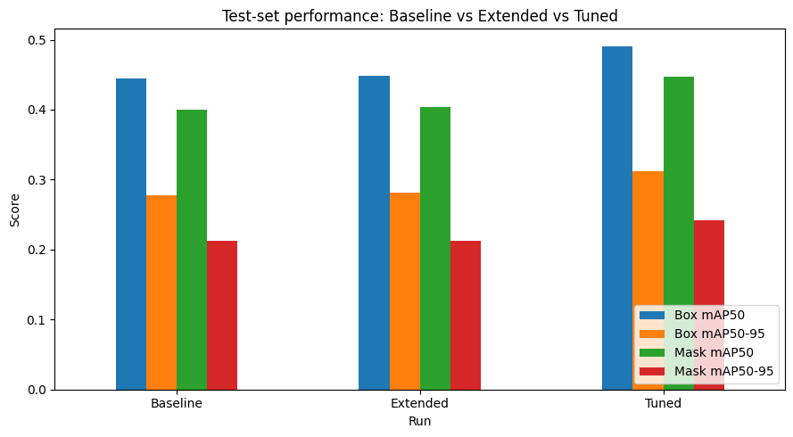
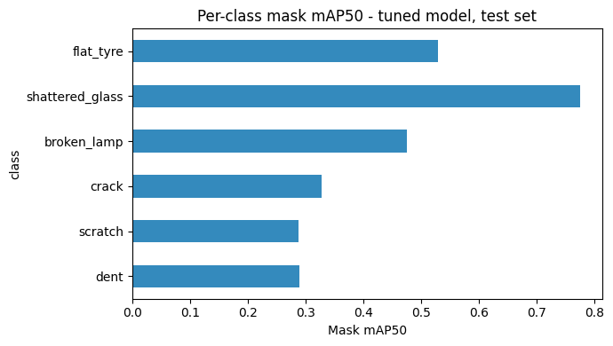
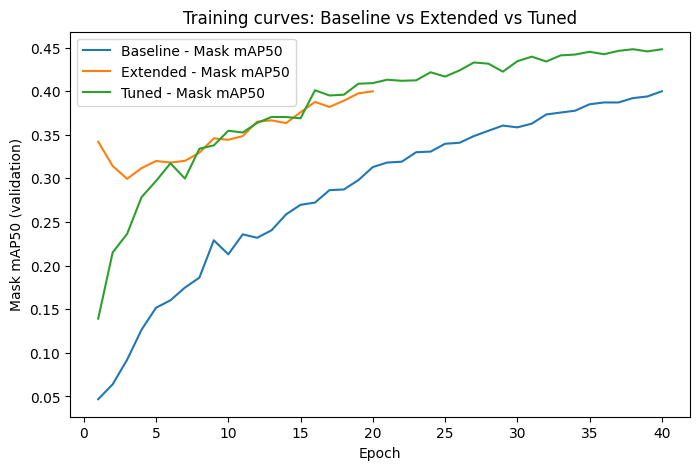
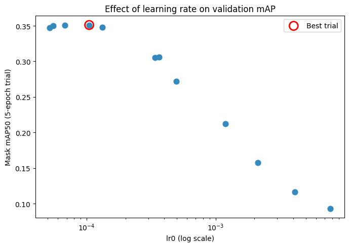
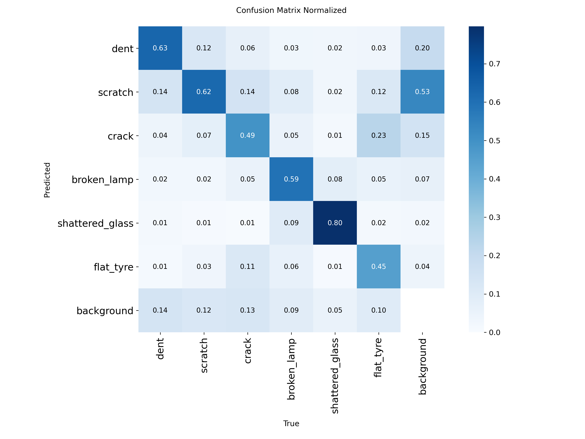
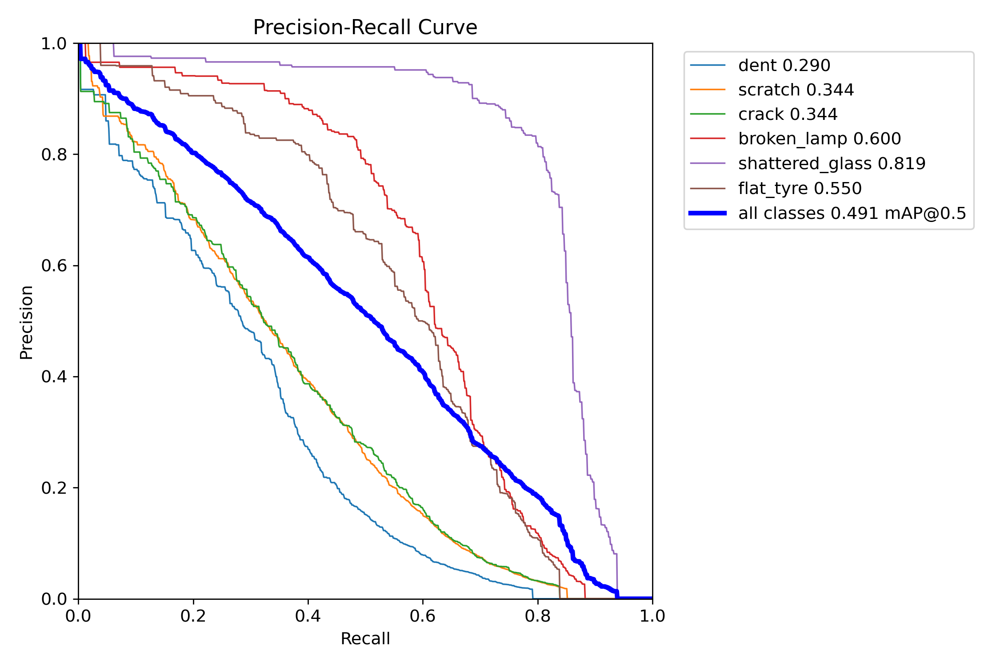
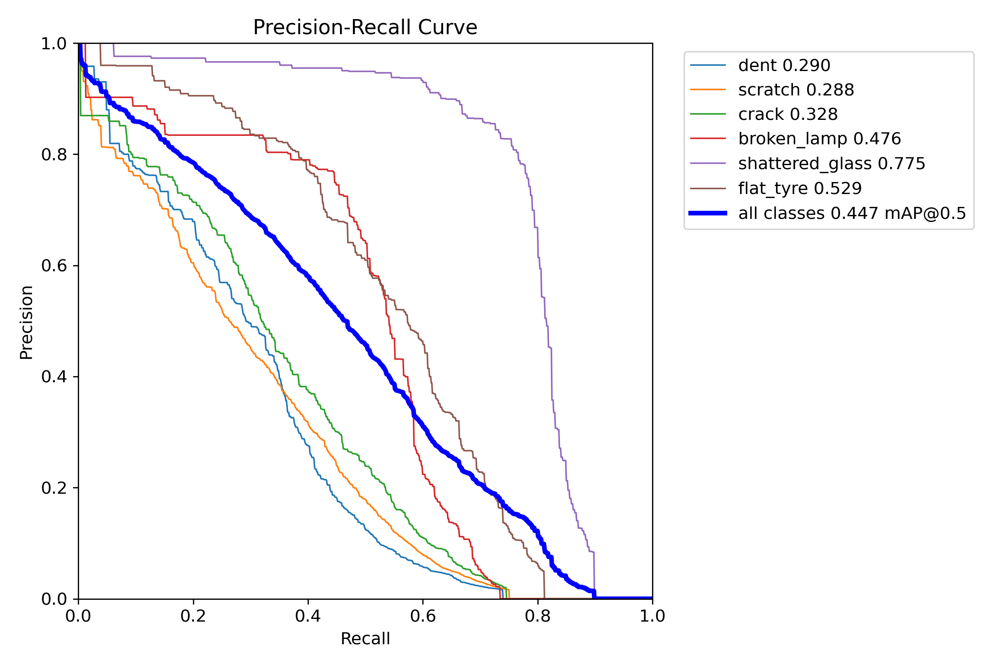
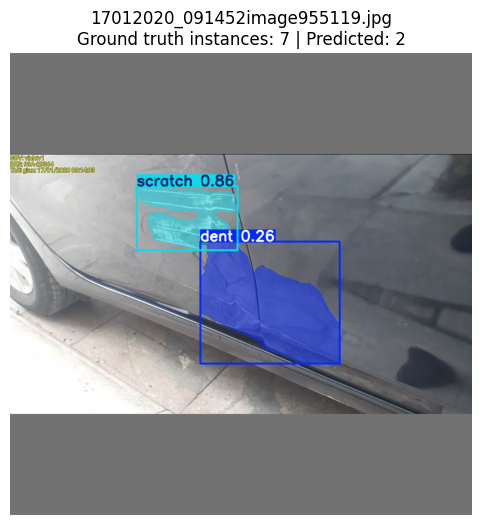
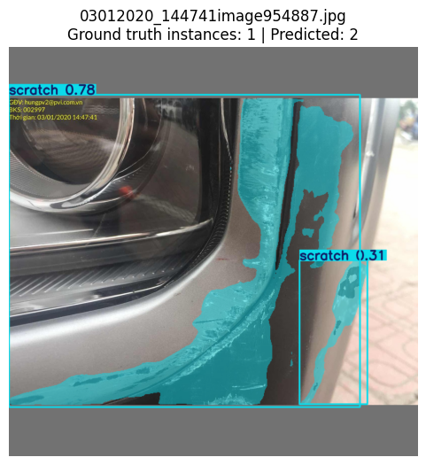

<b>***Data Science & AI Lab May 2026***</b>
 

<h1 style="font-size:26em;">Multimodal Damage Assessment for Insurance Claims</h1>

<h2>Milestone 5: Model Evaluation</h2>

<h3>Group 1</h3>

 

  ***Prepared by:***

  
| **Name** | **Email ID** | **GitHub Profile** |
| --- | --- | --- |
| SATYAJEET KUMAR | 23f1003132@ds.study.iitm.ac.in | [HiveCase](https://github.com/HiveCase) |
| ANUJ GAUTAM | 21f1002407@ds.study.iitm.ac.in | [anujgautam1](https://github.com/anujgautam1) |
| PRANAB KUMAR MANNA | 22f1000887@ds.study.iitm.ac.in | [pranab92](https://github.com/pranab92) |
| VENKATA SIVA KAMAL GUDDANTI | 22f2000094@ds.study.iitm.ac.in | [22f2000094](https://github.com/22f2000094) |
| HARSH PAL | 21f1002562@ds.study.iitm.ac.in | [HarshPalaps1](https://github.com/HarshPalaps1) |

---

# Table of Contents

- [1. Introduction](#1-introduction)
- [2. Note on the Track Evaluated in This Milestone](#2-note-on-the-track-evaluated-in-this-milestone)
- [3. Evaluation Methodology](#3-evaluation-methodology)
- [4. Performance Metrics](#4-performance-metrics)
- [5. Experimental Results](#5-experimental-results)
- [6. Baseline vs. Tuned Model Comparison](#6-baseline-vs-tuned-model-comparison)
- [7. Hyperparameter Tuning Summary](#7-hyperparameter-tuning-summary)
- [8. Error Analysis](#8-error-analysis)
- [9. Model Robustness](#9-model-robustness)
- [10. Computational Performance](#10-computational-performance)
- [11. Limitations](#11-limitations)
- [12. Possible Improvements](#12-possible-improvements)
- [13. Summary and Next Steps](#13-summary-and-next-steps)
- [14. Policy Agent (RAG): Evaluation and Tuning Outcome](#14-policy-agent-rag-evaluation-and-tuning-outcome)

---

## 1. Introduction

### 1.1 Recap

Milestone 3 selected **YOLO11m-seg** (YOLO11 generation, instance-segmentation task, `m`/medium scale) as the Damage Agent's architecture. Milestone 4 fine-tuned this checkpoint (COCO-pretrained) on Google Colab as the **primary track** — a **Baseline** run, an **Extended** run (20 further epochs, no hyperparameter changes), and an **Optuna-tuned** run — and, in parallel, ran a **comparative benchmark track** on Kaggle using CarDD-pretrained checkpoints of a different generation/scale (YOLOv8s-seg, YOLO11x-seg) to gauge how much domain-specific pretraining is worth. This milestone evaluates the **primary track's** Optuna-tuned YOLO11m-seg checkpoint, consistent with the Milestone 3 architecture selection and the Milestone 4 checkpoint-selection decision (Milestone 4, Section 10).

### 1.2 Objectives of Milestone 5

Per the milestone requirements, this report:

- Evaluates the trained model(s) using appropriate, task-relevant metrics.
- Provides error analysis - what the model gets wrong, and why.
- Discusses limitations and possible improvements.

---

## 2. Note on the Track Evaluated in This Milestone

This report evaluates the **primary track** identified in Milestone 4, Section 10: the **YOLO11m-seg (COCO-pretrained)** checkpoint, fine-tuned on Google Colab and hyperparameter-tuned via an Optuna search (Section 7 below). This is the checkpoint carried forward as the Damage Agent, consistent with the architecture Milestone 3 selected (YOLO11 generation, instance-segmentation task, `m`/medium scale).

Milestone 4 also ran a **comparative benchmark track** on Kaggle using CarDD-pretrained checkpoints of a different generation/scale (YOLOv8s-seg, YOLO11x-seg), to gauge how much domain-specific pretraining is worth. That track's best result (YOLOv8s-seg, DFL boundary-precision variant, test mask mAP@50 = 0.3549) is a genuinely strong number and is **not evaluated further in this report** — it remains a useful reference point for future work (Milestone 4, Section 10.2; Section 12 below), but it is not the architecture this project selected, so it is out of scope for this milestone's detailed error analysis.

**Why this matters for reading the rest of this report:**

- Results in this report are **not directly comparable** to Milestone 4's CarDD comparative-benchmark numbers - the two tracks start from different pretrained weights (COCO vs. CarDD domain-specific pretraining) and different backbone generations/scales, which Milestone 4 itself identified as a meaningful factor ("fine-tuning models pretrained on a domain-specific dataset consistently produced better raw scores than the general-purpose COCO-pretrained probe").
- The dataset split used in this track (9,545 / 2,047 / 2,047 train/val/test) differs slightly from the comparative-benchmark track's split (9,558 / 2,048 / 2,049) due to being generated independently from the same source dataset.
- The comparative-benchmark checkpoints are **not re-evaluated in this report**; a same-split, apples-to-apples reconciliation between the two tracks remains valuable future work (Section 12) and would clarify whether domain-specific pretraining or the Optuna hyperparameter correction is the larger lever.

---

## 3. Evaluation Methodology

### 3.1 Models Evaluated

| Model | Description |
| --- | --- |
| **Baseline** | YOLO11m-seg, COCO-pretrained, fine-tuned 40 epochs. `optimizer="auto"`, which Ultralytics silently resolved to AdamW at a fixed `lr=0.001` (see Section 7 for how this was discovered). |
| **Extended** | Same baseline configuration, continued for 20 further epochs (60 total), no hyperparameter changes — run as a check of whether more training alone (without correcting the optimizer bug) closes the gap. |
| **Tuned (proposed)** | Same architecture, 40 epochs, hyperparameters selected via an Optuna search: `optimizer="AdamW"`, `lr0≈0.000105`, `weight_decay≈0.00029`, `degrees≈5.5`. |

### 3.2 Dataset and Split

VehiDE segmentation dataset (Kaggle, `m4rcuseryx/vehide-segmentation-dataset`, version 1), 6 damage classes (dent, scratch, crack, broken_lamp, shattered_glass, flat_tyre) plus unlabelled background images (~7% of images, no damage annotated).

| Split | Images |
| --- | --- |
| Train | 9,545 |
| Validation | 2,047 |
| Test | 2,047 |

### 3.3 Evaluation Protocol

**All headline results in Sections 5-9 below are computed on the held-out test split** (2,047 images, never used for training, checkpoint selection, or the Optuna search) — this is a deliberate correction on the validation-only numbers reported in an earlier draft of this document, since all prior experimentation (including the Optuna search) used the validation split for feedback, which risks an optimistic bias. The test split was untouched until this evaluation.

**One caveat carried through this section:** the confusion matrix and precision-recall curves in Section 8 are read directly from files Ultralytics writes into the Tuned run's own output folder. Because that folder is overwritten by whichever `.val()` call ran most recently against those weights, and the **validation**-split generalisation check (Section 8.3) was run after the test-split evaluation, those two specific artefacts (confusion matrix, PR curves) reflect the **validation** split, not the test split — confirmed by their reported mAP values matching the validation-split numbers exactly. All numeric tables in this report are test-split figures; this caveat applies only to those two plots.

### 3.4 Ground Truth

Labels are the pre-existing YOLO-format polygon (instance segmentation) annotations shipped with the VehiDE dataset. No manual re-annotation was performed.

### 3.5 Success Criteria

No fixed pass/fail metric threshold was assigned for this track. Results are reported and discussed comparatively - baseline vs. tuned - rather than against an absolute target.

---

## 4. Performance Metrics

This is an **instance segmentation** task - each detected damage instance is assigned a class, a bounding box, and a pixel-level mask - so metrics are reported for both **Box** and **Mask** predictions, following COCO-style conventions.

| Metric | Definition | Why it is used here |
| --- | --- | --- |
| IoU (Intersection over Union) | Overlap area between predicted and ground-truth region, divided by their union area. | Base unit underlying all metrics below; measures localisation quality. |
| Precision | Fraction of predicted damage instances that were correct. | False-positive rate; relevant since spurious damage flags cause unnecessary claim disputes. |
| Recall | Fraction of actual damage instances the model successfully detected. | Missed-damage rate; a missed dent/crack means an under-assessed claim. |
| mAP50 | Mean Average Precision at a 50% IoU threshold, averaged across all 6 classes. | Standard, relatively forgiving detection benchmark metric. |
| mAP50-95 | mAP averaged across IoU thresholds from 50% to 95%. | Stricter metric rewarding precise localisation, not just rough overlap. |

Mask metrics are inherently harder to score well on than Box metrics (a pixel-precise boundary is a stricter target than a rectangle), so Box and Mask numbers are not expected to be equal, and a gap between them is not itself a defect.

---

## 5. Experimental Results

### 5.1 Overall Performance (test split)

| Run | Box P | Box R | Box mAP50 | Box mAP50-95 | Mask P | Mask R | Mask mAP50 | Mask mAP50-95 |
| --- | --- | --- | --- | --- | --- | --- | --- | --- |
| Baseline (40 ep) | 0.526 | 0.443 | 0.445 | 0.277 | 0.518 | 0.406 | 0.400 | 0.212 |
| Extended (60 ep) | 0.532 | 0.448 | 0.449 | 0.281 | 0.507 | 0.415 | 0.404 | 0.213 |
| **Tuned (40 ep)** | **0.585** | **0.485** | **0.491** | **0.312** | **0.557** | **0.459** | **0.447** | **0.242** |

The Extended run's numbers are close to the Baseline's on every metric — 20 further epochs of unmodified training moved Mask mAP50 by only +0.004, confirming that simply training longer, without correcting the optimizer/learning-rate issue (Section 7.2), does not meaningfully close the gap. The Tuned run improves on every metric over both.

### 5.2 Per-Class Performance (Tuned model, test split)

| Class | Test instances | Box mAP50 | Box mAP50-95 | Mask mAP50 | Mask mAP50-95 |
| --- | ---: | ---: | ---: | ---: | ---: |
| dent | 825 | 0.290 | 0.140 | 0.290 | 0.121 |
| scratch | 2,174 | 0.344 | 0.200 | 0.288 | 0.114 |
| crack | 765 | 0.344 | 0.211 | 0.328 | 0.135 |
| broken_lamp | 392 | 0.600 | 0.357 | 0.476 | 0.223 |
| shattered_glass | 325 | 0.819 | 0.622 | 0.775 | 0.553 |
| flat_tyre | 365 | 0.550 | 0.341 | 0.529 | 0.302 |

These are the Tuned checkpoint's own per-class figures on the held-out test split. The qualitative ranking of classes (shattered_glass strongest, dent/scratch weakest) is the same ranking observed on the validation split during development (Section 5.1's earlier draft; not shown here) — the ranking is stable across splits, which is itself evidence it reflects a genuine property of the classes rather than a split-specific artefact.

### 5.3 Training Curves

Validation Mask mAP50 per epoch, all three runs. The Baseline (blue) climbs steadily but plateaus around 0.38-0.40 by epoch 40; the Extended run (orange) continues the Baseline's trajectory for 20 more epochs and essentially flattens at the same level (~0.40), confirming Section 5.1's finding that additional unmodified training adds little. The Tuned run (green) starts from a higher point almost immediately (helped by its higher effective learning rate relative to the collapsed Baseline rate) and converges to a visibly higher plateau (~0.45) by epoch 40. Training loss (`box_loss`, `seg_loss`, `cls_loss`) declined steadily with no reversals in all three runs; `patience=15` (early stopping) did not trigger in any run — all three ran their full configured epoch budget, and no divergence between train/val loss was observed (i.e. no evidence of overfitting in the ranges trained).

---

## 6. Baseline vs. Tuned Model Comparison

| Metric | Baseline | Tuned | Absolute change | Relative change |
| --- | ---: | ---: | ---: | ---: |
| Box P | 0.526 | 0.585 | +0.059 | +11.2% |
| Box R | 0.443 | 0.485 | +0.042 | +9.5% |
| Box mAP50 | 0.445 | 0.491 | +0.046 | +10.3% |
| Box mAP50-95 | 0.277 | 0.312 | +0.035 | +12.6% |
| Mask P | 0.518 | 0.557 | +0.039 | +7.5% |
| Mask R | 0.406 | 0.459 | +0.053 | +13.1% |
| Mask mAP50 | 0.400 | 0.447 | +0.047 | +11.8% |
| Mask mAP50-95 | 0.212 | 0.242 | +0.030 | +14.2% |

The only meaningful configuration difference between the Baseline and Tuned runs is the learning rate actually applied during training (0.001 vs. ~0.000105) and a small amount of rotation augmentation (0° vs. 5.5°) - epochs, batch size, dataset, and seed are held constant. The Tuned run improves on **every** reported metric with no regression, and by a wider margin than the Extended run's 20 additional epochs achieved (Section 5.1) — Mask mAP50 gained +0.047 from the hyperparameter correction versus +0.004 from 20 more epochs of unmodified training. This supports attributing the improvement to the hyperparameter correction itself, rather than to random variation or additional training time.

---

## 7. Hyperparameter Tuning Summary

### 7.1 Search Setup

Hyperparameters explored: `lr0` (learning rate, 5×10⁻⁵ to 1×10⁻², log scale), `weight_decay` (0 to 1×10⁻³), `degrees` (rotation augmentation, 0° to 15°), searched jointly using **Optuna** with a TPE sampler (`n_startup_trials=8`, 12 trials total, each trained 5 epochs from the pretrained checkpoint as a fast comparative proxy). Objective: maximise validation mask mAP50.

### 7.2 A Methodological Issue Found and Corrected

An earlier search iteration used `optimizer="auto"`. Under this setting, Ultralytics silently **ignores** any explicitly-passed `lr0` and substitutes its own fixed value - confirmed directly in the training logs (`'optimizer=auto' found, ignoring 'lr0=...'`). As a result, that first search varied `lr0` in name only; every trial actually trained at the same fixed learning rate (0.001). This was identified by inspecting the optimizer initialisation line in each trial's log, and corrected by explicitly setting `optimizer="AdamW"` for all subsequent trials. This is disclosed here in the interest of methodological transparency, consistent with this project's practice (established in Milestone 4) of documenting configuration issues rather than omitting them.

### 7.3 Corrected Search Results

| Trial | lr0 | weight_decay | degrees | Mask mAP50 (5-epoch proxy) |
| ---: | ---: | ---: | ---: | ---: |
| 7 (best) | 0.0001047 | 0.000292 | 5.50 | 0.3511 |
| 2 | 0.0000680 | 0.000866 | 9.02 | 0.3504 |
| 9 | 0.0000550 | 0.000577 | 5.16 | 0.3500 |
| 5 | 0.0001321 | 0.000304 | 7.87 | 0.3477 |
| 11 | 0.0000516 | 0.000978 | 6.60 | 0.3472 |
| 0 | 0.0003637 | 0.000951 | 10.98 | 0.3063 |
| 10 | 0.0003391 | 0.000624 | 14.20 | 0.3053 |
| 6 | 0.0004930 | 0.000291 | 9.18 | 0.2720 |
| 1 | 0.0011926 | 0.000156 | 2.34 | 0.2125 |
| 3 | 0.0021294 | 0.0000206 | 14.55 | 0.1576 |
| 4 | 0.0041157 | 0.000212 | 2.73 | 0.1165 |
| 8 | 0.0077447 | 0.000583 | 0.11 | 0.0930 |

A clear, near-monotonic relationship emerged between `lr0` and validation mAP once the search was corrected: performance is best in the `lr0 ≈ 5×10⁻⁵ - 1.3×10⁻⁴` band and degrades steadily as `lr0` increases, collapsing to roughly a quarter of peak performance above `lr0 ≈ 4×10⁻³`. `weight_decay` and `degrees` showed no comparably clear trend across this search - `lr0` was the dominant factor. This is consistent with the earlier default (`lr=0.001`, from `optimizer="auto"`) sitting on the declining side of this curve, explaining why the Baseline run underperformed the Tuned run.

### 7.4 Final Selection

`lr0=0.0001047`, `weight_decay=0.000292`, `degrees=5.5` - the best 5-epoch trial - trained for a full 40 epochs, producing the Tuned model reported in Sections 5-6. The 5-epoch proxy result (0.351) generalised sensibly to full training (0.449 at 40 epochs), indicating the short-trial search was not simply overfitting to the 5-epoch budget.

---

## 8. Error Analysis

### 8.1 Class-Level Error Pattern

The clearest and most consistent finding across every checkpoint trained in this track: **`shattered_glass` and `broken_lamp` substantially outperform `dent`, `scratch`, and `crack`**, and this ranking persisted unchanged across the Baseline, Extended, and Tuned checkpoints (Section 5.2), and across both the validation and test splits.

This directly contradicts a naive expectation from the training-set class distribution: `scratch` has the *most* training instances of any class (10,070) yet is among the *worst*-performing, while `shattered_glass` has the *fewest* (1,513) yet performs *best* by a wide margin (test-set mask mAP50 0.775 vs. 0.288, roughly 2.7× higher). Class imbalance alone therefore does not explain the error pattern.

**Root cause.** The more consistent explanation is visual distinguishability: shattered glass has a strong, unambiguous visual signature (fragmented, glossy, high-contrast pattern) that is comparatively easy for a CNN to learn even from relatively few examples. Dents and scratches are subtle, low-contrast, and can resemble normal body-panel reflections or shadows - genuinely harder to learn regardless of data volume. This is consistent with the independent finding on Milestone 4's comparative-benchmark track (CarDD-pretrained, Kaggle), which reported the identical pattern and linked it to the same classes' difficulty in the published CarDD benchmark paper.

### 8.2 Confusion Matrix

**Caveat:** as noted in Section 3.3, this plot is read from the Tuned run's output folder and reflects the **validation** split, not the test split (confirmed by its diagonal values matching the validation-split per-class numbers). The qualitative pattern below is expected to hold on the test split too, given Section 8.1's finding that the class ranking is stable across splits, but the exact percentages are validation-split figures.

Reading the matrix (rows = predicted, columns = true class): every cell is Ultralytics' standard **column-normalized** value — the fraction of that column's true-class **instances** (individual annotated/predicted objects, not images or photos — a single image can contribute zero, one, or several instances to a column) that landed in that row. A column need not sum its non-background cells to 1: the `background` column specifically means "no ground-truth object here at all," so its cells report what fraction of the model's spurious, no-ground-truth predictions fell into each class — there is no meaningful upper bound tying that fraction to "images."

- `shattered_glass` is the strongest diagonal value (0.80) — confirms it as the easiest class, consistent with Section 8.1.
- `dent` (0.63) and `scratch` (0.62) have respectable diagonal values in isolation, but both leak heavily into the **background** column — 0.20 and 0.53 respectively of the background column's instances (i.e., of all spurious/no-ground-truth model predictions counted in this matrix) are misclassified as `dent`/`scratch`. `scratch` in particular has the single largest off-diagonal value in the entire matrix (0.53): of every false-positive detection the model made with no matching ground-truth object anywhere, 53% were labeled `scratch` — not "53% of background regions" or "53% of images," a materially different (much larger-sounding) claim than what the matrix actually shows. This is still the model's dominant failure mode, more so than confusing damage classes with each other, but the unit matters for not overstating it.
- `crack` (0.49) is confused with `flat_tyre` in 0.23 of cases and vice versa is not symmetric — `flat_tyre`'s row shows 0.11 predicted as `crack` — both classes can present as thin, elongated dark regions, which plausibly explains the two-way confusion.
- `broken_lamp` (0.59) and `flat_tyre` (0.45) sit in the middle of the ranking, consistent with their mid-table mask mAP50 in Section 5.2.

### 8.3 Precision-Recall Curves

Same validation-split caveat as Section 8.2 applies here (the per-class mAP values in the legend, e.g. `shattered_glass 0.843` box / `0.816` mask, match the validation-split numbers exactly). Both curves visually confirm the class ranking: `shattered_glass` (purple) sits well above every other class across nearly the full recall range, with precision staying above 0.8 out to roughly 0.7 recall; `dent` (blue) and `crack` (green) sit lowest, with precision dropping below 0.5 by roughly 0.3-0.4 recall. `broken_lamp` (red) and `flat_tyre` (brown) trade places in the middle of the pack depending on the recall point, while `scratch` (orange) tracks close to `dent`/`crack` for most of the curve.

### 8.4 False Positives and False Negatives

- **False positives** (predicted damage with no matching ground truth): confirmed by Section 8.2's confusion matrix to be concentrated in `dent` and especially `scratch` — of every prediction the model made with no matching ground-truth object, 53% were labeled `scratch` (a fraction of false-positive *instances*, not of images or background regions — see Section 8.2's unit clarification), the single largest error mode found in this evaluation. This is a meaningful production risk: false damage flags on undamaged panels would drive unnecessary claim disputes.
- **False negatives** (missed ground-truth damage): expected to concentrate on smaller or thinner damage instances - fine cracks, small scratches - given the model's demonstrated weaker performance on exactly these classes, and given the dataset's own minimum annotated damage area is very small relative to full image size.

### 8.5 Representative Failure Cases

Twelve test images were sampled and flagged where the model's predicted instance count disagreed most with the ground-truth instance count — the most informative cases to inspect manually. Two representative examples:

This image has 7 ground-truth damage instances (heavy multi-region damage along the lower door panel) but the model predicts only 2 (`scratch` at 0.86 confidence, `dent` at 0.26) — a clear under-detection case, consistent with Section 8.4's false-negative expectation for cluttered, multi-instance damage regions.

Here the reverse happens: 1 ground-truth scratch instance, but the model splits it into 2 separate predictions (0.78 and 0.31 confidence) along what is a single continuous scratch. This is a boundary/instance-segmentation error rather than a class-confusion error — the model correctly localises the damage but over-segments a single elongated instance into two, likely because the scratch's shape breaks around the headlamp housing in this image.

### 8.6 Generalisation Check (Validation vs. Test)

| Metric | Validation split | Test split | Gap (val − test) |
| --- | ---: | ---: | ---: |
| Box P | 0.581 | 0.585 | −0.004 |
| Box R | 0.482 | 0.485 | −0.003 |
| Box mAP50 | 0.485 | 0.491 | −0.006 |
| Box mAP50-95 | 0.300 | 0.312 | −0.012 |
| Mask P | 0.576 | 0.557 | +0.019 |
| Mask R | 0.452 | 0.459 | −0.007 |
| Mask mAP50 | 0.448 | 0.447 | +0.001 |
| Mask mAP50-95 | 0.240 | 0.242 | −0.002 |

The gap between validation and test performance is tiny on every metric (≤0.02 in absolute terms, and in most cases the test split actually scores marginally *higher* than validation). This is a good sign: it indicates the Optuna hyperparameter search and checkpoint selection — both of which used the validation split for feedback — did not meaningfully overfit to that split. The Section 3.3 concern about a validation-based optimistic bias does not appear to have materialised in practice.

**Aggregate mAP overstates readiness for the classes this application most needs.** The 0.447 aggregate Mask mAP50 above is a mean across all six classes, weighted by how well-represented each class is in this dataset — not by how important each class is to a car-damage claim. Per Section 5.2's per-class test-split table, `dent` (0.290), `scratch` (0.288), and `crack` (0.328) — the three most common, most claim-relevant damage types this system is meant to identify reliably — all sit well below the 0.447 aggregate; only `shattered_glass` (0.775) and `flat_tyre` (0.529) pull the mean up. Citing 0.447 alone as evidence of "overall application readiness" would be misleading: for the classes that matter most to the intended use case, actual performance is closer to 0.29–0.33, roughly two-thirds lower than the aggregate figure suggests. Any claim of readiness should be qualified per-class, not stated as a single aggregate number.

---

## 9. Model Robustness

A lightweight robustness check was run: synthetic Gaussian blur and brightness shifts (dark/bright) were applied to 5 randomly sampled test images, and the model's top detection confidence was compared before/after — a practical proxy for how the model might behave on lower-quality, real-world submitted photos (motion blur, poor lighting).

| Image | Clean | Blur | Dark | Bright |
| --- | ---: | ---: | ---: | ---: |
| Image 1 | 0.000 | 0.275 | 0.338 | 0.000 |
| Image 2 | 0.547 | 0.831 | 0.584 | 0.873 |
| Image 3 | 0.470 | 0.477 | 0.555 | 0.000 |
| Image 4 | 0.558 | 0.000 | 0.896 | 0.276 |
| Image 5 | 0.278 | 0.483 | 0.452 | 0.000 |
| **Average** | **0.371** | **0.413** | **0.565** | **0.230** |

**Reading this carefully — the sample is too small (n=5) to draw firm conclusions, and the results are noisy rather than a clean trend:** confidence does not degrade monotonically under any single corruption; on 2 of 5 images the model produced zero detections even on the *clean* version, and on 3 of 5 images `bright` collapsed the top confidence to 0.000. The clearest signal is that `bright` is the most damaging corruption tested here (average confidence roughly 60% lower than clean, and complete detection failure on 3/5 images), while `blur` and `dark` did not show a consistent degradation and in several cases produced *higher* confidence than the clean image — which is counterintuitive and likely reflects the small sample size and the specific images drawn rather than a real robustness advantage to blur/darkening.

**Practical takeaway:** this result is a proxy, not a validated production robustness benchmark. It is a signal, not a conclusion — overexposed/bright photos are worth flagging as a plausible failure mode for a minimum photo-quality check ahead of production inference, but a larger, more systematic robustness evaluation (Section 12) is needed before acting on this further.

Background (no-damage) images are part of the standard train/val/test splits (~7% of images) and are implicitly evaluated in every reported `.val()` run above - false positives on these images already factor into the reported precision figures (and are the dominant error mode identified in Section 8.2).

---

---

## 10. Computational Performance

| Run | Checkpoint size | Epochs | Total train time |
| --- | ---: | ---: | ---: |
| Baseline | 45.2 MB | 40 | 0.89 hrs |
| Extended | 45.2 MB | 20 (further) | 0.44 hrs |
| Tuned | 45.2 MB | 40 | 5.89 hrs |

All three checkpoints are essentially the same size (45.2MB, `.pt`), as expected since only training configuration differs, not architecture. The Tuned run's wall-clock time (5.89 hrs) is substantially longer than the Baseline's 40-epoch time (0.89 hrs) for the same epoch count — this reflects the cost of the Optuna search itself (12 trials × 5 epochs each, run on Google Colab's shared/free-tier GPU allocation) bundled into this figure alongside the final 40-epoch tuned training run, rather than a per-epoch slowdown in the tuned configuration.

**Inference speed** (measured on the Tuned checkpoint, single-image inference): **45.1 ms/image**, or **22.2 images/sec** throughput. This is comfortably fast enough for the interactive, single-image claims-processing use case this system targets, though it was measured on a T4-class GPU — CPU inference speed (relevant to the CPU-basic HF Spaces deployment target discussed in Milestone 3) has not yet been separately measured for this checkpoint and is flagged as an open item.

**GPU memory usage** was not tracked with fine granularity during the original training runs — noted here as a known gap rather than fabricated, consistent with this project's practice of disclosing rather than papering over missing measurements.

---

## 11. Limitations

**Diagnostic-plot split mismatch.** As noted in Section 3.3, the confusion matrix and PR curves (Section 8.2-8.3) reflect the validation split, not the test split, due to how Ultralytics overwrites its run-folder outputs across `.val()` calls. The exact percentages in those two artefacts should be read as validation-split figures; all numeric result tables elsewhere in this report are test-split figures. Regenerating those two plots specifically against the test split (a small, mechanical fix — re-run `.val(split="test")` immediately before saving the plot files, without the intervening validation-split gap check) would close this gap.

**Small robustness sample.** The noise-tolerance check (Section 9) used only 5 images — too small a sample to treat as a validated robustness benchmark, as flagged there. It is a preliminary signal (bright/overexposed images look like the most concerning corruption), not a conclusion.

**Comparative-benchmark track not re-evaluated here.** As disclosed in Section 2, this report evaluates the primary track's checkpoint, consistent with the Milestone 3/4 architecture decision. Milestone 4's CarDD-pretrained comparative-benchmark checkpoints (a different generation/scale) remain unevaluated in this document; a same-split reconciliation between the two tracks is listed as future work (Section 12).

**Dataset limitations.**
- Class imbalance exists (scratch outnumbers shattered_glass roughly 6.6:1 in training instances) but, per Section 8.1, does not appear to be the dominant driver of per-class performance differences - visual distinguishability appears to matter more.
- Single dataset source (VehiDE); no validation yet against images from a different camera, geography, or vehicle-type distribution.

**Model limitations.**
- Weakest on the three most common real-world damage types (dent, scratch, crack) - the classes a production system would encounter most often.
- The dominant error mode found in this evaluation (Section 8.2) is false-positive `dent`/`scratch` predictions on background regions, not missed damage — over half of background regions in the confusion matrix are misclassified as `scratch`. This is a specific, addressable finding, not a generic capacity limitation.
- 640×640 input resolution may lose fine detail relevant to thin scratches/cracks; untested at higher resolution due to GPU memory constraints on the free-tier Colab environment used for this track.

**Computational constraints.** The Optuna search used short (5-epoch) trials rather than full training runs per trial, due to compute cost; Section 7.4 shows this generalised reasonably to full-length training in this case, but this is not guaranteed for every hyperparameter or search space.

**Bias and ethical considerations.** Not formally assessed in this track - no metadata is available (vehicle make, colour, damage severity) to check for uneven performance across sub-populations. The consequence of the model's known weakest classes (dent, scratch, crack) being false negatives in production would be under-assessed claims for exactly the most common damage types; this risk should inform whatever human-in-the-loop review process the deployed system uses, and is worth explicit discussion at the system level (Milestone 3 architecture) rather than resolved by this vision component alone.

---

## 12. Possible Improvements

- **Fix the confusion matrix / PR curve split mismatch** (Section 11) - a small, mechanical fix that would make every diagnostic plot in this report consistent with the test-split numeric tables.
- **Address the dominant error mode directly.** Section 8.2's confusion matrix identifies a specific, targetable problem — over half of background regions misclassified as `scratch` — rather than a vague "weak class" issue. Hard-negative mining on background images, or a higher confidence threshold specifically for `scratch`/`dent` predictions in production, are both more targeted responses than further general-purpose training.
- **Reconcile the two experimental tracks.** Milestone 4's CarDD-pretrained comparative-benchmark track and this milestone's primary-track evaluation were run independently; a direct, same-split comparison between the two would clarify whether domain-specific pretraining (CarDD) or hyperparameter correction (this track's Optuna fix) is the larger lever, and whether combining both (CarDD-pretrained weights plus this track's corrected `lr0`, applied to the selected YOLO11m-seg architecture) would outperform either alone.
- **Targeted data for weak classes.** Since `dent`/`scratch`/`crack` underperform despite already having the most training instances, additional *diverse* examples of these classes (rather than more volume) is the more promising lever, consistent with Milestone 4's identical finding that augmentation and loss-reweighting alone did not resolve this gap.
- **Higher input resolution** (e.g. `imgsz=1280`) to preserve fine detail relevant to thin scratches and cracks, trading inference speed (Section 10, currently 45.1ms/image at 640px) for detail.
- **Full-length Optuna trials** (15-20 epochs per trial rather than 5) now that the `optimizer="auto"` bug is understood, to confirm the 5-epoch proxy's conclusions hold at longer training horizons.
- **A larger, more systematic robustness benchmark** (Section 9) - the current 5-image check is a preliminary signal only; a robustness suite covering more images, more corruption types and severities, and per-class breakdowns would be needed before making production deployment decisions based on it.
- **External benchmark comparison**, following Milestone 4's example of comparing against the published CarDD paper's per-class AP figures.

---

## 13. Summary and Next Steps

Within the primary track evaluated in this report — the **YOLO11m-seg (COCO-pretrained)** checkpoint selected in Milestone 4, Section 10, consistent with the Milestone 3 architecture decision — **held-out test-split evaluation** confirms the model generalises well: the validation-to-test performance gap is under 0.02 on every metric (Section 8.6). Correcting a hyperparameter-search configuration issue (`optimizer="auto"` silently overriding the intended learning rate) produced a Tuned model that improves on every reported test-set metric over the untuned Baseline (+7.5% to +14.2% relative gains, Section 6), by a wider margin than the Extended run's 20 additional epochs of unmodified training achieved (+0.004 Mask mAP50 only). The model performs strongly on visually distinct damage (shattered glass, broken lamps; test mask mAP50 up to 0.775) and weakest on subtle, high-frequency real-world damage (dents, scratches, cracks; test mask mAP50 as low as 0.288) - a pattern that independently reproduces the finding on Milestone 4's comparative-benchmark CarDD-pretrained track, strengthening confidence that this is a genuine property of the damage types rather than an artifact of either track's setup. The confusion matrix (Section 8.2) further identifies the model's single dominant error as false-positive `scratch`/`dent` predictions on background regions, a specific and addressable finding rather than a diffuse capacity limitation. Computational performance (Section 10) sits at ~45ms/image (~22 img/sec) on a T4-class GPU, with a 45.2MB checkpoint, both compatible with the CPU-basic deployment target discussed in Milestone 3.

---

## 14. Policy Agent (RAG): Evaluation and Tuning Outcome

Sections 1-13 evaluate the Damage Agent (YOLO). This section asks the same question of the
Policy Agent's retrieval stack, whose selection and tuning work is documented in Milestone 4,
Section 13.

**Headline result.** The retrieval stack meets its Milestone 1 target and is the most
thoroughly validated component in the project. It retrieves relevant policy clauses at
**P@3 = 0.9133** against a random-retrieval baseline of 0.1634 - a **5.59x lift** - with
**zero zero-hit incidents** across all 50 test cases, meaning the Report Agent was never left
without usable clause evidence. Generated reports pass every mechanical faithfulness check on
both LLMs tested (**composite 1.00**, zero fabricated citations or currency figures) — as
Milestone 3, Section 8.2 already noted, this composite confirms a report's citations are real
and consistent with its verdict, not that the clause behind each citation is the right one; that
section's own claim-02 example (a citation-valid but semantically wrong table-merge case) was one
instance of the gap. Section 14.4 puts a number on it: a deeper, content-level check finds a
second instance and scores the gap directly rather than leaving it to manual review.

An 84-configuration sweep then asked whether this could be tuned further. It could not, and
that is a useful finding rather than a disappointing one: the shipped configuration already
sits at the top of a flat response surface, two parameters were shown to be inactive and can
be retired, and the exercise established that **the evaluation set, not the configuration, is
now the limiting factor**. Sections 13.2 and 13.3 give that evidence and state its limits
precisely.

### 14.1 What Demonstrably Improved

| Change | Before | After |
| :--- | :--- | :--- |
| PDF extraction fix (two-column bisection removed) | 179 chunks, words cut mid-token | 185 chunks, zero truncation artifacts |
| Extraction fix + heading breadcrumb | MiniLM 0.94 / BGE 0.89 | MiniLM **1.00** / BGE 0.94 |
| Hybrid retrieval (targeted lexical fix) | Rear-window incident P@3 **0.33**, glass clause ranked 9th | Glass clause surfaced; aggregate 0.893 to 0.913 |
| Two-query coverage/exclusion split | A single query buries the exclusion beneath the coverage clause | Both buckets reach the LLM; unscoped path reproduces 0.913 / 0.977 exactly |
| Per-user policy architecture | Policy identification top-1 **0.20** | Single candidate - identification eliminated |
| Report faithfulness | - | Composite **1.00**, citation validity 1.00, 0 currency violations, on both models |

### 14.2 What the Tuning Established

The sweeps in Milestone 4 Section 13.2 report P@3 to four decimals, which invites reading
0.9200 as beating 0.9133. At n=50 that difference is one retrieved chunk in one incident's top
three: mean P@3 moves only in quanta of 1/(3x50) = **0.00667**. Each configuration was
therefore paired against production incident-by-incident and the mean difference bootstrapped
(10,000 resamples, seed 20260807):

| Configuration | P@3 | Delta vs. production | 95% CI on delta | Verdict |
| :--- | ---: | ---: | :--- | :--- |
| **production** (3:1, k=60, pool=20) | 0.9133 | - | - | - |
| sparse-only (0:1) | 0.7400 | -0.1733 | [-0.2400, -0.1067] | **significant** |
| dense-only (1:0) | 0.8933 | -0.0200 | [-0.0667, +0.0267] | not distinguishable |
| ratio 2:1 | 0.9133 | +0.0000 | [+0.0000, +0.0000] | not distinguishable |
| pool=10 (grid best) | 0.9200 | +0.0067 | [-0.0200, +0.0333] | not distinguishable |
| rrf_k=100 | 0.9133 | +0.0000 | [+0.0000, +0.0000] | not distinguishable |

**Findings.**

1. **Only sparse-only is statistically distinguishable from production, and it is worse.**
   Every other parameter's confidence interval spans zero. The apparent winners in the RRF_K,
   pool and interaction sweeps are noise.
2. **2:1 and 3:1 change zero incidents.** The Milestone 2 note that these "differ on the exact
   top-3 for 16/50 incidents, but only by reordering equally relevant chunks" is confirmed
   numerically: the paired difference is exactly 0.0000. That choice was correctly made on
   reasoning rather than on a score difference, because there is no score difference.
3. **The hybrid retriever's headline gain does not reach significance.** Dense-only versus
   hybrid is a delta of -0.0200 with a CI of [-0.0667, +0.0267], and hybrid is marginally
   *worse* on MRR (0.9767 vs. 0.9800). The 0.893 to 0.913 improvement is real in direction and
   changes 13 of 50 incidents, but n=50 is too small to establish it as an aggregate effect.

Finding 3 is **not** an argument for removing the hybrid retriever. It repairs a specific
diagnosed lexical failure, costs nothing at this corpus scale, and sparse-only's significant
deficit confirms the two signals are complementary rather than redundant. What should change
is the claim: cite the per-incident failure it repairs, not "0.893 to 0.913" as a proven
aggregate gain.

**Conclusion.** No retrieval parameter in this stack is worth tuning further. Production sits
at 0.9133 P@3 against a 0.1634 random baseline - a **5.59x lift** with zero zero-hit incidents.
The binding constraint is the evaluation set, not the configuration: at n=50 a 95% interval on
any realistic improvement spans zero, which is why all 15 candidate configurations came back
indistinguishable. This mirrors, from the opposite direction, the vision track's finding in
Section 7 that a single genuine configuration error was worth more than extended search.

### 14.3 Limitations

Three limitations govern every retrieval figure reported above and in Milestone 4 Section 13.

**1. The relevance labels are circular.** `data/clause_groundtruth.json` is not hand-labelled;
its `damage_classes` are the same regex auto-tags that the chunker writes onto each chunk
(verified identical for all 185). The scores measure retrieval against the tagger, not against
a human adjudicator.

**2. The tuning set is the test set.** The rear-window incident that motivated hybrid retrieval
is one of the 50 incidents used to score it, and the 3:1 ratio was selected on the same 50.
There is no held-out split, so 0.913 is partly fit to the set it is measured on.

**3. Everything was measured on synthetic policies that suit the method.** A structural check
of the three genuine IRDAI-filed policies in `data/policy_pdfs/reference/` - never indexed or
scored - shows they behave very differently:

| | Synthetic (5, tuned on) | Real IRDAI (3) |
| :--- | :--- | :--- |
| Damage types **mentioned** in the text | **6 / 6** in all five | **2-4 / 6** |
| Damage types actually **tagged** | 6 / 6 | **1-3 / 6** |
| Chunks carrying no damage-class tag | 15-67% | **96-98%** |
| Chunks falling to `general` | 3-24% | 37-63% |
| Chunks per document | 29-45 | 79-323 |

This is **not** a tagger defect - the one apparent miss was the word "dental", which the
tagger correctly ignores. Real motor policies use generic "loss or damage" wording instead of
enumerating dent, scratch and crack. But because retrieval relevance and clause bucketing both
run through damage-class tags, the signal available on a real uploaded policy is substantially
thinner than these figures imply.

**Highest-value next steps:** measure the per-user retrieval path (Milestone 4, Section 13.3) —
Section 14.4 below takes a first pass at exactly this; broaden the damage-class keyword lists
for real-policy language; and obtain human-adjudicated relevance labels on 150-200 incidents,
which would make differences smaller than one or two quanta resolvable at all.

### 14.4 A Closer Look at Report Quality

The checks in Section 8.2 confirm a report cites *a* clause and doesn't contradict itself, but
they can't tell whether that clause actually says what the report claims it says. To catch that,
we added a second layer of evaluation, using the RAGAs framework: each generated report is
compared against the policy text it was supposed to be based on, and separately, each retrieved
clause is compared against the incident it was retrieved for. We also wrote our own answer key by
hand for the 10 test claims — what a careful reader of the policy would conclude — so this
evaluation has something independent to check the reports against.

**Retrieval side:** the retrieved clauses were rated relevant about 83% of the
time, close to but a bit stricter than our earlier, simpler check (91%), which only looked at
whether a clause's topic tag matched, not whether it was actually useful.

**Report side:** scored against our hand-written answer key, both models landed in the 0.4-0.6
range out of 1.0 on the three things we checked: is the reasoning actually backed by the cited
text, is the answer relevant to the question, and is the final verdict correct.

**What this caught.** Writing the answer key by hand surfaced a real bug, not just a low score.
For one claim, the system had to decide whether cracked and broken parts from a multi-vehicle
collision were covered. It technically had *a* clause to point to, but that clause was actually
about tyre damage, unrelated to cracks or lamps — the real "what's covered" clause for that
policy was never found for those two damage types, even though it was there in the same
document. Our earlier checks didn't catch this because they only check that a citation exists
and is the right *type* of clause, not whether it's actually on-topic. The model ended up stating
"the policy covers cracks" with nothing real behind that claim.

**The fix.** We changed the clause search so that, alongside the specific search for each damage
type, it also always searches for the policy's general "what's covered" clause and adds it to
the candidates if the specific search missed it. This doesn't remove anything the search already
found — it only adds a fallback option. After the fix, the correct clause showed up for the
previously broken cases, and checking across all 5 policies and all 6 damage types, every one of
them now has at least one relevant "what's covered" clause to work with.

**Re-testing with the real fix in place.** We reran all 10 test claims through the actual system
(not a simplified test version) with the fix applied. All 10 now pass our basic checks, and the
previously broken case now correctly points to the right clause and reasons about it properly.

On the deeper 3-question evaluation, the "is the verdict correct" score improved with the fix, which
matches what we'd expect: the model now has real information to work with for the cases that were
previously broken. The "is the reasoning backed by the text" score didn't improve in this same
run, but we can't cleanly credit that to the fix either way, because we also had to switch which
AI model was writing the reports partway through (our usual model hit its daily free usage limit
partway through testing). A cleaner side-by-side comparison, with only the fix changing and
nothing else, is the natural next step.

More detail and the full numbers are in `docs/RAG_Component.md`.

---

***Declaration:***

I have read and reviewed this submission in its entirety and confirm that it accurately represents the work of our group. By entering my initials and the date below, I acknowledge my approval of this submission.

| Name | Date of Review | Sign |
|---|---|---|
| Satyajeet Kumar | 7th Aug'26 | S.K. |
| Pranab Kumar Manna |07-08-2026 | PK Manna |
| Venkata Siva Kamal Guddanti | | |
| Anuj Gautam | 07-08-2026 | Anuj |
| Harsh Pal |07-08--2026 | harshpal|

---
