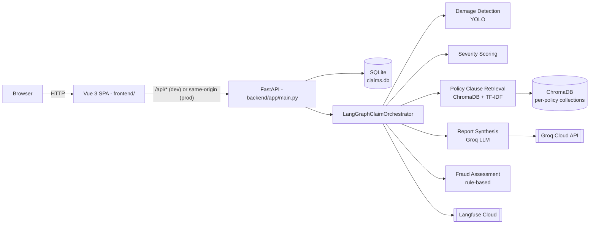
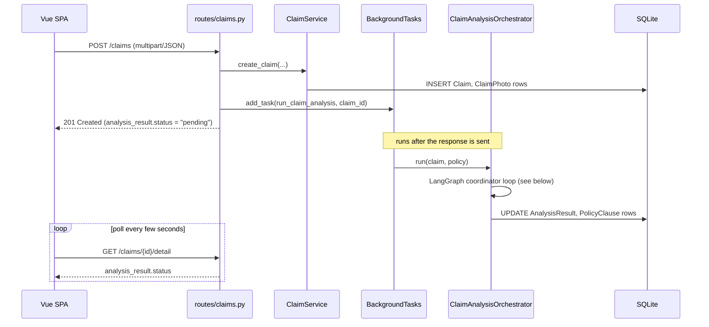
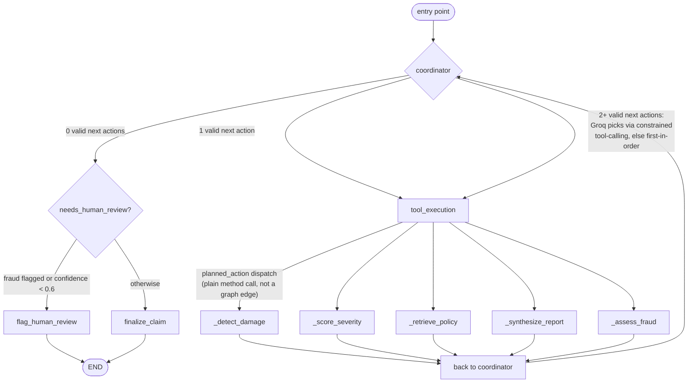
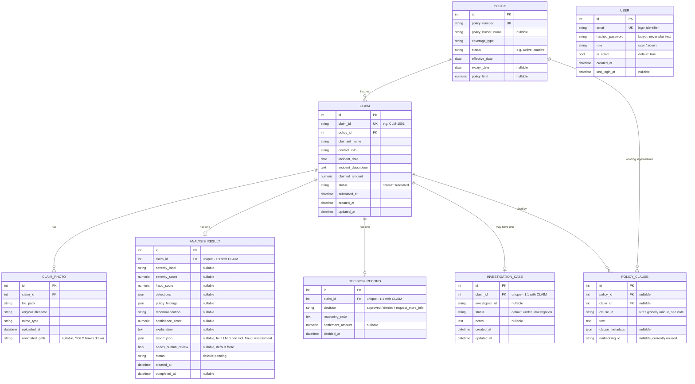

<div align="center">


<b>***Data Science & AI Lab May 2026***</b>
<br>


<h1 style="font-size:26em;">Multimodal Damage Assessment for Insurance Claims</h1>

<h2>Milestone 6: Deployment & Reproducibility</h2>

<h3>Group 1</h3>

<br>

  ***Prepared by:***

  
| **Name** | **Email ID** | **GitHub Profile** |
| --- | --- | --- |
| SATYAJEET KUMAR | 23f1003132@ds.study.iitm.ac.in | [HiveCase](https://github.com/HiveCase) |
| ANUJ GAUTAM | 21f1002407@ds.study.iitm.ac.in | [anujgautam1](https://github.com/anujgautam1) |
| PRANAB KUMAR MANNA | 22f1000887@ds.study.iitm.ac.in | [pranab92](https://github.com/pranab92) |
| VENKATA SIVA KAMAL GUDDANTI | 22f2000094@ds.study.iitm.ac.in | [22f2000094](https://github.com/22f2000094) |
| HARSH PAL | 21f1002562@ds.study.iitm.ac.in | [HarshPalaps1](https://github.com/HarshPalaps1) |

</div>

---

# Car Damage Insurance Claim Portal


## Table of Contents

1. [Project Overview](#1-project-overview)
   - [High-level architecture](#high-level-architecture)
   - [Low-level architecture](#low-level-architecture)
   - [Database schema (SQLite)](#database-schema-sqlite)
2. [Environment Setup](#2-environment-setup)
3. [Configuration & Secrets](#3-configuration--secrets)
4. [Data & Inputs](#4-data--inputs)
5. [Running the Application](#5-running-the-application)
6. [Model / Pipeline Execution](#6-model--pipeline-execution)
7. [End-to-End Reproducibility](#7-end-to-end-reproducibility)
8. [Deployment Details](#8-deployment-details)
9. [Evaluation & Results](#9-evaluation--results)
10. [Repository Structure](#10-repository-structure)
11. [Troubleshooting](#11-troubleshooting)
12. [Contribution Summary](#12-contribution-summary)
13. [Future Improvements / Limitations](#13-future-improvements--limitations)

## 1. Project Overview

An AI-assisted motor insurance claim portal with four role-based interfaces: **Claimant** (submit a claim with photos), **Adjuster** (review AI findings and decide), **SIU** (investigate high-fraud-score claims), and **Supervisor** (portfolio analytics). Every submitted claim runs through a 5-agent AI pipeline — real object detection, real retrieval-augmented policy-clause lookup, and a real LLM call — not a mock.

Source: ("Build a minimal AI-assisted car damage insurance claim portal with Claimant and Adjuster portals, and expand it to include SIU and Supervisor portals as part of the same cohesive experience.")

### Key features

- **Claimant intake**: policy-number lookup, claim submission with 1–5 photos (`backend/app/routes/claims.py`).
- **YOLO damage detection**: an Ultralytics YOLO model (`backend/models/model.pt`) classifies `dent`, `scratch`, `crack`, `broken_lamp`, `shattered_glass`, `flat_tyre` (`backend/app/services/damage_detection_service.py`).
- **Severity scoring**: deterministic area-ratio heuristic over the real photo dimensions, not the raw model confidence (`backend/app/services/severity_scoring_service.py`).
- **RAG policy-clause retrieval**: hybrid dense (sentence-transformers) + sparse (TF-IDF) retrieval over per-policy ChromaDB collections built from the policy's own PDF wording (`backend/app/services/policy_clause_service.py`, wrapping the library under `backend/app/rag_scripts/src/`).
- **LLM report synthesis**: Groq Cloud (`llama-3.3-70b-versatile` by default) produces the recommendation, confidence score, cited coverage, and a required `recommendation_reason` grounded in the retrieved clauses — with a deterministic fallback report if Groq is unavailable (`backend/app/services/report_synthesis_service.py`).
- **Deterministic fraud scoring**: rule-based checks — claimant/policyholder name mismatch, expired or inactive policy, cumulative claimed amount exceeding the policy limit — that can force human review and even override an LLM "Approve" recommendation (`backend/app/services/fraud_agent_service.py`, `backend/app/services/langgraph_orchestrator.py`).
- **LangGraph orchestration with an LLM planner**: a coordinator/tool-execution loop over damage detection, severity scoring, policy-clause retrieval, report synthesis, and fraud assessment; when more than one next step is valid, Groq picks which one runs next via constrained tool-calling, with a deterministic fallback (`backend/app/services/langgraph_orchestrator.py`).
- **Langfuse observability**: every claim analysis is traced as one nested trace covering all five agents plus the coordinator's own planning decisions.
- **Human-in-the-loop decisioning**: the AI pipeline only ever recommends; an adjuster's own decision (`approved`/`denied`/`under review`) is what changes claim status.
- **Signup/login**: `POST /auth/signup` and `POST /auth/login` (bcrypt password hashing, JWT access tokens) — standalone infrastructure only; no existing route requires the resulting token yet (see the `users` table note below).

### High-level architecture



### Low-level architecture

**Request → analysis sequence.** AI analysis runs as a `BackgroundTasks` job so `POST /claims` returns immediately (FR-010); the frontend then polls `GET /claims/{id}/detail` until the analysis finishes.



**The LangGraph coordinator loop itself.** `LangGraphClaimOrchestrator._build_graph()` (`backend/app/services/langgraph_orchestrator.py`) wires a `coordinator` node and a `tool_execution` node in a loop; the 5 agent methods are registered as LangGraph nodes too, but — verified directly in the source — **no graph edges ever route to them**. `tool_execution` calls the matching method as a plain Python function based on `state["planned_action"]` instead. The diagram below reflects the actual wiring, not the idealized 5-node chain:



Dependency order enforced by `_valid_next_actions` (not the graph structure): `detect_damage` must run first; once it has, `score_severity` and `retrieve_policy` both become valid simultaneously (the one genuine multi-choice point the LLM planner resolves); then `synthesize_report`; then `assess_fraud` last.

**Key internal call chain** (file → responsibility):

| Layer | File | Responsibility |
| --- | --- | --- |
| HTTP route | `backend/app/routes/claims.py` | `create_claim`, `run_claim_analysis` (background task), dashboards, decisions, SIU actions |
| Domain service | `backend/app/services/claim_service.py` | Claim CRUD, claim-ID generation |
| Orchestration wrapper | `backend/app/services/claim_analysis_graph.py` | Thin `ClaimAnalysisOrchestrator` facade instantiated once as a module-level singleton in `claims.py` (so the YOLO model / embedding model / TF-IDF indices load once, not per request) |
| Orchestration engine | `backend/app/services/langgraph_orchestrator.py` | `LangGraphClaimOrchestrator` — the actual `StateGraph`, coordinator, and per-agent methods described above |
| Tool layer | `backend/app/services/mcp_tools.py` | Wraps each service as a `langchain_core` `@tool` (`detect_damage_tool`, `score_severity_tool`, `retrieve_policy_clauses_tool`, `synthesize_report_tool`, `assess_fraud_tool`) invoked via `_call_tool` |
| Agents | `damage_detection_service.py`, `severity_scoring_service.py`, `policy_clause_service.py`, `report_synthesis_service.py`, `fraud_agent_service.py` | The 5 actual implementations behind each tool |
| Observability | `backend/app/services/langfuse_observability.py` | `LangfuseObserver` — one trace per claim, with each agent + the coordinator's planning decisions as nested spans/generations |
| Auth | `backend/app/routes/auth.py`, `backend/app/services/auth_service.py` | `AuthService` — bcrypt hashing, JWT issuance; not applied as a dependency to any other route |

### Database schema (SQLite)

All 7 tables, from `backend/app/db/models.py` (SQLAlchemy ORM). SQLite is the only supported backend — `database_url` defaults to a local file, and `backend/app/db/database.py` has a homegrown `sync_sqlite_schema()` that only handles `ALTER TABLE ADD COLUMN` (no renames/drops/type changes; see §13).



Notes on real, non-obvious design decisions (verified in `models.py`, not idealized):

- **`policy_clauses` is uniquely keyed on `(claim_id, clause_id)`, not `clause_id` alone** (`UniqueConstraint`). The same retrieved clause is routinely cited by many different claims against the same policy over time, so one row per **citation** is correct; the table's own docstring in the source explains this was a deliberate fix — a bare `clause_id` unique key would silently drop or overwrite every claim's citation after the first. `claim_id`/`policy_id` are both nullable to accommodate the two seed rows (`CL-AUTO-001`/`CL-AUTO-002`) that aren't tied to any specific claim.
- **Foreign keys are declared but not enforced.** Nothing in `database.py` sets `PRAGMA foreign_keys = ON` (SQLite's own default is off), so the `FK` columns above are structural/documentation only — the database will not reject an orphaned row.
- **Only `ClaimPhoto` cascades on delete** (`cascade="all, delete-orphan"` from `Claim`). `AnalysisResult`, `DecisionRecord`, `InvestigationCase`, and `PolicyClause` have no cascade behavior defined, and `InvestigationCase`/`PolicyClause`'s relationship back to `Claim` has no `back_populates` — i.e. `Claim` doesn't expose `.investigation_case` or `.policy_clauses` attributes; those are only navigable from the child side.
- **`ix_claim_policy_status`** is a composite index on `(Claim.policy_id, Claim.status)`, declared at module level after the class bodies, not as a column-level `index=True`.
- **No migration tool** — see §13.

### `users` table (signup/login)

`User` model in `backend/app/db/models.py`, exposed via `POST /auth/signup` and `POST /auth/login` (`backend/app/routes/auth.py`, `backend/app/services/auth_service.py`). Passwords are hashed with `bcrypt`; login returns a JWT access token (`PyJWT`, `HS256`, signed with `JWT_SECRET_KEY`). `USER` is included in the ER diagram above, in the same database as every other table — drawn with **no relationship lines**, on purpose: there is no foreign key from `Claim`, `DecisionRecord`, or any other table to `users` in `models.py` yet, so a signed-up user isn't yet linked to the claims/decisions they touch.

**What this does and doesn't do, precisely:**
- ✅ A real account can be created and authenticated; the JWT payload carries `sub` (user id), `email`, and `role`.
- ❌ **No route in the app actually requires authentication yet.** `/claims/*`, `/policies/*`, and `/analytics/*` remain fully open — signup/login exists as standalone infrastructure, not as a gate in front of anything. There is no `get_current_user` dependency applied to any existing route, and no frontend login page, token storage, or route guard (`frontend/src/router.js` has no navigation guards).
- Only `email`/`password`/`role` are collected at signup; `role` must be one of `user`, `admin` (`backend/app/schemas/auth_schema.py::VALID_ROLES`) — invalid roles and duplicate emails are rejected with `422`. This is a two-tier role model, not one role per portal — it isn't currently tied to which of the four portals (Claimant/Adjuster/SIU/Supervisor) an account can reach.

---

## 2. Environment Setup

| Requirement | Version | Source |
| --- | --- | --- |
| Python | 3.12 | `.github/workflows/deploy-gke.yml`, `Dockerfile` |
| Node.js | 20 | `.github/workflows/deploy-gke.yml`, `Dockerfile` (`node:20-alpine`) |
| OS | No hard restriction in code. Developed on Windows; deployment images are `python:3.12-slim` / `node:20-alpine` (Linux). | TODO: fill in manually if a specific OS is mandated |
| Hardware | CPU-only inference (small YOLO model, no GPU code path). No GPU/CUDA requirement. | Inferred from `damage_detection_service.py` (plain `ultralytics.YOLO`, no `.cuda()`/device selection) |

### Virtual environment (backend)

```bash
cd backend
python -m venv .venv
# Windows PowerShell:
.\.venv\Scripts\Activate.ps1
# macOS/Linux:
source .venv/bin/activate

pip install -r requirements.txt
```

### Frontend dependencies

```bash
cd frontend
npm install
```

---

## 3. Configuration & Secrets

The backend reads configuration through `pydantic-settings` (`backend/app/core/config.py`), which loads a `.env` file from the **repository root**. These are the environment variables actually read by the running app:

| Variable | Used for | Required? |
| --- | --- | --- |
| `DATABASE_URL` | SQLAlchemy connection string. Defaults to `sqlite:///backend/data/claims.db` if unset. | No (has a working default) |
| `UPLOAD_DIR` | Where uploaded claim photos are stored. | No (defaults to `backend/data/uploads`) |
| `MODEL_DIR` | Where the YOLO weights are read from. | No (defaults to `backend/models`) |
| `DATA_DIR` | Base data directory (created at startup). | No (defaults to `backend/data`) |
| `GROQ_API_KEY` | Groq Cloud API key — powers report synthesis and the LangGraph coordinator's LLM planning. | **Effectively required** — without it, every claim gets the deterministic fallback report (`is_fallback: true`) instead of a real LLM assessment. |
| `MODEL_NAME` | Overrides the Groq model (maps to `groq_model`). | No (defaults to `llama-3.3-70b-versatile`) |
| `GROQ_BASE_URL` | Groq's OpenAI-compatible API base URL. | No (defaults to `https://api.groq.com/openai/v1`) |
| `LANGFUSE_PUBLIC_KEY`, `LANGFUSE_SECRET_KEY` | Enables Langfuse tracing. Observability is silently disabled if either is missing. | No |
| `LANGFUSE_HOST` or `LANGFUSE_BASE_URL` | Langfuse ingestion endpoint (both names accepted; `LANGFUSE_BASE_URL` is the one actually in `.env.example`). | No (defaults to `https://cloud.langfuse.com`) |
| `JWT_SECRET_KEY` | Signs/verifies the JWT issued by `POST /auth/login`. | **Effectively required for production** — defaults to the placeholder `"change-me-in-production"`, which is intentionally insecure (23 bytes; `PyJWT` warns it's below the 32-byte minimum recommended for HS256). |
| `JWT_ACCESS_TOKEN_EXPIRE_MINUTES` | Access token lifetime. | No (defaults to `15`) |
| `JWT_REFRESH_TOKEN_EXPIRE_DAYS` | Present in config for a future refresh-token flow — **no refresh-token endpoint exists yet**, so this value isn't consumed anywhere yet. | No (defaults to `7`) |

**`.env.example` exists at the repo root, but is still partially stale**: `JWT_SECRET_KEY`, `JWT_ACCESS_TOKEN_EXPIRE_MINUTES`, and `JWT_REFRESH_TOKEN_EXPIRE_DAYS` are now real (table above). `MAX_UPLOAD_SIZE_MB`, `CHROMA_PERSIST_DIR`, `LLM_PROVIDER`, `USE_LANGGRAPH`, `MOCK_LLM_FAIL_AGENT`, `OTEL_EXPORTER_OTLP_ENDPOINT`, `OLLAMA_MODEL`, and `OLLAMA_BASE_URL` are still **not read anywhere in `backend/app`** (verified by grep against the `Settings` class). TODO: fill in manually — confirm with the team whether to prune the remaining unused entries from `.env.example`, or whether they map to other planned-but-unbuilt features.

### API key setup

1. Create a `.env` file at the repository root: `cp .env.example .env` (or `copy .env.example .env` on Windows).
2. Get a Groq API key from [console.groq.com](https://console.groq.com) and set `GROQ_API_KEY`. Note Groq's free tier has a daily token limit (100,000 TPD observed in practice) — once exhausted, the app degrades gracefully to the deterministic fallback report rather than failing.
3. (Optional) Get Langfuse keys from [cloud.langfuse.com](https://cloud.langfuse.com) for pipeline tracing.

---

## 4. Data & Inputs

- **Seed policies**: 5 fictional policies (`POL-001`–`POL-005`), each with a policy holder name, coverage type, status, effective/expiry dates, and a policy limit — seeded automatically at startup (`backend/app/services/policy_service.py::SEED_POLICIES`).
- **Policy wording PDFs**: each seeded policy maps to a synthetic PDF under `backend/app/rag_scripts/data/policy_pdfs/synthetic/` (e.g. `policy_1_bharat_suraksha.pdf`). These are explicitly synthetic specimen documents (per their own PDF text: "This is a synthetic specimen policy for research and educational use only. Not a valid insurance contract."), auto-ingested into per-policy ChromaDB collections on first app startup (`PolicyClauseService.ensure_all_seeded_policies_ingested`).
- **Damage detection model**: `backend/models/model.pt` (~45MB YOLO weights), loaded directly at inference time. **No training script exists in this repository** — the model is a pre-trained artifact. TODO: fill in manually — document what dataset/pipeline produced `model.pt` (an unused `backend/models/model_old.pt`, ~95MB, also sits in the repo).
- **Claim photos**: uploaded by the claimant (1–5 required per claim), stored under `UPLOAD_DIR` at `<upload_dir>/<claim_id>/<uuid>.<ext>` (`backend/app/services/photo_storage_service.py`).
- **Data format**: claim submission accepts either `multipart/form-data` (with photo files) or `application/json` (no photos) — see §5 for the exact field list.
- **Standalone RAG tooling** (not wired into the running app; CLI scripts under `backend/app/rag_scripts/scripts/`): `preprocess_policy_pdfs.py`, `ingest_user_policy.py`, `chunk_quality_analysis.py`, `ragas_eval.py`, `sweep_rag_params.py`, and others — these were used to develop/evaluate the retrieval pipeline (`src/retrieval/*.py`) but are not invoked at runtime.

---

## 5. Running the Application

### Backend

```bash
cd backend
uvicorn app.main:app --reload --host 127.0.0.1 --port 8000
```

### Frontend (dev server)

```bash
cd frontend
npm run dev
```

Open `http://localhost:5173` (Vite proxies `/api/*` to the backend on `127.0.0.1:8000`, per `frontend/vite.config.js`).

### Example requests

Policy lookup:
```bash
curl -X POST http://127.0.0.1:8000/policies/lookup \
  -H "Content-Type: application/json" \
  -d '{"policy_number": "POL-001"}'
```

Submit a claim (JSON, no photos):
```bash
curl -X POST http://127.0.0.1:8000/claims \
  -H "Content-Type: application/json" \
  -d '{
    "policy_number": "POL-001",
    "claimant_name": "Ada Lovelace",
    "contact_info": "ada@example.com",
    "incident_date": "2026-08-01",
    "incident_description": "Rear bumper dent from a parking collision",
    "claimed_amount": 1200
  }'
```
Expected response (`201 Created`, shape from `ClaimRead` in `backend/app/schemas/claim_schema.py`):
```json
{
  "claim_id": "CLM-1001",
  "status": "submitted",
  "message": "Claim received",
  "claimant_name": "Ada Lovelace",
  "incident_date": "2026-08-01",
  "incident_description": "Rear bumper dent from a parking collision",
  "claimed_amount": "1200.00",
  "submitted_at": "2026-08-13T00:00:00",
  "photos": [],
  "analysis_result": { "status": "pending" }
}
```
AI analysis runs as a background task (FastAPI `BackgroundTasks`) — poll `GET /claims/{claim_id}/detail` until `analysis_result.status` is `completed` or `failed`.

Health check:
```bash
curl http://127.0.0.1:8000/health
# {"status":"ok"}
```

Full endpoint list (`backend/app/routes/`):

| Method | Path | Purpose |
| --- | --- | --- |
| POST | `/policies/lookup` | Look up a policy by number |
| POST | `/claims` | Submit a new claim (multipart or JSON) |
| GET | `/claims` | List claims (optional `?status=`) |
| GET | `/claims/{claim_id}` | Get a claim |
| GET | `/claims/{claim_id}/detail` | Get a claim plus its AI analysis result |
| GET | `/claims/{claim_id}/annotated-photo` | The claim's primary photo with detected-damage boxes drawn on it |
| POST | `/claims/{claim_id}/decision` | Adjuster records approve/deny/request-more-info |
| GET | `/claims/adjuster-dashboard` | Pending claims for the adjuster portal |
| GET | `/claims/siu-dashboard` | Claims with `fraud_score >= 0.65` for the SIU portal |
| POST | `/claims/{claim_id}/siu-action` | SIU opens/updates an investigation |
| GET | `/analytics/summary` | Supervisor portfolio analytics |
| POST | `/auth/signup` | Create an account (`email`, `password`, `role`) |
| POST | `/auth/login` | Authenticate, returns a JWT access token |
| GET | `/health` | Liveness/readiness check |

None of the routes above `/auth/*` currently require the resulting token — see the `users` table note in §1 for exactly what is and isn't wired up.

Signup / login example:
```bash
curl -X POST http://127.0.0.1:8000/auth/signup \
  -H "Content-Type: application/json" \
  -d '{"email": "user1@example.com", "password": "supersecret1", "role": "user"}'

curl -X POST http://127.0.0.1:8000/auth/login \
  -H "Content-Type: application/json" \
  -d '{"email": "user1@example.com", "password": "supersecret1"}'
# {"access_token": "eyJ...", "token_type": "bearer", "user": {"id": 1, "email": "user1@example.com", "role": "user", "is_active": true}}
```

---

## 6. Model / Pipeline Execution

Entry point: `LangGraphClaimOrchestrator.run(claim, policy)` in `backend/app/services/langgraph_orchestrator.py`, invoked from the background task `run_claim_analysis()` in `backend/app/routes/claims.py` right after a claim is created.

Pipeline (a LangGraph `StateGraph` coordinator/tool-execution loop, not a flat chain):

1. **Damage detection** — YOLO inference on each uploaded photo (`DamageDetectionService`).
2. **Severity scoring** and **Policy clause retrieval** — both become valid once detection finishes; when both are available, Groq's coordinator picks which runs next via constrained tool-calling (falls back to a fixed order if Groq is unavailable).
3. **Report synthesis** — Groq LLM call producing `damage_table`, `applicable_coverage` (with clause citations), `recommendation`, `recommendation_reason`, `confidence_score`, `next_steps`.
4. **Fraud assessment** — deterministic rule checks; can force `needs_human_review` and can override an "Approve" recommendation to "Investigate" if the policy was inactive/expired at the incident date.
5. **Human-review routing** — deterministic: escalate if fraud flags investigation, or if `confidence_score < 0.6`.

**Model/checkpoint loading**: the YOLO model is loaded lazily on first use and cached on the service instance (`DamageDetectionService._load_model`); the sentence-transformers embedding model (`all-MiniLM-L6-v2`) downloads from the Hugging Face Hub on first use and is cached locally by `sentence-transformers` itself.

**Approximate runtime**: TODO: fill in manually for a rigorous benchmark. Observed during development (not a formal measurement): a few seconds end-to-end when Groq responds normally; tens of seconds to minutes if Groq is rate-limited (3 retries with backoff) or the sentence-transformers model needs to download on a cold start.

---

## 7. End-to-End Reproducibility

```bash
# 1. Clone
git clone https://github.com/HiveCase/Group-1-DS-and-AI-Lab-Project.git
cd Group-1-DS-and-AI-Lab-Project

# 2. Configure
cp .env.example .env
# edit .env: set GROQ_API_KEY at minimum

# 3. Backend setup
cd backend
python -m venv .venv
source .venv/bin/activate   # or .\.venv\Scripts\Activate.ps1 on Windows
pip install -r requirements.txt

# 4. Run backend
uvicorn app.main:app --reload --host 127.0.0.1 --port 8000 &

# 5. Frontend setup and run (separate terminal)
cd ../frontend
npm install
npm run dev

# 6. Open http://localhost:5173, pick a portal, submit a claim as a Claimant
#    using policy number POL-001, then review it as an Adjuster at /adjuster

# 7. Verify with the test suites
cd ../backend && python -m pytest -q
cd ../frontend && npm test
```

---

## 8. Deployment Details

### Local: Docker Compose

```bash
docker compose up --build
```
Backend on `http://localhost:8000`, frontend dev server on `http://localhost:5173`. Compose pulls Groq/Langfuse secrets from a root-level `.env` if present. See inline comments in `docker-compose.yml` for known local-dev workarounds already applied (corporate-proxy `--trusted-host` flags, a CPU-only PyTorch index to avoid downloading ~1.5GB of unused CUDA libraries, an anonymous volume to prevent Windows/Linux `node_modules` binary mismatches, and pip/npm cache volumes).

### Single container (production-style)

The `Dockerfile` builds the Vue frontend and copies its static output into the FastAPI image; FastAPI serves both the API and the compiled SPA from one process/port.

```bash
docker build -t claims-portal .
docker run --rm -p 8000:8000 -v ${PWD}/.local-data:/data claims-portal
```
Open `http://localhost:8000`.

### Kubernetes (GKE)

`k8s/` holds `namespace.yaml`, `pvc.yaml`, `deployment.yaml`, `service.yaml`, `kustomization.yaml`. `.github/workflows/deploy-gke.yml` builds, vulnerability-scans (Trivy), pushes to Artifact Registry, and deploys via `kubectl` on pushes to the configured branch, with a post-deploy smoke test and automatic rollback on failure. Required GitHub secrets and manual `kubectl` commands are documented in [`docs/gke-cicd.md`](docs/gke-cicd.md).

### Ports

| Port | Service |
| --- | --- |
| 8000 | FastAPI backend (and, in the single-container image, the compiled frontend) |
| 5173 | Vite frontend dev server (local dev only) |
| 80 | Kubernetes `Service` (routes to container port 8000) |

### Known limitations

- **`replicas: 1` only** (`k8s/deployment.yaml`, deliberate) — the app persists to a single SQLite file and a local-disk ChromaDB index, neither safe to share across pods. Scaling out needs Postgres + a shared/hosted vector store first.
- No LangGraph checkpointer (`SqliteSaver`) is wired in — if the process restarts mid-analysis, the claim stays in `pending` (recovered automatically to `failed` on next startup by `_fail_orphaned_pending_analyses`, not resumed) and must be resubmitted .
- The RAG ChromaDB index rebuilds inside the container's own filesystem on every restart (not on the mounted PVC), adding a few seconds of startup latency each time.

---

## 9. Evaluation & Results

- No automated evaluation suite runs as part of CI. `backend/app/rag_scripts/scripts/ragas_eval.py`, `eval_report_agent.py`, `sweep_rag_params.py`, and `sweep_significance.py` are standalone CLI tools used during development of the retrieval pipeline — they are not invoked by the test suite or CI workflow, and have their own separate dependencies/usage not documented here. TODO: fill in manually if these should be run as part of a documented evaluation process.
- Langfuse provides live per-claim tracing (each of the 5 agents plus the coordinator's planning decisions as nested spans/generations under one trace) rather than batch metrics.
- **Known limitations**: all 5 policy documents are synthetic specimens explicitly marked "not a valid insurance contract"; the fraud-scoring model is a hand-written rule engine, not a trained classifier; the claims/policy dataset is a small seeded set (5 policies), not a representative production sample.

---

## 10. Repository Structure

```text
.
├── backend/
│   ├── app/
│   │   ├── main.py                  # FastAPI app, startup seeding, static SPA serving
│   │   ├── core/config.py           # pydantic-settings configuration
│   │   ├── db/                      # SQLAlchemy models (models.py) and session/engine (database.py)
│   │   ├── routes/                  # claims.py, policies.py, analytics.py
│   │   ├── schemas/                 # Pydantic request/response models
│   │   ├── services/                # domain services: damage detection, severity, RAG clauses,
│   │   │                            #   report synthesis, fraud, LangGraph orchestrator, etc.
│   │   └── rag_scripts/             # hybrid dense+sparse retrieval library (src/) + standalone
│   │                                #   research/eval CLI tools (scripts/, not used at runtime)
│   ├── models/                      # model.pt (YOLO weights, in use), model_old.pt (unused)
│   ├── tests/                       # pytest suite (conftest.py isolates the test DB)
│   └── requirements.txt
├── frontend/
│   ├── src/
│   │   ├── views/                   # LandingView, ClaimantView, AdjusterView, SIUView, SupervisorView
│   │   ├── components/AiAnalysisPanel.vue  # shared AI-result display, used by Adjuster & SIU views
│   │   ├── services/api.ts          # axios client / API adapter
│   │   ├── router.js, App.vue, main.js
│   │   └── styles/                  # tokens.css, main.css
│   ├── tests/                       # Vitest + @vue/test-utils
│   └── package.json
├── k8s/                             # Kubernetes manifests for GKE deployment
├── .github/workflows/deploy-gke.yml # CI (pytest + vitest) and CD (build/scan/push/deploy) pipeline
├── Dockerfile                       # multi-stage: builds frontend, serves it from the FastAPI image
├── docker-compose.yml               # local dev: separate backend/frontend containers
└── pytest.ini                       # pythonpath=backend (gitignored — see Troubleshooting)
```

---

## 11. Troubleshooting

Issues below were actually encountered and diagnosed during this project's development (not generic boilerplate):

- **`ModuleNotFoundError: No module named 'app'` when running `pytest` in CI** — the root `pytest.ini` (which sets `pythonpath = backend`) is listed in `.gitignore` and never reaches a fresh checkout. Run tests with `python -m pytest` (not bare `pytest`), which adds the current directory to `sys.path` regardless.
- **`connect ECONNREFUSED 127.0.0.1:8000` from the Vite dev server** — almost always means the backend simply isn't running yet or has crashed; start/restart it. If running under Docker Compose specifically, the frontend container must reach the backend by its Compose **service name** (`http://backend:8000`), not `127.0.0.1` — see `VITE_BACKEND_PROXY_TARGET` in `docker-compose.yml` and `frontend/vite.config.js`.
- **`[SSL: CERTIFICATE_VERIFY_FAILED]` during `pip install` or `npm install`** — a corporate TLS-inspecting proxy not trusted by Python/Node's default certificate bundle. The backend already installs `pip-system-certs` (uses the OS cert store) for the app's own runtime HTTP calls; for `pip`/`npm` themselves during local Docker builds, see the `--trusted-host` flags already present in `docker-compose.yml` and the Dockerfile's `PIP_EXTRA_ARGS` build arg.
- **A claim's AI analysis stays `pending` forever** — check for a Groq or Langfuse network timeout with no bound (both now have explicit timeouts; see `report_synthesis_service.py` and `langfuse_observability.py`). On the next app restart, `_fail_orphaned_pending_analyses` (`main.py`) automatically marks any still-`pending` analysis as `failed` rather than leaving it silently stuck.
- **A code change doesn't seem to take effect even after restarting `uvicorn --reload`** — check for an orphaned worker process left over from a previous reloader crash (`netstat`/`Get-NetTCPConnection` for what's actually bound to port 8000); a dead reloader's worker keeps serving stale code indefinitely.
- **`404 {"detail":"policy not found"}` on claim submission** — `ClaimService.create_claim` requires `policy.status == "active"`; POL-003 in the seed data is intentionally `"inactive"` for fraud-scenario testing.
- **Groq 429 rate limit** — the free tier has a daily token cap; the app falls back to a deterministic report (`report_json.is_fallback == true`, surfaced in the Adjuster UI) rather than failing the claim.
- **SQLite data appears to reset/lose rows unexpectedly** — if the repository lives inside a cloud-synced folder (OneDrive/Dropbox/etc.), the sync client can interfere with a live, frequently-written SQLite file. Exclude `backend/data/` (and `backend/uploads*/`) from sync, or relocate them outside the synced tree.

---

## 12. Contribution Summary

> TODO: fill in manually — team members, add your contributions below.

| Name | Area(s) | Summary |
| --- | --- | --- |
| TODO | TODO | TODO |

---

## 13. Future Improvements / Limitations

Gaps identified during development:

- **No LangGraph checkpointing** (task T037) — analysis state doesn't survive a process restart mid-run.
- **No automated end-to-end / manual validation script** covering all four portals (task T081) — the backend/frontend test suites cover units and key flows, but there's no scripted full walkthrough.
- **Signup/login exist (`/auth/signup`, `/auth/login`), but nothing enforces them yet** — no route requires the issued JWT, there's no `get_current_user` dependency applied anywhere, and the frontend has no login page, token storage, or route guards. All four portals remain reachable by anyone; role-based access control (using the `role` already captured at signup) is the natural next step but is not built.
- **No database migration tooling** — schema evolution goes through a homegrown `sync_sqlite_schema()` (`ADD COLUMN`-only) helper in `backend/app/db/database.py`, not Alembic; it cannot handle column removals, type changes, or renames, and destructive schema changes (e.g. removing a `UNIQUE` constraint) require a manual one-off migration function (see `_rename_legacy_policy_clauses_table`/`_restore_legacy_policy_clauses_rows` in the same file for a precedent).
- **SQLite + local-disk ChromaDB** cap the deployment at a single replica; horizontal scaling needs a Postgres migration and a shared/hosted vector store first (see `k8s/deployment.yaml` comments).
- **No HPA (Horizontal Pod Autoscaler)** configured, for the same reason.


---

***Declaration:***

I have read and reviewed this submission in its entirety and confirm that it accurately represents the work of our group. By entering my initials and the date below, I acknowledge my approval of this submission.

| Name | Date of Review | Sign |
|---|---|---|
| Satyajeet Kumar |  |  |
| Pranab Kumar Manna |13-08-2026 | PK Manna |
| Venkata Siva Kamal Guddanti | | |
| Anuj Gautam | |  |
| Harsh Pal | | |

---
